# Android Compose 多屏幕导航 — Codelab 逐段解说版

> 本版本**严格按照官方 Codelab 的原始结构、步骤编号和措辞**呈现全部内容。官方原文在每一节中以正常格式展示，而我的解说以 **▸ 解说** 标注插入，帮助你"边读边理解"。
>
> 来源：[Android Developers — 使用 Compose 实现多屏幕导航](https://developer.android.com/codelabs/basic-android-kotlin-compose-navigation?hl=zh-cn)

---

## 1. 前言

到目前为止，您创建的应用仅包含一个屏幕。不过，您使用的许多应用可能都有多个屏幕，您可以在这些屏幕之间导航。例如，Settings 应用中有多页内容分布在不同的界面上。

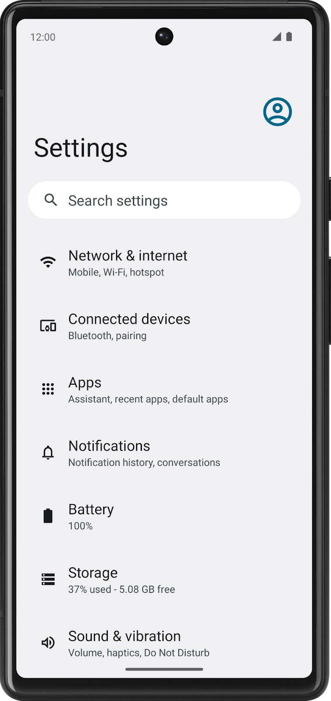

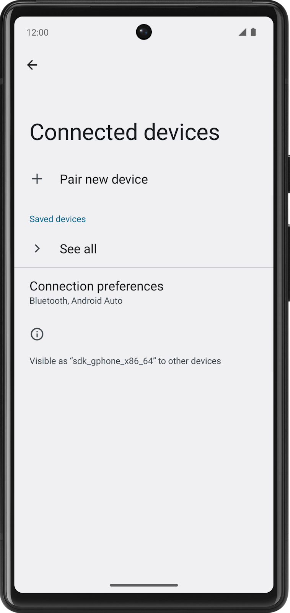

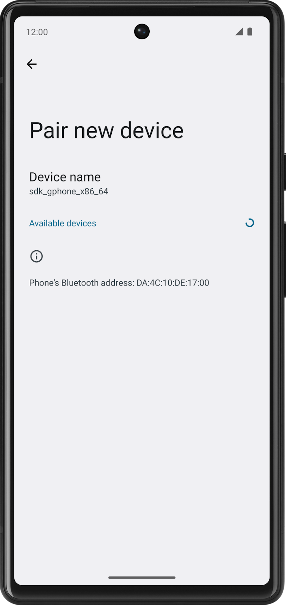

现代 Android 开发中，使用 Jetpack Navigation 组件创建多界面应用。借助 Navigation Compose 组件，您可以使用声明性方法在 Compose 中轻松构建多屏幕应用，就像构建界面一样。此 Codelab 介绍了 Navigation Compose 组件的基础知识、如何使应用栏具备自适应能力，以及如何使用 intent 将数据从您的应用发送到另一个应用，同时还将演示在日益复杂的应用中使用的最佳实践。

> **▸ 解说：这里提到 Settings 应用，是因为它是 Android 系统自带的多屏应用的最好例子——WiFi 设置 → 网络列表 → 高级选项，每一步都是一个"屏幕"，中间有返回按钮和标题变化。本 Codelab 就要教你做同样的事情。**

### 前提条件

- 熟悉 Kotlin 语言，包括函数类型、lambda 和作用域函数
- 熟悉 Compose 中的基本 `Row` 和 `Column` 布局

> **▸ 解说：注意这里特别提到"函数类型"和"lambda"——这是本 Codelab 的核心设计模式。后面你会看到，每个屏幕不直接持有 `navController`，而是暴露 `onNextButtonClicked: (Int) -> Unit` 这样的函数类型参数，由外部注入导航行为。如果对 Kotlin 函数类型不太熟，建议先复习 `() -> Unit` 和 `(Int) -> Unit` 的区别。**

### 学习内容

- 创建 `NavHost` 可组合项以定义应用中的路线和屏幕。
- 使用 `NavHostController` 在屏幕之间导航。
- 操控返回堆栈，以切换到之前的屏幕。
- 使用 intent 与其他应用共享数据。
- 自定义应用栏，包括标题和返回按钮。

### 构建内容

- 您将在多屏幕应用中实现导航功能。

### 所需条件

- 最新版本的 Android Studio
- 互联网连接，用于下载起始代码

> **▸ 解说：Codelab 采用"给你一个只有 UI 没有导航的起始项目 → 一步步添加导航功能"的教学方式。这意味着所有可组合项（屏幕 UI）已经写好了，你只需要专注学习导航逻辑本身。**

---

## 2. 下载起始代码

首先，请下载起始代码：

[下载 ZIP 文件](https://github.com/google-developer-training/basic-android-kotlin-compose-training-cupcake/archive/refs/heads/starter.zip)

或者，您也可以克隆该代码的 GitHub 代码库：

```bash
git clone https://github.com/google-developer-training/basic-android-kotlin-compose-training-cupcake.git
cd basic-android-kotlin-compose-training-cupcake
git checkout starter
```

**注意**：起始代码位于所下载代码库的 `starter` 分支中。

如果您想查看此 Codelab 的起始代码，请前往 [GitHub](https://github.com/google-developer-training/basic-android-kotlin-compose-training-cupcake/tree/starter) 查看。

> **▸ 解说：`starter` 分支是起点——四个屏幕的可组合项都已经写好，ViewModel 的状态管理也已经就绪，但应用目前只显示第一个屏幕，没有任何页面跳转。本 Codelab 的目标就是打通这四个屏幕。**
>
> 如果想看最终成品，可以切到 `navigation` 分支：
> ```bash
> git checkout navigation
> ```

---

## 3. 应用演示

Cupcake 应用与您到目前为止所使用过的应用略有不同。该应用不是在单个屏幕上显示所有内容，而是采用四个单独的屏幕，并且用户可以在订购纸杯蛋糕时在各个屏幕之间切换。如果您运行应用，您将无法查看任何内容，也无法在这些屏幕之间进行导航，因为 navigation 组件尚未添加到应用代码中。不过，您仍可以检查每个屏幕的可组合项预览，并将它们与下方的最终应用屏幕配对。

> **▸ 解说：这段话非常关键——起始代码**跑不起来**！因为导航还没有接上。但每个屏幕都可以通过 Android Studio 的 `@Preview` 单独预览。这是 Compose 开发的一个好习惯：每个屏幕作为独立可组合项开发，不依赖导航框架也能预览和测试。**

### Start Order 屏幕

第一个屏幕向用户显示三个按钮，这些按钮对应于要订购的纸杯蛋糕数量。

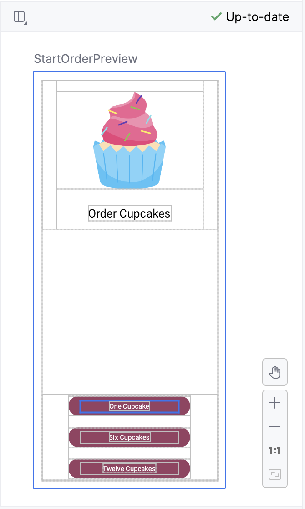

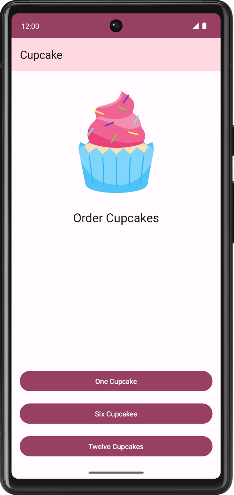

在代码中，这由 `StartOrderScreen.kt` 中的 `StartOrderScreen` 可组合项表示。

该屏幕包含一个列（包含图片和文字）以及三个用于订购不同数量的纸杯蛋糕的自定义按钮。自定义按钮由同样位于 `StartOrderScreen.kt` 中的 `SelectQuantityButton` 可组合项实现。

> **▸ 解说：`StartOrderScreen` 的 `quantityOptions` 参数类型是 `List<Pair<Int, Int>>`。`Pair` 的第一个值（`.first`）是按钮上显示文字的字符串资源 ID（如 `R.string.one_cupcake`），第二个值（`.second`）是真实的数量数字（如 `1`）。后面会用到这个设计。**

### Choose Flavor 屏幕

选择数量后，应用会提示用户选择纸杯蛋糕的口味。应用使用单选按钮来显示不同的选项。用户可以从多种可选口味中选择一种口味。

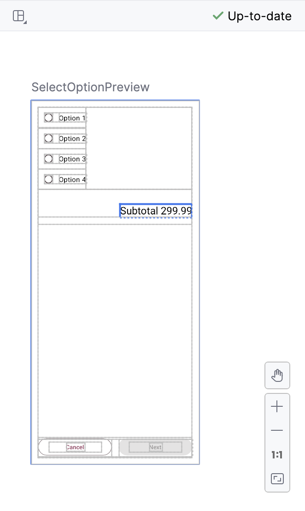

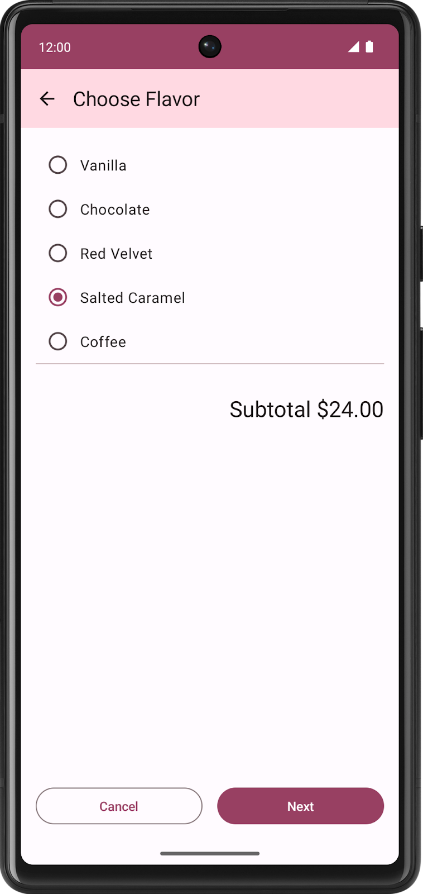

可选口味列表以字符串资源 ID 列表的形式存储在 `data.DataSource.kt` 中。

### Choose Pickup Date 屏幕

用户选择口味后，应用会向用户显示另一些单选按钮，用于选择自提日期。自提选项来自 `OrderViewModel` 中的 `pickupOptions()` 函数返回的列表。

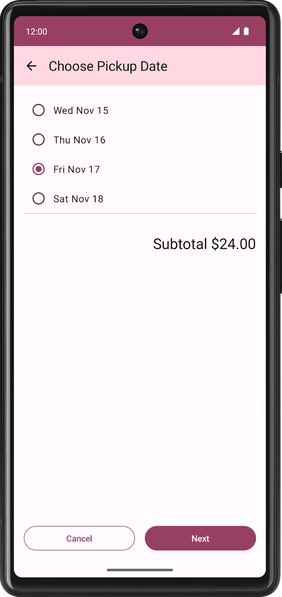

**注意**：**Choose Flavor** 屏幕和 **Choose Pick-Date** 屏幕均由 `SelectOptionScreen.kt` 中的相同可组合项 `SelectOptionScreen` 表示。为什么要使用相同的可组合项？因为这些屏幕的布局完全相同！唯一的区别在于数据，但您可以使用相同的可组合项来同时显示口味屏幕和自提日期屏幕。

> **▸ 解说：这是"组件复用"的经典案例。`SelectOptionScreen` 接受 `options: List<String>`——传口味列表就显示口味选择页，传日期列表就显示日期选择页。布局（单选按钮 + Cancel/Next 按钮）完全一样，只有数据不同。这也意味着导航逻辑要对这个"万能组件"的两个实例传入不同的 `onNextButtonClicked` 回调：口味页要跳转日期页，日期页要跳转摘要页。**

### Order Summary 屏幕

用户选择自提日期后，应用会显示 **Order Summary** 屏幕，用户可以在其中检查和完成订单。

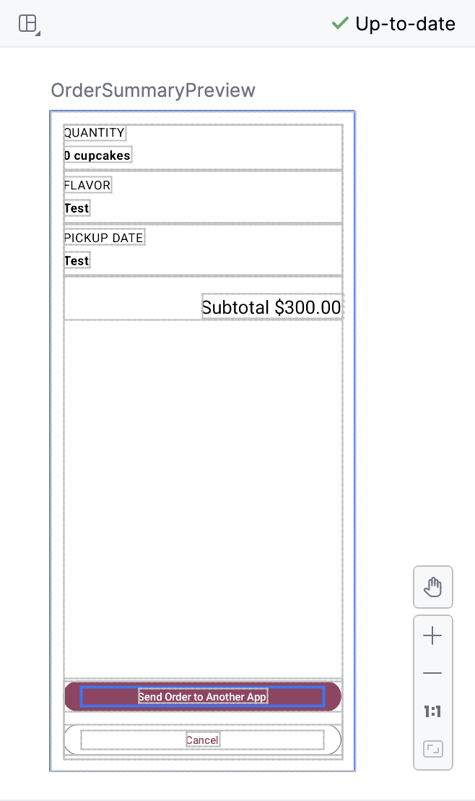

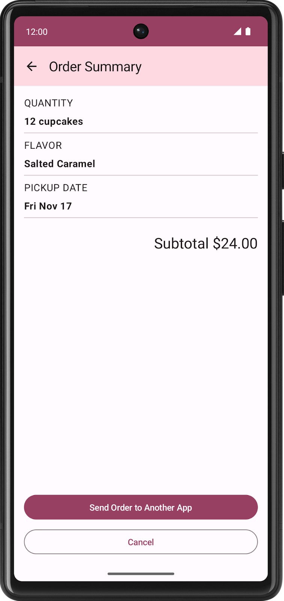

此屏幕由 `SummaryScreen.kt` 中的 `OrderSummaryScreen` 可组合项实现。

布局包含一个 `Column`（包含订单的所有信息）、一个 `Text` 可组合项（用于显示小计），以及用于将订单发送到其他应用或取消订单并返回第一个屏幕的多个按钮。

如果用户选择将订单发送到其他应用，Cupcake 应用会显示 Android ShareSheet（分享对话框），其中显示了不同的分享选项。

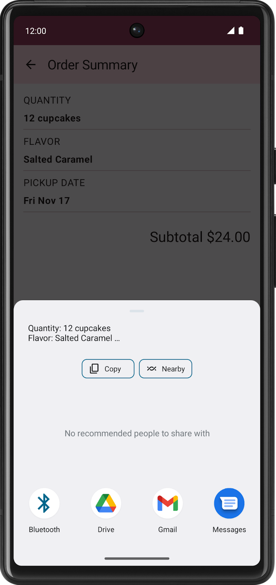

应用的当前状态存储在 `data.OrderUiState.kt` 中。`OrderUiState` 数据类包含用于存储在每个屏幕中为用户提供的可用选项的属性。

应用的屏幕将显示在 `CupcakeApp` 可组合项中。不过，在起始项目中，应用仅显示第一个屏幕。目前还无法在应用的所有屏幕之间导航，不过别担心，本课程的目的就是实现这种导航！您将学习如何定义导航路线，设置用于在屏幕（也称为目标页面）之间导航的 NavHost 可组合项、执行 intent 以与共享屏幕等系统界面组件集成，并让应用栏能够响应导航更改。

### 可重复使用的可组合项

在适当的情况下，本课程中的示例应用可实现最佳实践。Cupcake 应用也不例外。在 **ui.components** 软件包中，您会看到一个名为 `CommonUi.kt` 的文件，其中包含一个 `FormattedPriceLabel` 可组合项。应用中的多个屏幕使用此可组合项来统一设置订单价格的格式。您无需重复定义具有相同格式和修饰符的相同 `Text` 可组合项，而是只需定义一次 `FormattedPriceLabel`，然后根据需要将其重复用于其他屏幕。

同样，口味屏幕和自提日期屏幕也使用可重复使用的 `SelectOptionScreen` 可组合项。此可组合项接受名为 `options` 且类型为 `List<String>` 的参数，该参数表示要显示的选项。这些选项显示在 `Row` 中，后者由一个 `RadioButton` 可组合项和一个包含各个字符串的 `Text` 可组合项组成。整个布局周围有一个 `Column`，还包含一个用于显示格式化价格的 `Text` 可组合项、一个 **Cancel** 按钮和一个 **Next** 按钮。

> **▸ 解说：这一节整体在讲起始项目的架构。总结关键信息：**
> - **四个屏幕** → StartOrderScreen / SelectOptionScreen（口味和日期共用）/ OrderSummaryScreen
> - **数据层** → `OrderUiState`（状态数据类）+ `DataSource`（静态数据）+ `OrderViewModel`（业务逻辑）
> - **目前的状态** → 只有第一个屏幕能显示，因为没有导航。我们接下来的任务就是：定义路线 → 创建 NavHost → 让按钮触发导航 → 应用栏自适应。

---

## 4. 定义路线并创建 NavHostController

### 导航组件的组成部分

Navigation 组件有三个主要部分：

- **NavController**：负责在目标页面（即应用中的屏幕）之间导航。
- **NavGraph**：用于映射要导航到的可组合项目标页面。
- **NavHost**：此可组合项充当容器，用于显示 NavGraph 的当前目标页面。

在此 Codelab 中，您将重点关注 NavController 和 NavHost。在 NavHost 中，您将定义 Cupcake 应用的 NavGraph 的目标页面。

> **▸ 解说：三者的关系可以这样理解：**
> - **NavGraph** = 地图（定义了所有路线和对应的目的地）
> - **NavHost** = 显示地图的窗口（只显示当前路线对应的内容）
> - **NavController** = 操作地图的手指（执行"跳转到 Flavor""返回"等操作）
>
> 在代码中，NavGraph 并不是一个独立的对象——它是通过 `NavHost { composable(...) { ... } }` 的 lambda 内容隐式定义的。每个 `composable()` 调用都向图中注册了一条路线。

### 在应用中为目标页面定义路线

在 Compose 应用中，导航的一个基本概念就是路线。路线是与目标页面对应的字符串。这类似于网址的概念。就像不同网址映射到网站上的不同页面一样，路线是可映射至目标页面并作为其唯一标识符的字符串。目标页面通常是与用户看到的内容相对应的单个可组合项或一组可组合项。Cupcake 应用需要显示"Start Order"屏幕、"Flavor"屏幕、"Pickup Date"屏幕和"Order Summary"屏幕的目标页面。

应用中的屏幕数量有限，因此路线数量也是有限的。您可以使用枚举类来定义应用的路线。Kotlin 中的枚举类具有一个名称属性，该属性会返回具有属性名称的字符串。

> **▸ 解说：路线（Route）本质上就是一个字符串标识符，类似 Web 开发的 URL。官方推荐用 Kotlin `enum` 而不是直接写字符串 `"Start"`, `"Flavor"`，原因是：**
> - 编译期检查，IDE 可以自动补全，错误在编译时就能发现
> - 枚举的 `.name` 属性返回的值恰好等于枚举常量名（`CupcakeScreen.Flavor.name == "Flavor"`）
> - 枚举可以附加更多属性（后面会加 `title` 字段来存储每个屏幕的应用栏标题）

首先，定义 Cupcake 应用的四个路线。

- **`Start`**：从三个按钮之一选择纸杯蛋糕的数量。
- **`Flavor`**：从选项列表中选择口味。
- **`Pickup`**：从选项列表中选择自提日期。
- **`Summary`**：检查所选内容，然后发送或取消订单。

添加一个枚举类来定义路线。

1. 在 `CupcakeScreen.kt` 中的 `CupcakeAppBar` 可组合项上方，添加一个名称为 `CupcakeScreen` 的枚举类。

```kotlin
enum class CupcakeScreen() {

    }
```

2. 在枚举类中添加四种情况：`Start`、`Flavor`、`Pickup` 和 `Summary`。

```kotlin
enum class CupcakeScreen() {
        Start,
        Flavor,
        Pickup,
        Summary
    }
```

> **▸ 解说：步骤清晰——先声明空枚举，再填入四个值。`CupcakeScreen()` 后面的空圆括号目前没有参数，后面会给它加一个 `title: Int` 参数。**

### 为应用添加 NavHost

NavHost 是一个可组合项，用于根据给定路线来显示其他可组合项目标页面。例如，如果路线为 `Flavor`，`NavHost` 会显示用于选择纸杯蛋糕口味的屏幕。如果路线为 `Summary`，则应用会显示摘要屏幕。

`NavHost` 的语法与任何其他可组合项的语法一样。

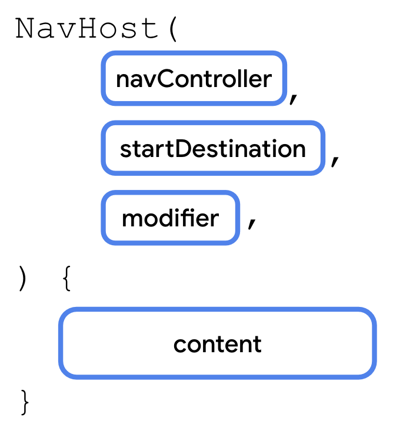

有两个参数值得注意：

- **`navController`：**`NavHostController` 类的实例。您可以使用此对象在屏幕之间导航，例如，通过调用 `navigate()` 方法导航到另一个目标页面。您可以通过从可组合函数调用 `rememberNavController()` 来获取 `NavHostController`。
- **`startDestination`**：此字符串路线用于定义应用首次显示 `NavHost` 时默认显示的目标页面。对于 Cupcake 应用，这应该是 `Start` 路线。

与其他可组合项一样，`NavHost` 也接受 `modifier` 参数。

**注意**：`NavHostController` 是 `NavController` 类的子类，可提供与 `NavHost` 可组合项搭配使用的额外功能。

> **▸ 解说：记住 `rememberNavController()` ——这是 Compose 中创建 `NavHostController` 的唯一方式。它内部使用了 `remember`，所以导航控制器的生命周期跟 Composable 绑定，不会在重组时丢失状态。**
>
> `startDestination = CupcakeScreen.Start.name` 意味着应用一启动就显示 Start 屏幕。如果把它改成 `CupcakeScreen.Summary.name`，应用打开就是订单摘要页——当然这不合理，但说明了这个参数的控制作用。**

您将向 `CupcakeScreen.kt` 中的 `CupcakeApp` 可组合项添加一个 `NavHost`。首先，您需要建立一个到导航控制器的引用。您现在添加的 `NavHost` 以及将在后续步骤中添加的 `AppBar` 中都可以使用该导航控制器。因此，您应在 `CupcakeApp()` 可组合项中声明该变量。

1. 打开 `CupcakeScreen.kt`。
2. 在 `Scaffold` 中的 `uiState` 变量下方，添加一个 `NavHost` 可组合项。

```kotlin
import androidx.navigation.compose.NavHost

    Scaffold(
        ...
    ) { innerPadding ->
        val uiState by viewModel.uiState.collectAsState()

        NavHost()
    }
```

3. 为 `navController` 参数传入 `navController` 变量，并为 `startDestination` 参数传入 `CupcakeScreen.Start.name`。传递之前传入到修饰符参数的 `CupcakeApp()` 中的修饰符。为最后一个参数传入空的尾随 lambda。

```kotlin
import androidx.compose.foundation.layout.padding

    NavHost(
        navController = navController,
        startDestination = CupcakeScreen.Start.name,
        modifier = Modifier.padding(innerPadding)
    ) {

    }
```

> **▸ 解说：注意 `modifier = Modifier.padding(innerPadding)`——`innerPadding` 来自 `Scaffold`，它表示 TopAppBar 等系统 UI 占据的空间。如果不加这个 padding，NavHost 里的内容会被应用栏遮住。**
>
> 此时 `NavHost` 的花括号是空的，这意味着应用不会显示任何内容。接下来要往里面填 `composable()` 调用。**

### 在 `NavHost` 中处理路线

与其他可组合项一样，`NavHost` 接受函数类型作为其内容。

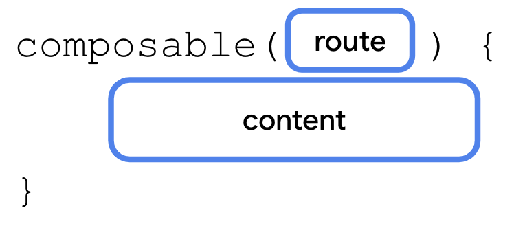

在 `NavHost` 的内容函数中，调用 `composable()` 函数。`composable()` 函数有两个必需参数。

- **`route`**：与路线名称对应的字符串。这可以是任何唯一的字符串。您将使用 `CupcakeScreen` 枚举的常量的名称属性。
- **`content`**：您可以在此处调用要为特定路线显示的可组合项。

您将针对这四个路线分别调用一次 `composable()` 函数。

**注意：**`composable()` 函数是 `NavGraphBuilder` 的扩展函数。

> **▸ 解说：`composable()` 是 `NavGraphBuilder.composable()`——只能在 `NavHost { }` 的花括号里调用，在外面写会编译报错。这是 Kotlin 的"接收者限定扩展函数"设计，确保路线注册只能在构建导航图时进行。**

1. 调用 `composable()` 函数，为 `route` 传入 `CupcakeScreen.Start.name`。

```kotlin
import androidx.navigation.compose.composable

    NavHost(
        navController = navController,
        startDestination = CupcakeScreen.Start.name,
        modifier = Modifier.padding(innerPadding)
    ) {
        composable(route = CupcakeScreen.Start.name) {

        }
    }
```

2. 在尾随 lambda 中，调用 `StartOrderScreen` 可组合项，并为 `quantityOptions` 属性传入 `quantityOptions`。对于 `modifier` 参数传入 `Modifier.fillMaxSize().padding(dimensionResource(R.dimen.padding_medium))`。

```kotlin
import androidx.compose.foundation.layout.fillMaxSize
    import androidx.compose.ui.res.dimensionResource
    import com.example.cupcake.ui.StartOrderScreen
    import com.example.cupcake.data.DataSource

    NavHost(
        navController = navController,
        startDestination = CupcakeScreen.Start.name,
        modifier = Modifier.padding(innerPadding)
    ) {
        composable(route = CupcakeScreen.Start.name) {
            StartOrderScreen(
                quantityOptions = DataSource.quantityOptions,
                modifier = Modifier
                    .fillMaxSize()
                    .padding(dimensionResource(R.dimen.padding_medium))
            )
        }
    }
```

**注意：**`quantityOptions` 属性来自 **DataSource.kt** 中的 `DataSource` 单例对象。

> **▸ 解说：这里 `StartOrderScreen` 只传了 `quantityOptions` 和 `modifier`，没有传 `onNextButtonClicked`。因为起始代码中这个参数还不存在——等一下我们会去 `StartOrderScreen.kt` 中添加它。现在先把四个屏幕都挂到 NavHost 上。**

3. 在对 `composable()` 的第一次调用下方，再次调用 `composable()`，为 `route` 传入 `CupcakeScreen.Flavor.name`。

```kotlin
composable(route = CupcakeScreen.Flavor.name) {

    }
```

4. 在尾随 lambda 中，获取对 `LocalContext.current` 的引用，并将其存储到名称为 `context` 的变量中。`Context` 是一个抽象类，其实现由 Android 系统提供。它允许访问应用专用资源和类，以及向上调用应用级别的操作（例如启动 activity 等）。您可以使用此变量从视图模型中的资源 ID 列表中获取字符串以显示口味列表。

```kotlin
import androidx.compose.ui.platform.LocalContext

    composable(route = CupcakeScreen.Flavor.name) {
        val context = LocalContext.current
    }
```

> **▸ 解说：为什么 Flavor 屏幕需要 `LocalContext.current` 但 Start 屏幕不需要？因为 `DataSource.flavors` 存储的是字符串资源 ID（`List<Int>`，如 `[R.string.vanilla, R.string.chocolate, ...]`），需要 Context 来调用 `getString(id)` 转换成真正的字符串。而 `DataSource.quantityOptions` 已经是 `List<Pair<Int, Int>>`，直接可用。**
>
> 在 Compose 中，`LocalContext.current` 是获取 `Context` 的标准方式，相当于传统 Android 中的 `getContext()`。**

5. 调用 `SelectOptionScreen` 可组合项。

```kotlin
composable(route = CupcakeScreen.Flavor.name) {
        val context = LocalContext.current
        SelectOptionScreen(

        )
    }
```

6. 当用户选择口味时，Flavor 屏幕需要显示和更新小计。为 `subtotal` 参数传入 `uiState.price`。

```kotlin
composable(route = CupcakeScreen.Flavor.name) {
        val context = LocalContext.current
        SelectOptionScreen(
            subtotal = uiState.price
        )
    }
```

7. Flavor 屏幕从应用的字符串资源中获取口味列表。使用 `map()` 函数并调用 `context.resources.getString(id)` 将资源 ID 列表转换为字符串列表。

```kotlin
import com.example.cupcake.ui.SelectOptionScreen

    composable(route = CupcakeScreen.Flavor.name) {
        val context = LocalContext.current
        SelectOptionScreen(
            subtotal = uiState.price,
            options = DataSource.flavors.map { id -> context.resources.getString(id) }
        )
    }
```

8. 对于 `onSelectionChanged` 参数，请传入一个对视图模型调用 `setFlavor()` 的 lambda 表达式，并传入 `it`（传到 `onSelectionChanged()` 中的实参）。对于 `modifier` 形参，传入 `Modifier.fillMaxHeight()`。

```kotlin
import androidx.compose.foundation.layout.fillMaxHeight
    import com.example.cupcake.data.DataSource.flavors

    composable(route = CupcakeScreen.Flavor.name) {
        val context = LocalContext.current
        SelectOptionScreen(
            subtotal = uiState.price,
            options = DataSource.flavors.map { id -> context.resources.getString(id) },
            onSelectionChanged = { viewModel.setFlavor(it) },
            modifier = Modifier.fillMaxHeight()
        )
    }
```

> **▸ 解说：`onSelectionChanged = { viewModel.setFlavor(it) }`——当用户点击某个单选按钮时，`SelectOptionScreen` 内部会调用这个回调，`it` 就是被选中的选项字符串（如 "Vanilla"）。这会更新 ViewModel 的状态，从而触发 UI 重组更新价格。**

自提日期界面类似于口味界面。唯一的区别就是传入 `SelectOptionScreen` 可组合项的数据。

> **▸ 解说：这句话非常重要——官方的意思是："口味"和"日期"用的是**同一个组件**，只是传的数据不一样。设计优秀的 UI 框架都鼓励这种复用。**

9. 再次调用 `composable()` 函数，为 `route` 参数传入 `CupcakeScreen.Pickup.name`。

```kotlin
composable(route = CupcakeScreen.Pickup.name) {

    }
```

10. 在尾随 lambda 中，调用 `SelectOptionScreen` 可组合项，并像之前一样为 `subtotal` 传入 `uiState.price`。为 `options` 参数传入 `uiState.pickupOptions`，并为 `onSelectionChanged` 参数传入对 `viewModel` 调用 `setDate()` 的 lambda 表达式。对于 `modifier` 参数，传入 `Modifier.fillMaxHeight()`。

```kotlin
SelectOptionScreen(
        subtotal = uiState.price,
        options = uiState.pickupOptions,
        onSelectionChanged = { viewModel.setDate(it) },
        modifier = Modifier.fillMaxHeight()
    )
```

> **▸ 解说：对比 Flavor 和 Pickup 的 `composable()` 调用：**
>
> | 参数 | Flavor | Pickup |
> |---|---|---|
> | `options` | `DataSource.flavors.map { ... }` | `uiState.pickupOptions` |
> | `onSelectionChanged` | `viewModel.setFlavor(it)` | `viewModel.setDate(it)` |
>
> 这就是"相同组件，不同数据"的具体体现。**

11. 再次调用 `composable()`，并为 `route` 传入 `CupcakeScreen.Summary.name`。

```kotlin
composable(route = CupcakeScreen.Summary.name) {

    }
```

12. 在跟随的 lambda 中，调用 `OrderSummaryScreen()` 可组合函数，并为 `orderUiState` 形参传入 `uiState` 变量。对于 `modifier` 参数，传入 `Modifier.fillMaxHeight()`。

```kotlin
import com.example.cupcake.ui.OrderSummaryScreen

    composable(route = CupcakeScreen.Summary.name) {
        OrderSummaryScreen(
            orderUiState = uiState,
            modifier = Modifier.fillMaxHeight()
        )
    }
```

以上就是设置 `NavHost` 的全部内容。在下一部分中，您将让应用更改路线，并在用户点按每个按钮时在不同屏幕之间导航。

> **▸ 解说：至此，四个路线的 `composable()` 都已定义。但是**按钮还不能触发导航**——因为每个屏幕的 `onNextButtonClicked` 等参数还没有传入实际的导航逻辑（有些参数甚至还没加到函数签名里）。下一节就是做这件事。**

---

## 5. 在多个路线之间导航

现在，您已经定义了路线并将其映射到 `NavHost` 中的可组合项，接下来可以在不同屏幕之间导航了。`NavHostController`（`rememberNavController()` 调用中的 `navController` 属性）负责在多个路线之间导航。但请注意，此属性是在 `CupcakeApp` 可组合项中定义的。您需要从应用中的不同屏幕访问该属性。

很简单，对吧？只需将 `navController` 作为参数传递给每个可组合项即可。

尽管这种方法很有效，但这并不是构建应用的理想方式。使用 NavHost 处理应用导航的一项优势就是，导航逻辑将各个界面相隔离。此方法可避免将 `navController` 作为参数传递时的一些主要缺点。

- 导航逻辑会保存在一个集中位置，这样可以避免意外允许各个屏幕在应用中随意导航，从而让您的代码更易于维护并预防 bug。
- 在需要处理不同外形规格（例如竖屏模式手机、可折叠手机或大屏平板电脑）的应用中，按钮可能会触发导航，也可能不会触发导航，具体取决于应用的布局。各个屏幕应保持独立，无需了解应用中其他屏幕的信息。

而我们的方法是为每个可组合项传入一个函数类型，以便确定在用户点击该按钮时应当发生什么。这样，可组合项及其任何子可组合项就可以确定何时调用函数。不过，导航逻辑不会向应用中的各个屏幕公开。所有导航行为都在 NavHost 中处理。

> **▸ 解说：这是本 Codelab 最重要的设计思想之一。对比两种做法：**
>
> **❌ 不好的做法**——把 `navController` 直接传入每个屏幕：
> ```kotlin
> StartOrderScreen(navController = navController, ...)
> // 在 StartOrderScreen 内部：
> Button(onClick = { navController.navigate("Flavor") })
> ```
> 问题：StartOrderScreen 知道"跳转到 Flavor"，职责越界了。如果将来这个屏幕要复用到另一个导航流程，这里就写死了。
>
> **✅ 好的做法**——用函数类型参数隔离导航：
> ```kotlin
> StartOrderScreen(onNextButtonClicked = { navController.navigate("Flavor") }, ...)
> // 在 StartOrderScreen 内部：
> Button(onClick = { onNextButtonClicked(quantity) })
> ```
> 好处：StartOrderScreen 只知道"有人点了一个按钮，通知外面一声"，至于外面是跳转到 Flavor 还是做别的事情，它完全不关心。所有导航逻辑集中在 `NavHost { composable { ... } }` 的 lambda 中。
>
> 这本质上是**控制反转（IoC）**原则在 Compose 导航中的应用。**

### 为 `StartOrderScreen` 添加按钮处理程序

首先添加一个函数类型参数。当在第一个屏幕上点按某个数量按钮时，系统会调用该函数类型参数。此函数会传入 `StartOrderScreen` 可组合项，并负责更新视图模型以及导航到下一个屏幕。

1. 打开 `StartOrderScreen.kt`。
2. 在 `quantityOptions` 参数下方以及修饰符参数之前，添加一个名称为 `onNextButtonClicked` 且类型为 `() -> Unit` 的参数。

```kotlin
@Composable
    fun StartOrderScreen(
        quantityOptions: List<Pair<Int, Int>>,
        onNextButtonClicked: () -> Unit,
        modifier: Modifier = Modifier
    ){
        ...
    }
```

3. 现在，`StartOrderScreen` 可组合项需要 `onNextButtonClicked` 的值，请找到 `StartOrderPreview` 并将空的 lambda 正文传递给 `onNextButtonClicked` 参数。

```kotlin
@Preview
    @Composable
    fun StartOrderPreview() {
        CupcakeTheme {
            StartOrderScreen(
                quantityOptions = DataSource.quantityOptions,
                onNextButtonClicked = {},
                modifier = Modifier
                    .fillMaxSize()
                    .padding(dimensionResource(R.dimen.padding_medium))
            )
        }
    }
```

> **▸ 解说：Preview 函数也需要传这个新参数，因为函数签名变了。传 `{}`（空 lambda）是最简单的占位方式，Preview 本来就不能做真正的导航。**

每个按钮对应不同数量的纸杯蛋糕。您需要此信息，以便为 `onNextButtonClicked` 传入的函数会相应地更新视图模型。

4. 修改 `onNextButtonClicked` 参数的类型以接受 `Int` 参数。

```kotlin
onNextButtonClicked: (Int) -> Unit,
```

如需在调用 `onNextButtonClicked()` 时传入 `Int`，请查看 `quantityOptions` 参数的类型。

类型为 `List<Pair<Int, Int>>` 或 `Pair<Int, Int>` 列表。您可能不熟悉 `Pair` 类型，但顾名思义，该类型就是一对值。`Pair` 接受两个通用类型参数。在本例中，两者均为 `Int` 类型。

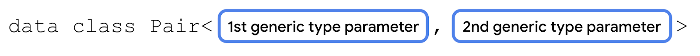

Pair 对中的每一项均由第一个属性或第二个属性访问。对于 `StartOrderScreen` 可组合项的 `quantityOptions` 参数，第一个 `Int` 是每个按钮上显示的字符串的资源 ID。第二个 `Int` 是纸杯蛋糕的实际数量。

当调用 `onNextButtonClicked()` 函数时，我们会传递所选 Pair 对的第二个属性。

> **▸ 解说：`Pair<Int, Int>` 的第一个 Int（`.first`）= 按钮文字的字符串资源 ID（如 `R.string.one_cupcake`），第二个 Int（`.second`）= 真实的蛋糕数量（如 1、6、12）。所以按钮点击时要传 `.second`（数量），而不是 `.first`（资源 ID）。**

1. 为 `SelectQuantityButton` 的 `onClick` 参数查找空 lambda 表达式。

```kotlin
quantityOptions.forEach { item ->
        SelectQuantityButton(
            labelResourceId = item.first,
            onClick = {}
        )
    }
```

2. 在 lambda 表达式中，调用 `onNextButtonClicked`，并传入 `item.second`（纸杯蛋糕的数量）。

```kotlin
quantityOptions.forEach { item ->
        SelectQuantityButton(
            labelResourceId = item.first,
            onClick = { onNextButtonClicked(item.second) }
        )
    }
```

> **▸ 解说：`quantityOptions.forEach { }` 遍历三个选项（如 1个、6个、12个），每个生成一个 `SelectQuantityButton`。点击时传入 `item.second`（实际数量），这是 ViewModel 需要的数据。**

### 为 SelectOptionScreen 添加按钮处理程序

1. 在 `SelectOptionScreen.kt` 中的 `SelectOptionScreen` 可组合项的 `onSelectionChanged` 参数下，添加一个名为 `onCancelButtonClicked`、类型为 `() -> Unit` 且默认值为 `{}` 的参数。

```kotlin
@Composable
    fun SelectOptionScreen(
        subtotal: String,
        options: List<String>,
        onSelectionChanged: (String) -> Unit = {},
        onCancelButtonClicked: () -> Unit = {},
        modifier: Modifier = Modifier
    )
```

2. 在 `onCancelButtonClicked` 参数下，添加另一个类型为 `() -> Unit`、名为 `onNextButtonClicked` 且默认值为 `{}` 的参数。

```kotlin
@Composable
    fun SelectOptionScreen(
        subtotal: String,
        options: List<String>,
        onSelectionChanged: (String) -> Unit = {},
        onCancelButtonClicked: () -> Unit = {},
        onNextButtonClicked: () -> Unit = {},
        modifier: Modifier = Modifier
    )
```

> **▸ 解说：这两个新参数都有默认值 `{}`（空 lambda）。这样设计的好处是：在 Preview 或不需要这两按钮的场景中，不用强制传参。这是 Kotlin 函数默认参数的一个很实用的模式。**

3. 为 Cancel 按钮的 `onClick` 参数传入 `onCancelButtonClicked`。

```kotlin
OutlinedButton(
        modifier = Modifier.weight(1f),
        onClick = onCancelButtonClicked
    ) {
        Text(stringResource(R.string.cancel))
    }
```

4. 为 Next 按钮的 `onClick` 参数传入 `onNextButtonClicked`。

```kotlin
Button(
        modifier = Modifier.weight(1f),
        enabled = selectedValue.isNotEmpty(),
        onClick = onNextButtonClicked
    ) {
        Text(stringResource(R.string.next))
    }
```

> **▸ 解说：注意 `enabled = selectedValue.isNotEmpty()`——用户必须选择了一个选项后，Next 按钮才会变为可用状态。`selectedValue` 是 `SelectOptionScreen` 内部的 `remember` 状态，当用户点击某个 `RadioButton` 时通过 `onSelectionChanged` 回调更新。**

### 为 SummaryScreen 添加按钮处理程序

最后，为 Summary 屏幕上的 **Cancel** 和 **Send** 按钮添加按钮处理程序函数。

1. 在 **`SummaryScreen.kt`** 的 `OrderSummaryScreen` 可组合项中，添加一个名称为 `onCancelButtonClicked` 且类型为 `() -> Unit` 的参数。

```kotlin
@Composable
    fun OrderSummaryScreen(
        orderUiState: OrderUiState,
        onCancelButtonClicked: () -> Unit,
        modifier: Modifier = Modifier
    ){
        ...
    }
```

2. 添加另一个类型为 `(String, String) -> Unit` 的参数，并将其命名为 `onSendButtonClicked`。

```kotlin
@Composable
    fun OrderSummaryScreen(
        orderUiState: OrderUiState,
        onCancelButtonClicked: () -> Unit,
        onSendButtonClicked: (String, String) -> Unit,
        modifier: Modifier = Modifier
    ){
        ...
    }
```

> **▸ 解说：`onSendButtonClicked` 的类型是 `(String, String) -> Unit`，比前面的回调多两个字符串参数。这两个字符串分别是：`subject`（分享标题，如 "New Cupcake Order"）和 `summary`（分享正文，如订单详细内容）。后面会看到它们被填入 `Intent.EXTRA_SUBJECT` 和 `Intent.EXTRA_TEXT`。**

3. `OrderSummaryScreen` 可组合项现在需要 `onSendButtonClicked` 和 `onCancelButtonClicked` 的值。找到 `OrderSummaryPreview`，将包含两个 `String` 参数的空 lambda 正文传递给 `onSendButtonClicked`，然后将一个空 lambda 正文传递给 `onCancelButtonClicked` 参数。

```kotlin
@Preview
    @Composable
    fun OrderSummaryPreview() {
       CupcakeTheme {
           OrderSummaryScreen(
               orderUiState = OrderUiState(0, "Test", "Test", "$300.00"),
               onSendButtonClicked = { subject: String, summary: String -> },
               onCancelButtonClicked = {},
               modifier = Modifier.fillMaxHeight()
           )
       }
    }
```

4. 为 **Send** 按钮的 `onClick` 参数传递 `onSendButtonClicked`。传入 `newOrder` 和 `orderSummary`，这是之前在 `OrderSummaryScreen` 中定义的两个变量。这些字符串由用户可以与其他应用共享的实际数据组成。

```kotlin
Button(
        modifier = Modifier.fillMaxWidth(),
        onClick = { onSendButtonClicked(newOrder, orderSummary) }
    ) {
        Text(stringResource(R.string.send))
    }
```

5. 为 **Cancel** 按钮的 `onClick` 参数传递 `onCancelButtonClicked`。

```kotlin
OutlinedButton(
        modifier = Modifier.fillMaxWidth(),
        onClick = onCancelButtonClicked
    ) {
        Text(stringResource(R.string.cancel))
    }
```

### 导航到其他路线

如需导航到其他路线，只需在 `NavHostController` 实例上调用 `navigate()` 方法即可。

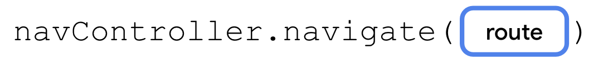

navigation 方法仅接受一个参数：与 `NavHost` 中定义的路线相对应的 `String`。如果路线与 `NavHost` 中的 `composable()` 任一调用匹配，应用便会转到该屏幕。

您将传入在用户按下 `Start`、`Flavor` 和 `Pickup` 屏幕上的按钮时调用 `navigate()` 的函数。

> **▸ 解说：`navigate(route)` 的核心逻辑：**NavController 在 NavGraph 中查找 route 对应的 `composable()` 调用 → 执行其 content lambda → 将新的可组合项显示在屏幕上。**如果 route 不匹配任何已注册的路线，应用会崩溃。**

1. 在 `CupcakeScreen.kt` 中，找到起始屏幕的 `composable()` 调用。为 `onNextButtonClicked` 参数传入 lambda 表达式。

```kotlin
StartOrderScreen(
        quantityOptions = DataSource.quantityOptions,
        onNextButtonClicked = {
        }
    )
```

还记得传入此函数用于表示纸杯蛋糕数量的 `Int` 属性吗？在导航到下一个屏幕之前，您应当更新视图模型，以便应用显示正确的小计。

2. 对 `viewModel` 调用 `setQuantity`，并传入 `it`。

```kotlin
onNextButtonClicked = {
        viewModel.setQuantity(it)
    }
```

3. 对 `navController` 调用 `navigate()`，并传入 `route` 的 `CupcakeScreen.Flavor.name`。

```kotlin
onNextButtonClicked = {
        viewModel.setQuantity(it)
        navController.navigate(CupcakeScreen.Flavor.name)
    }
```

> **▸ 解说：这里有一个很重要的**执行顺序**：先 `viewModel.setQuantity(it)`，再 `navController.navigate(...)`。如果反过来——先跳转再保存数据——目标页面可能在数据还没准备好的情况下就渲染了，导致短暂显示错误的小计金额。**
>
> 另外 `it` 是 Kotlin 的隐式参数名，因为 `onNextButtonClicked` 的类型是 `(Int) -> Unit`，所以 `it` 是传入的 `Int`（蛋糕数量）。**

4. 对于 Flavor 屏幕上的 `onNextButtonClicked` 参数，只需传入调用 `navigate()` 的 lambda，并为 `route` 传入 `CupcakeScreen.Pickup.name`。

```kotlin
composable(route = CupcakeScreen.Flavor.name) {
        val context = LocalContext.current
        SelectOptionScreen(
            subtotal = uiState.price,
            onNextButtonClicked = { navController.navigate(CupcakeScreen.Pickup.name) },
            options = DataSource.flavors.map { id -> context.resources.getString(id) },
            onSelectionChanged = { viewModel.setFlavor(it) },
            modifier = Modifier.fillMaxHeight()
        )
    }
```

> **▸ 解说：Flavor 页的 Next 直接跳转 Pickup 页不需要额外调 ViewModel——因为用户选口味时已经通过 `onSelectionChanged = { viewModel.setFlavor(it) }` 保存过了。**

5. 为 `onCancelButtonClicked` 传入一个空的 lambda，您接下来要实现该 lambda。

```kotlin
SelectOptionScreen(
        subtotal = uiState.price,
        onNextButtonClicked = { navController.navigate(CupcakeScreen.Pickup.name) },
        onCancelButtonClicked = {},
        options = DataSource.flavors.map { id -> context.resources.getString(id) },
        onSelectionChanged = { viewModel.setFlavor(it) },
        modifier = Modifier.fillMaxHeight()
    )
```

6. 对于 Pickup 屏幕上的 `onNextButtonClicked` 参数，请传入调用 `navigate()` 的 lambda，并为 `route` 传入 `CupcakeScreen.Summary.name`。

```kotlin
composable(route = CupcakeScreen.Pickup.name) {
        SelectOptionScreen(
            subtotal = uiState.price,
            onNextButtonClicked = { navController.navigate(CupcakeScreen.Summary.name) },
            options = uiState.pickupOptions,
            onSelectionChanged = { viewModel.setDate(it) },
            modifier = Modifier.fillMaxHeight()
        )
    }
```

7. 同样，为 `onCancelButtonClicked()` 传入一个空的 lambda。

```kotlin
SelectOptionScreen(
        subtotal = uiState.price,
        onNextButtonClicked = { navController.navigate(CupcakeScreen.Summary.name) },
        onCancelButtonClicked = {},
        options = uiState.pickupOptions,
        onSelectionChanged = { viewModel.setDate(it) },
        modifier = Modifier.fillMaxHeight()
    )
```

8. 对于 `OrderSummaryScreen`，请为 `onCancelButtonClicked` 和 `onSendButtonClicked` 传入空的 lambda。为传入到 `onSendButtonClicked` 中的 `subject` 和 `summary` 添加参数，您很快就将实现这些参数。

```kotlin
composable(route = CupcakeScreen.Summary.name) {
        OrderSummaryScreen(
            orderUiState = uiState,
            onCancelButtonClicked = {},
            onSendButtonClicked = { subject: String, summary: String ->

            },
            modifier = Modifier.fillMaxHeight()
        )
    }
```

您现在应当能够在应用的各个屏幕之间导航。请注意，通过调用 `navigate()`，屏幕不仅会发生变化，而且会实际放置在返回堆栈之上。此外，当您点按系统返回按钮时，即可返回到上一个界面。

应用会将每个界面堆叠在上一个界面上，而返回按钮可以移除这些界面。从底部 `startDestination` 到刚才显示的最顶部的屏幕的历史记录称为返回堆栈。


> **▸ 解说：**返回堆栈（Back Stack）**的概念非常重要。每次调用 `navigate()` 都相当于往一个栈上压入（push）一个新页面。当前返回堆栈：**
>
> ```
> Start → Flavor → Pickup → Summary  （Summary 在最上面）
> ```
>
> 按系统返回键 = pop（弹出）最上面的页面，露出下面一层的页面。这跟 Android 的 Activity 堆栈是同一个概念，只不过现在这是 Composable 级别的。**

### 跳转至起始屏幕

与系统返回按钮不同，**Cancel** 按钮不会返回上一个屏幕。而是跳转移除返回堆栈中的所有屏幕，并返回起始屏幕。

您可以通过调用 `popBackStack()` 方法来实现此目的。

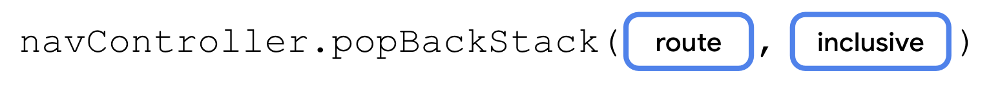

`popBackStack()` 方法有两个必需参数。

- **`route`**：此字符串表示您希望返回到的目标页面的路线。
- **`inclusive`：**这是一个布尔值，如果为 true，还会弹出（移除）指定路线。如果为 false，`popBackStack()` 将移除起始目标页面之上的所有目标页面，但不包含该起始目标页面，并仅留下该起始目标页面作为最顶层的屏幕显示给用户。

> **▸ 解说：`inclusive` 参数是关键。假设当前栈是 `[Start, Flavor, Pickup, Summary]`：**
> - `popBackStack("Start", inclusive = false)` → 弹出 Flavor、Pickup、Summary，留下 `[Start]`
> - `popBackStack("Start", inclusive = true)` → 弹出全部包括 Start，留下空栈（一般不这么做）
> - `popBackStack("Flavor", inclusive = false)` → 只弹出 Pickup 和 Summary，回到 `[Start, Flavor]`
>
> Cancel 按钮的意图是"取消订单回到首页"，所以用 `popBackStack("Start", inclusive = false)`。**

当用户在任何屏幕上点按 **Cancel** 按钮时，应用会重置视图模型中的状态并调用 `popBackStack()`。首先，您将实现一个方法来执行此操作，然后为包含 **Cancel** 按钮的所有三个屏幕的相应参数传入该方法。

1. 在 `CupcakeApp()` 函数后面，定义一个名称为 `cancelOrderAndNavigateToStart()` 的私有函数。

```kotlin
private fun cancelOrderAndNavigateToStart() {
    }
```

2. 添加两个参数：`OrderViewModel` 类型的 `viewModel` 和 `NavHostController` 类型的 `navController`。

```kotlin
private fun cancelOrderAndNavigateToStart(
        viewModel: OrderViewModel,
        navController: NavHostController
    ) {
    }
```

3. 在函数主体中，对 `viewModel` 调用 `resetOrder()`。

```kotlin
private fun cancelOrderAndNavigateToStart(
        viewModel: OrderViewModel,
        navController: NavHostController
    ) {
        viewModel.resetOrder()
    }
```

4. 对 `navController` 调用 `popBackStack()`，为 `route` 传入 `CupcakeScreen.Start.name`，并为 `inclusive` 传入 `false`。

```kotlin
private fun cancelOrderAndNavigateToStart(
        viewModel: OrderViewModel,
        navController: NavHostController
    ) {
        viewModel.resetOrder()
        navController.popBackStack(CupcakeScreen.Start.name, inclusive = false)
    }
```

> **▸ 解说：先 `resetOrder()` 清空 ViewModel 中的 quantity/flavor/date，再 `popBackStack()` 回到首页。这样回到 Start 页面后，状态是干净的——如果用户重新点"1 cupcake"，又是全新的订单流程。**

5. 在 `CupcakeApp()` 可组合项中，为两个 `SelectOptionScreen` 可组合项和 `OrderSummaryScreen` 可组合项的 `onCancelButtonClicked` 参数传入 `cancelOrderAndNavigateToStart`。

```kotlin
composable(route = CupcakeScreen.Start.name) {
        StartOrderScreen(
            quantityOptions = DataSource.quantityOptions,
            onNextButtonClicked = {
                viewModel.setQuantity(it)
                navController.navigate(CupcakeScreen.Flavor.name)
            },
            modifier = Modifier
                .fillMaxSize()
                .padding(dimensionResource(R.dimen.padding_medium))
        )
    }
    composable(route = CupcakeScreen.Flavor.name) {
        val context = LocalContext.current
        SelectOptionScreen(
            subtotal = uiState.price,
            onNextButtonClicked = { navController.navigate(CupcakeScreen.Pickup.name) },
            onCancelButtonClicked = {
                cancelOrderAndNavigateToStart(viewModel, navController)
            },
            options = DataSource.flavors.map { id -> context.resources.getString(id) },
            onSelectionChanged = { viewModel.setFlavor(it) },
            modifier = Modifier.fillMaxHeight()
        )
    }
    composable(route = CupcakeScreen.Pickup.name) {
        SelectOptionScreen(
            subtotal = uiState.price,
            onNextButtonClicked = { navController.navigate(CupcakeScreen.Summary.name) },
            onCancelButtonClicked = {
                cancelOrderAndNavigateToStart(viewModel, navController)
            },
            options = uiState.pickupOptions,
            onSelectionChanged = { viewModel.setDate(it) },
            modifier = Modifier.fillMaxHeight()
        )
    }
    composable(route = CupcakeScreen.Summary.name) {
        OrderSummaryScreen(
            orderUiState = uiState,
            onCancelButtonClicked = {
                cancelOrderAndNavigateToStart(viewModel, navController)
            },
            onSendButtonClicked = { subject: String, summary: String ->

            },
            modifier = Modifier.fillMaxHeight()
       )
    }
```

> **▸ 解说：这里给出了完整的 `NavHost` 代码。注意到 Flavor、Pickup、Summary 三个屏幕的 `onCancelButtonClicked` 都指向同一个函数。这就是"导航逻辑集中化"的好处——如果 Cancel 的行为需要改（比如不是回首页而是弹确认对话框），只改这一个函数就行。**

6. 运行应用，并测试点按任何屏幕上的 **Cancel** 按钮是否会返回第一个屏幕。

---

## 6. 导航到其他应用

到目前为止，您已经学习了如何导航到应用中的不同屏幕，以及如何返回主屏幕。在 Cupcake 应用中实现导航只剩最后一步了。在订单摘要屏幕上，用户可以将其订单发送到其他应用。此选项会打开一个 ShareSheet（覆盖屏幕底部部分的界面组件），其中会显示分享选项。

此部分界面不属于 Cupcake 应用。事实上，它是由 Android 操作系统提供的。您的 `navController` 不会调用系统界面（例如分享屏幕）。作为替代方案，您可以使用 intent。

intent 将请求系统执行某项操作，通常用于呈现新的 activity。有许多不同的 intent，建议您参阅相关文档，查看完整列表。不过，我们感兴趣的是 `ACTION_SEND`。您可以向此 intent 提供某些数据（例如字符串），并为这些数据提供适当的分享操作。

> **▸ 解说：这里明确区分了两种"跳转"：**
> - **应用内部跳转**（屏幕 A → 屏幕 B）→ 用 `navController.navigate()`
> - **跳到其他应用 / 系统界面** → 用 `Intent` + `startActivity()`
>
> `navController` 只管应用内部的 Composable 导航。ShareSheet 是 Android 系统提供的——它不是 Composable，更不在你的 NavGraph 里。**

设置 intent 的基本过程如下：

1. 创建一个 intent 对象并指定 intent，例如 `ACTION_SEND`。
2. 指定随 intent 一同发送的其他数据类型。对于简单的一段文本，您可以使用 `"text/plain"`，但也可以使用其他类型，例如 `"image/*"` 或 `"video/*"`。
3. 通过调用 `putExtra()` 方法，向 intent 传递任何其他数据，例如要分享的文本或图片。此 intent 将接受两个 extra：`EXTRA_SUBJECT` 和 `EXTRA_TEXT`。
4. 调用上下文的 `startActivity()` 方法，并传入从 intent 创建的 activity。

我们将向您介绍如何创建分享操作 intent，但对于其他类型的 intent，流程是相同的。在后续项目中，建议您参阅特定数据类型和所需 extra 的相关文档。

> **▸ 解说：这四个步骤是所有 Intent 的标准流程。`ACTION_SEND` + `"text/plain"` 组合告诉系统：**"我要发文本，谁能处理就出来接"**。系统会过滤出能处理 `text/plain` 的 App（微信、邮件、短信等），不相关的 App（比如相机）不会显示。**

如需创建 intent 以将纸杯蛋糕订单发送给其他应用，请完成以下步骤：

1. 在 **CupcakeScreen.kt** 中的 `CupcakeApp` 可组合项下方，创建一个名称为 `shareOrder()` 的私有函数。

```kotlin
private fun shareOrder()
```

2. 添加一个名称为 `context` 且类型为 `Context` 的参数。

```kotlin
import android.content.Context

    private fun shareOrder(context: Context) {
    }
```

3. 添加两个 `String` 参数：`subject` 和 `summary`。这些字符串将显示在分享操作工作表中。

```kotlin
private fun shareOrder(context: Context, subject: String, summary: String) {
    }
```

4. 在函数主体中，创建一个名称为 `intent` 的 intent，并将 `Intent.ACTION_SEND` 作为参数传递。

```kotlin
import android.content.Intent

    val intent = Intent(Intent.ACTION_SEND)
```

由于您只需配置此 `Intent` 对象一次，因此，您可以使用在之前的 Codelab 中学到的 `apply()` 函数，让接下来的几行代码更加简洁。

5. 对新创建的 intent 调用 `apply()` 并传入 lambda 表达式。

```kotlin
val intent = Intent(Intent.ACTION_SEND).apply {

    }
```

> **▸ 解说：`apply()` 是 Kotlin 的作用域函数——在 lambda 内直接访问对象的属性和方法，不需要重复写 `intent.` 前缀。三行都是 `intent.type = ...` / `intent.putExtra(...)`，用 `apply` 可以简写成 `type = ...` / `putExtra(...)`。**

6. 在 lambda 主体中，将类型设置为 `"text/plain"`。由于您是在传递到 `apply()` 的函数中执行此操作，因此无需引用对象的标识符 `intent`。

```kotlin
val intent = Intent(Intent.ACTION_SEND).apply {
        type = "text/plain"
    }
```

7. 调用 `putExtra()`，并传入 `EXTRA_SUBJECT` 的 subject。

```kotlin
val intent = Intent(Intent.ACTION_SEND).apply {
        type = "text/plain"
        putExtra(Intent.EXTRA_SUBJECT, subject)
    }
```

8. 调用 `putExtra()`，并传入 `EXTRA_TEXT` 的 summary。

```kotlin
val intent = Intent(Intent.ACTION_SEND).apply {
        type = "text/plain"
        putExtra(Intent.EXTRA_SUBJECT, subject)
        putExtra(Intent.EXTRA_TEXT, summary)
    }
```

9. 调用上下文的 `startActivity()` 方法。

```kotlin
context.startActivity(

    )
```

10. 在传入 `startActivity()` 的 lambda 中，通过调用类方法 `createChooser()` 从 intent 中创建一个 activity。为第一个参数和 `new_cupcake_order` 字符串资源传递 intent。

```kotlin
context.startActivity(
        Intent.createChooser(
            intent,
            context.getString(R.string.new_cupcake_order)
        )
    )
```

> **▸ 解说：`Intent.createChooser(intent, title)` 的作用是**强制弹出选择器**（ShareSheet），让用户选择分享目标。如果不用 `createChooser` 直接用 `startActivity(intent)`，结果取决于系统：**
> - 如果只有一个 App 能处理 → 直接打开那个 App
> - 如果有多个 → 弹出选择器（但用户可能之前勾了"始终"，就跳过了选择器）
>
> 用 `createChooser` 保证每次都让用户**主动选择**。第二个参数 `"New Cupcake Order"` 是选择器顶部的标题文字。**

11. 在 `CupcakeApp` 可组合项的 `CucpakeScreen.Summary.name` 的 `composable()` 调用中，获取对上下文对象的引用，以便将其传递给 `shareOrder()` 函数。

```kotlin
composable(route = CupcakeScreen.Summary.name) {
        val context = LocalContext.current

        ...
    }
```

12. 在 `onSendButtonClicked()` 的 lambda 主体中，调用 `shareOrder()`，并传入 `context`、`subject` 和 `summary` 作为参数。

```kotlin
onSendButtonClicked = { subject: String, summary: String ->
        shareOrder(context, subject = subject, summary = summary)
    }
```

13. 运行应用并在各个屏幕间导航。

点击 **Send Order to Other App** 时，您应当会看到底部动作条上的分享操作（例如 **Messaging** 和 **Bluetooth**）以及您以 extra 形式提供的主题和摘要。


> **▸ 解说：到这一步，应用的"正向流程"全部打通了：选择数量 → 选择口味 → 选择日期 → 查看摘要 → 分享订单。Cancel 按钮也能回到首页。现在还差最后一步：让应用栏的标题和返回按钮也跟着页面切换而变化。**

---

## 7. 让应用栏响应导航

尽管您的应用可以正常运行，并且可以在各个屏幕之间导航，但在此 Codelab 最开始的屏幕截图中仍缺少一些内容。应用栏无法自动响应导航。当应用导航至新路线时，不会更新标题，也不会适时在标题前显示向上按钮。

**注意**：系统返回按钮由 Android 操作系统提供，位于屏幕底部。


另一方面，向上按钮位于应用的 `AppBar` 中。


在您的应用上下文中，返回按钮和向上按钮的作用相同，都是返回上一个屏幕。

> **▸ 解说：Android 有两种"回去"的方式：**
> - **系统返回键**：屏幕底部导航栏的 ◁ 按钮（或手势），由系统自动处理，默认行为就是 `popBackStack()`
> - **应用栏向上按钮**：AppBar 左上角的 ← 箭头，需要我们自己实现
>
> 两者在功能上通常一样，但向上按钮是**应用内**的选择，需要显式编码。在 Start 屏幕（首页）上不应该显示向上按钮（因为没有"上一页"可回），这就是 `canNavigateBack` 要控制的事情。**

起始代码包含一个可组合项，用于管理名称为 `CupcakeAppBar` 的 `AppBar`。现在，您已经在应用中实现了导航，接下来可以使用返回堆栈中的信息来显示正确的标题，并适时显示向上按钮。`CupcakeAppBar` 可组合项应了解当前屏幕，以便标题进行相应更新。

1. 在 **CupcakeScreen.kt** 中的 `CupcakeScreen` 枚举中，使用 `@StringRes` 注解添加类型为 `Int` 且名为 `title` 的参数。

```kotlin
import androidx.annotation.StringRes

    enum class CupcakeScreen(@StringRes val title: Int) {
        Start,
        Flavor,
        Pickup,
        Summary
    }
```

2. 为每个枚举用例添加资源值，与各屏幕的标题文本相对应。将 `app_name` 用于 `Start` 屏幕，`choose_flavor` 用于 `Flavor` 屏幕，`choose_pickup_date` 用于 `Pickup` 屏幕，`order_summary` 用于 `Summary` 屏幕。

```kotlin
enum class CupcakeScreen(@StringRes val title: Int) {
        Start(title = R.string.app_name),
        Flavor(title = R.string.choose_flavor),
        Pickup(title = R.string.choose_pickup_date),
        Summary(title = R.string.order_summary)
    }
```

> **▸ 解说：`@StringRes` 是 Android 的注解，告诉编译器和 IDE：**"这个 `Int` 必须是 `R.string.xxx` 类型的字符串资源 ID"**。如果你传了一个普通数字，IDE 会显示警告。这是一种编译期的类型安全保障。**
>
> 每个枚举值现在关联了一个标题资源 ID——Start 用 `app_name`（应用名），其他屏幕用对应的标题。这样从"当前是哪条路线"就能推导出"顶部标题应该显示什么"。**

3. 将名为 `currentScreen` 且类型为 `CupcakeScreen` 的参数添加到 `CupcakeAppBar` 可组合函数中。

```kotlin
@Composable
fun CupcakeAppBar(
        currentScreen: CupcakeScreen,
        canNavigateBack: Boolean,
        navigateUp: () -> Unit = {},
        modifier: Modifier = Modifier
    )
```

4. 在 `CupcakeAppBar` 内，将硬编码应用名称替换为当前屏幕的标题，具体方法为将 `currentScreen.title` 传递给对 `TopAppBar` 标题参数的 `stringResource()` 的调用。

```kotlin
TopAppBar(
        title = { Text(stringResource(currentScreen.title)) },
        modifier = modifier,
        navigationIcon = {
            if (canNavigateBack) {
                IconButton(onClick = navigateUp) {
                    Icon(
                        imageVector = Icons.Filled.ArrowBack,
                        contentDescription = stringResource(R.string.back_button)
                    )
                }
            }
        }
    )
```

> **▸ 解说：`CupcakeAppBar` 的三个新参数：**
> - `currentScreen` → 决定顶栏标题（`stringResource(currentScreen.title)`）
> - `canNavigateBack` → 决定是否显示返回箭头（只有非首页才显示）
> - `navigateUp` → 点击返回箭头时做什么（调用 `navController.navigateUp()`）
>
> `navigationIcon` 的花括号里用 `if (canNavigateBack)` 控制显示——Start 页不显示箭头，其他页显示。**

仅当返回堆栈上有可组合项时才应显示向上按钮。如果应用在返回堆栈上没有任何屏幕（显示 `StartOrderScreen`），则不应显示向上按钮。如需检查这一点，您需要建立对返回堆栈的引用。

1. 在 `CupcakeApp` 可组合项中的 `navController` 变量下方，创建一个名称为 `backStackEntry` 的变量，并使用 `by` 委托调用 `navController` 的 `currentBackStackEntryAsState()` 方法。

```kotlin
import androidx.navigation.compose.currentBackStackEntryAsState

    @Composable
    fun CupcakeApp(
        viewModel: OrderViewModel = viewModel(),
        navController: NavHostController = rememberNavController()
    ){

        val backStackEntry by navController.currentBackStackEntryAsState()

        ...
    }
```

> **▸ 解说：`currentBackStackEntryAsState()` 返回一个 Compose `State` 对象。因为它被声明为 `by` 委托，所以当返回堆栈变化时，读取 `backStackEntry` 的代码所在的 Composable 会自动重组。这就是响应式导航监听的核心机制。**
>
> `backStackEntry` 包含了当前屏幕的信息，其中 `backStackEntry.destination.route` 就是路线字符串（`"Start"`, `"Flavor"` 等）。**

2. 将当前屏幕的标题转换为 `CupcakeScreen` 的值。在 `backStackEntry` 变量下方，使用名为 `currentScreen` 的 `val` 创建一个变量，并将其设为等于 `CupcakeScreen` 的 `valueOf()` 类函数调用的结果，然后传入 `backStackEntry` 的目标页面的路线。使用 elvis 运算符提供 `CupcakeScreen.Start.name` 的默认值。

```kotlin
val currentScreen = CupcakeScreen.valueOf(
        backStackEntry?.destination?.route ?: CupcakeScreen.Start.name
    )
```

> **▸ 解说：这行代码做了三件事：**
> 1. `backStackEntry?.destination?.route` — 安全调用链，获取当前路线的字符串
> 2. `?: CupcakeScreen.Start.name` — 如果为 null（极少见），默认取 Start
> 3. `CupcakeScreen.valueOf("Flavor")` — 把字符串 `"Flavor"` 转成枚举 `CupcakeScreen.Flavor`，从而拿到对应的 `title`
>
> `valueOf()` 是 Kotlin 枚举的静态方法，类似 Java 的 `Enum.valueOf()`。如果传入的字符串不匹配任何枚举值，会抛 `IllegalArgumentException`。**

3. 将 `currentScreen` 变量传递给 `CupcakeAppBar` 可组合项的同名参数。

```kotlin
CupcakeAppBar(
        currentScreen = currentScreen,
        canNavigateBack = false,
        navigateUp = {}
    )
```

只要返回堆栈中的当前屏幕后面还有屏幕，系统就会显示向上按钮。您可以使用布尔表达式来确定是否应显示向上按钮：

1. 对于 `canNavigateBack` 参数，请传入一个布尔表达式，用于检查 `navController` 的 `previousBackStackEntry` 属性是否不等于 null。

```kotlin
canNavigateBack = navController.previousBackStackEntry != null,
```

2. 如需实际返回上一个屏幕，请调用 `navController` 的 `navigateUp()` 方法。

```kotlin
navigateUp = { navController.navigateUp() }
```

> **▸ 解说：`navigateUp()` 和 `popBackStack()` 的区别：**
> - `navigateUp()` — 返回上一页（弹出一个），不需要指定路线
> - `popBackStack(route, inclusive)` — 返回到特定路线（可能弹出多个）
>
> 向上按钮用 `navigateUp()` 更语义化："回到上一层"。Cancel 按钮用 `popBackStack("Start", ...)` 因为要"一步回到首页"。**

3. 运行应用。

请注意，`AppBar` 标题现已更新以反映当前屏幕。当您导航到 `StartOrderScreen` 以外的界面时，其中应当会显示向上按钮，点按该按钮可返回到上一个界面。


> **▸ 解说：回顾整个响应式应用栏的流程：**
>
> ```
> 用户点击 Next
>   → navController.navigate("Flavor")
>   → 返回堆栈更新
>   → currentBackStackEntryAsState 发出新值
>   → Compose 触发重组
>   → currentScreen = CupcakeScreen.valueOf("Flavor") = CupcakeScreen.Flavor
>   → CupcakeAppBar 标题变成 "Choose Flavor"
>   → canNavigateBack = (previousBackStackEntry != null) = true → 显示箭头
>   → NavHost 也响应路线变化，显示 SelectOptionScreen 可组合项
> ```
>
> 整条链路是**纯响应式**的——不需要手动 `setTitle()` 或 `showBackButton()`，全部由状态驱动。

---

## 8. 获取解决方案代码

如需下载完成后的 Codelab 代码，您可以使用以下 Git 命令：

```bash
git clone https://github.com/google-developer-training/basic-android-kotlin-compose-training-cupcake.git
cd basic-android-kotlin-compose-training-cupcake
git checkout navigation
```

或者，您也可以下载 ZIP 文件形式的代码库，将其解压缩并在 Android Studio 中打开。

[下载 ZIP 文件](https://github.com/google-developer-training/basic-android-kotlin-compose-training-cupcake/archive/refs/heads/navigation.zip)

**注意：**解决方案代码位于所下载代码库的 `navigation` 分支中。

如果您想查看此 Codelab 的解决方案代码，请前往 [GitHub](https://github.com/google-developer-training/basic-android-kotlin-compose-training-cupcake/tree/navigation) 查看。

> **▸ 解说：对比学习法：**
> ```bash
> # 查看你一步步修改后和官方解决方案的差异
> git diff starter..navigation
> ```
> 重点关注 `CupcakeScreen.kt`（NavHost + 应用栏 + 导航逻辑），这是改动最大的文件。**

---

## 9. 总结

恭喜！您已经使用 Jetpack Navigation 组件从简单的单屏幕应用转变为复杂的多屏幕应用，支持在多个屏幕之间切换。您定义了路线，在 NavHost 中处理了路线，并使用函数类型参数将导航逻辑与各个屏幕相隔离。您还学习了如何使用 intent 将数据发送到其他应用，以及如何自定义应用栏以响应导航。在接下来的几个单元中，您将学习开发其他复杂程度不断增加的多屏幕应用，并继续运用这些技能。

### 了解详情

- [使用 Compose 进行导航](https://developer.android.com/jetpack/compose/navigation?hl=zh-cn)
- [导航原则](https://developer.android.com/guide/navigation/navigation-principles?hl=zh-cn)
- [Jetpack Compose Navigation](https://developer.android.com/codelabs/jetpack-compose-navigation?hl=zh-cn#0)
- [导航类型](https://material.io/design/navigation/understanding-navigation.html)

---

> **▸ 最终总结：**
>
> 本 Codelab 的五个核心知识点及它们之间的关系：
>
> ```
>                  ┌────────────────────────────────────┐
>                  │           CupcakeApp.kt            │
>                  │                                    │
>                  │  rememberNavController()  ← 总控   │
>                  │         │                          │
>                  │    ┌────┴────┐                     │
>                  │    │Scaffold  │                    │
>                  │    │ ┌──────┐ │                    │
>                  │    │ │AppBar│ │ ← 自适应标题+箭头  │
>                  │    │ └──────┘ │                    │
>                  │    │ ┌──────┐ │                    │
>                  │    │ │NavHost│ │ ← 路线→屏幕映射   │
>                  │    │ │      │ │                    │
>                  │    │ │ comp. │ │ ← 导航逻辑集中    │
>                  │    │ │ comp. │ │    (函数类型参数)  │
>                  │    │ │ comp. │ │                    │
>                  │    │ │ comp. │ │                    │
>                  │    │ └──────┘ │                    │
>                  │    └──────────┘                    │
>                  │                                    │
>                  │  shareOrder()  ← Intent 跨应用     │
>                  │  cancelOrder() ← popBackStack      │
>                  └────────────────────────────────────┘
> ```
>
> **关键设计原则回顾：**
>
> | 原则 | 实现方式 |
> |---|---|
> | 路线类型安全 | `enum class CupcakeScreen` 而非硬编码字符串 |
> | 导航逻辑隔离 | 屏幕暴露函数类型参数，导航实现在 NavHost 的 composable 中 |
> | 数据持久化 | ViewModel 跨屏幕共享，生命周期长于单个屏幕 |
> | 组件复用 | `SelectOptionScreen` 通过不同 `options` 参数服务两个屏幕 |
> | 响应式 UI | `currentBackStackEntryAsState()` 自动触发重组 |

---

## 附录：全部图片索引

| 图片 | 说明 |
|---|---|
|  | Settings 应用多页示例 1 |
|  | Settings 应用多页示例 2 |
|  | Settings 应用多页示例 3 |
|  | Start Order 屏幕 |
|  | Start Order 屏幕（代码高亮） |
|  | Choose Flavor 屏幕 |
|  | Choose Flavor 屏幕（选项） |
|  | Choose Pickup Date 屏幕 |
|  | Order Summary 屏幕 |
|  | Order Summary 屏幕（详情） |
|  | ShareSheet 分享对话框 |
|  | NavHost 语法图 |
|  | composable() 语法图 |
|  | Pair 类型图 |
|  | navigate() 语法图 |
|  | popBackStack() 语法图 |
|  | 系统返回按钮示意 |
|  | 返回按钮图标 |
|  | 向上按钮示例 |
|  | 完整导航效果动画 |
