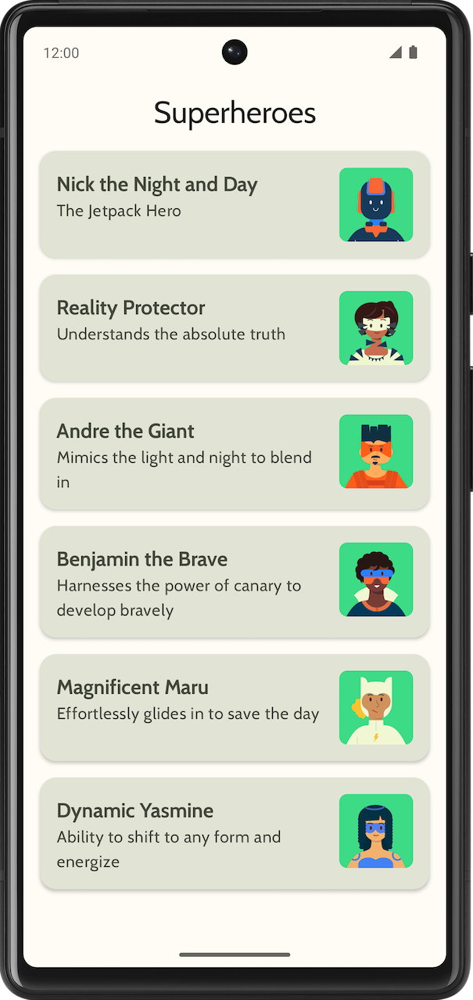
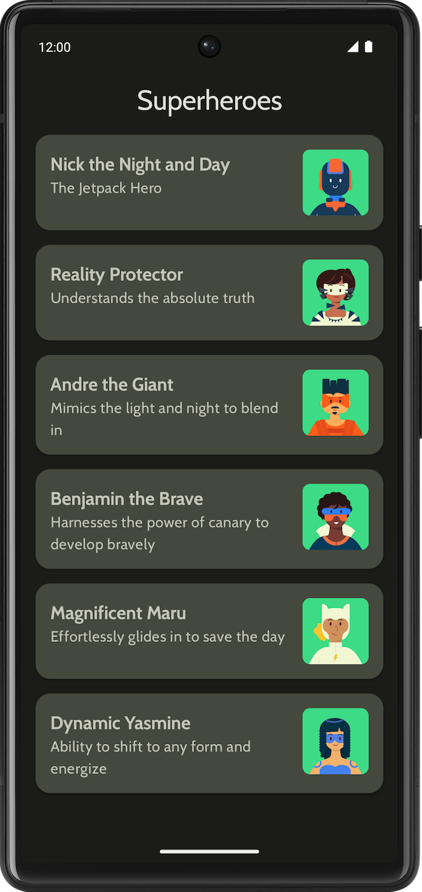
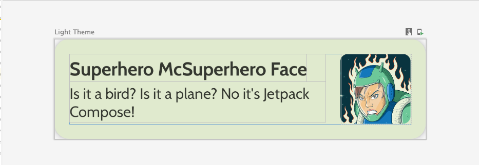
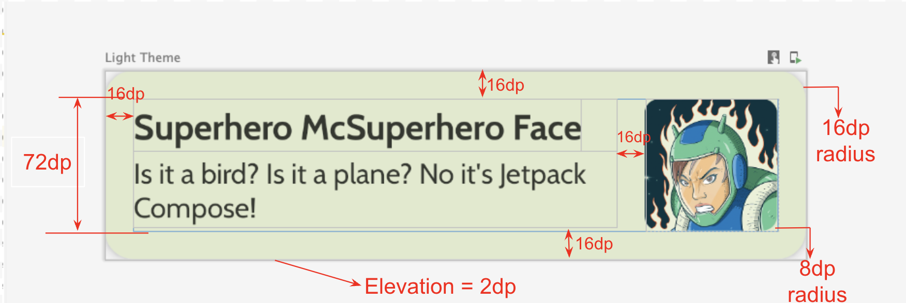
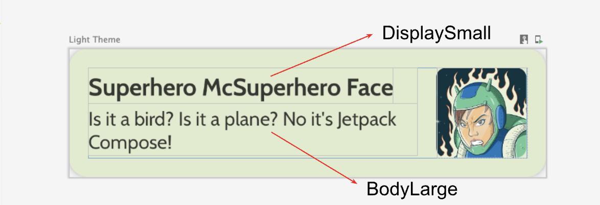
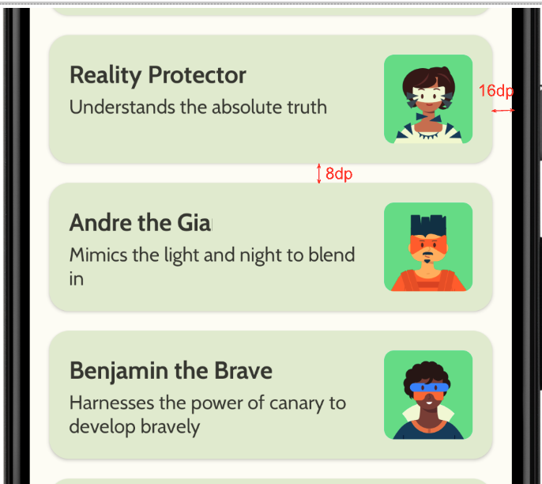
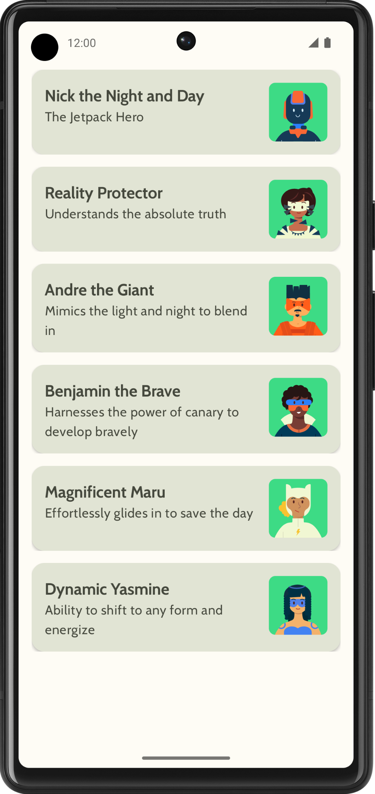
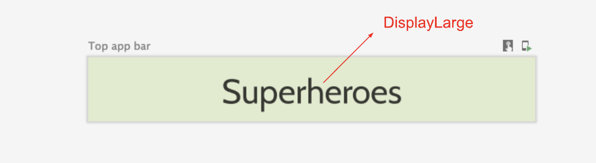

# Lab8：构建超级英雄列表应用

## 实验背景

本次实验基于 综合运用 Kotlin 数据类、资源管理、静态数据源、Compose 可滚动列表、Material 3 主题、顶部应用栏和状态栏适配等知识，构建一款 Superheroes 应用。

应用的核心界面是一个可滚动的超级英雄列表。每个列表项展示英雄名称、英雄说明和对应图片；应用整体需要使用自定义颜色、字体和形状，使界面不再停留在默认模板样式。

本实验更偏向综合实践。官方页面提供了最终效果和部分规格，你需要根据这些规格独立完成项目结构、数据源、主题和界面实现。

---

## 前提条件

- 已完成前面的 Compose 基础布局、可滚动列表和 Material 主题相关实验
- 已安装 Android Studio，能够创建并运行 Empty Activity 项目
- 熟悉 `data class`、`object`、`List` 和资源 ID 的基本用法
- 熟悉 `Card`、`Row`、`Column`、`Image`、`LazyColumn`、`Scaffold` 等 Compose 组件
- 了解 Material 3 中颜色、字体、形状、浅色模式和深色模式的配置方式

---

## 实验目标

完成本实验后，你应能够：

- 使用数据类描述应用中的列表项数据
- 使用 Repository 或 DataSource 集中管理静态数据
- 使用字符串资源和图片资源组织英雄名称、说明和头像
- 使用 `LazyColumn` 构建可滚动列表
- 使用 `Card`、`Row`、`Box`、`Image` 等组件实现规范化列表项
- 自定义 Material 3 颜色、排版和形状
- 使用 `Scaffold` 和顶部应用栏构建完整应用结构
- 处理状态栏与导航栏颜色，使应用视觉更完整
- 编写实验报告说明数据结构、列表实现和主题配置思路

---

## 所需资源

本目录中的图片仅用于说明实验要求，不需要放入学生项目。

| 资源 | 用途 |
|------|------|
| `images/superheroes_final_light.png` | 官方最终浅色主题效果图 |
| `images/superheroes_final_dark.png` | 官方最终深色主题效果图 |
| `images/hero_list_item_sample.png` | 单个英雄列表项效果示例 |
| `images/hero_item_layout_spec.png` | 英雄列表项布局规格图 |
| `images/hero_item_typography_spec.png` | 英雄列表项文字与尺寸规格图 |
| `images/heroes_list_padding_spec.png` | 英雄列表整体间距规格图 |
| `images/superheroes_without_top_bar.png` | 未添加顶部应用栏时的列表效果 |
| `images/top_app_bar_spec.png` | 顶部应用栏规格图 |

本目录还提供了可复制到 Android 项目中的官方素材：

| 资源 | 目标目录 | 说明 |
|------|----------|------|
| `drawable/android_superhero1.xml` 到 `drawable/android_superhero6.xml` | `app/src/main/res/drawable/` | 6 个超级英雄图片资源 |
| `drawable/ic_launcher_background.xml`、`drawable/ic_launcher_foreground.xml` | `app/src/main/res/drawable/` | 应用启动图标相关资源 |
| `fonts/Cabin-Regular.ttf`、`fonts/Cabin-Bold.ttf` | `app/src/main/res/font/` | Cabin 字体文件，复制后请改名为小写下划线格式 |

**`material_theming_reference/` 和 `woof_animation_reference/` 两个文件夹用作参考资料，不是实验提交内容。**

---

## 最终效果参考

最终应用应同时适配浅色主题和深色主题，界面效果如下：



> *图 1. Superheroes App 浅色主题最终效果。*



> *图 2. Superheroes App 深色主题最终效果。*

---

## 实验任务

### 任务一：创建项目

使用 **Empty Activity** 模板新建 Android 项目，最低 SDK 版本设为 **24**。

建议项目名称使用：

```text
Superheroes
```

---

### 任务二：准备图片与字体资源

#### 目标

将应用需要的图片、图标和字体资源放入正确目录。

#### 图片资源

将超级英雄图片放入：

```text
app/src/main/res/drawable/
```

图片文件命名建议与官方资源保持一致：

```text
android_superhero1.xml
android_superhero2.xml
android_superhero3.xml
android_superhero4.xml
android_superhero5.xml
android_superhero6.xml
```

#### 字体资源

使用本目录 `fonts/` 中提供的 **Cabin Regular** 和 **Cabin Bold** 字体文件，复制到：

```text
app/src/main/res/font/
```

复制到 Android 资源目录后，推荐改名为：

```text
cabin_regular.ttf
cabin_bold.ttf
```

#### 注意

- Android 资源文件名必须使用小写英文、数字和下划线
- 图片资源不要放入 `mipmap`，普通界面图片应放入 `drawable`
- 字体文件名不要包含空格或大写字母

---

### 任务三：创建 Hero 数据类

#### 目标

使用数据类描述单个超级英雄列表项。

#### 要求

在 `model/Hero.kt` 中创建 `Hero` 数据类：

```kotlin
data class Hero(
    @StringRes val nameRes: Int,
    @StringRes val descriptionRes: Int,
    @DrawableRes val imageRes: Int
)
```

#### 字段说明

| 字段 | 类型 | 说明 |
|------|------|------|
| `nameRes` | `@StringRes Int` | 英雄名称字符串资源 ID |
| `descriptionRes` | `@StringRes Int` | 英雄说明字符串资源 ID |
| `imageRes` | `@DrawableRes Int` | 英雄图片资源 ID |

#### 提示

`@StringRes` 和 `@DrawableRes` 是资源类型注解，可以帮助开发者避免将错误类型的资源 ID 传入字段。

---

### 任务四：创建英雄数据源

#### 目标

集中管理应用需要展示的全部英雄数据。

#### 要求

在 `model/HeroesRepository.kt` 或 `data/HeroesRepository.kt` 中创建 `object`：

```kotlin
object HeroesRepository {
    val heroes = listOf(
        Hero(
            nameRes = R.string.hero1,
            descriptionRes = R.string.description1,
            imageRes = R.drawable.android_superhero1
        ),
        Hero(
            nameRes = R.string.hero2,
            descriptionRes = R.string.description2,
            imageRes = R.drawable.android_superhero2
        ),
        Hero(
            nameRes = R.string.hero3,
            descriptionRes = R.string.description3,
            imageRes = R.drawable.android_superhero3
        ),
        Hero(
            nameRes = R.string.hero4,
            descriptionRes = R.string.description4,
            imageRes = R.drawable.android_superhero4
        ),
        Hero(
            nameRes = R.string.hero5,
            descriptionRes = R.string.description5,
            imageRes = R.drawable.android_superhero5
        ),
        Hero(
            nameRes = R.string.hero6,
            descriptionRes = R.string.description6,
            imageRes = R.drawable.android_superhero6
        )
    )
}
```

#### 字符串资源

将以下内容添加到 `app/src/main/res/values/strings.xml`：

```xml
<string name="app_name">Superheroes</string>
<string name="hero1">Nick the Night and Day</string>
<string name="description1">The Jetpack Hero</string>
<string name="hero2">Reality Protector</string>
<string name="description2">Understands the absolute truth</string>
<string name="hero3">Andre the Giant</string>
<string name="description3">Mimics the light and night to blend in</string>
<string name="hero4">Benjamin the Brave</string>
<string name="description4">Harnesses the power of canary to develop bravely</string>
<string name="hero5">Magnificent Maru</string>
<string name="description5">Effortlessly glides in to save the day</string>
<string name="hero6">Dynamic Yasmine</string>
<string name="description6">Ability to shift to any form and energize</string>
```

---

### 任务五：自定义 Material 主题

#### 目标

为应用配置自定义颜色、形状和字体，使浅色模式和深色模式都有一致的视觉风格。

#### 颜色

在 `ui/theme/Color.kt` 中定义浅色和深色主题所需颜色。可以使用官方示例配色，也可以使用 Material Theme Builder 生成新的配色方案。

#### 形状

在 `ui/theme/Shape.kt` 中定义卡片和组件圆角，例如：

```kotlin
val Shapes = Shapes(
    small = RoundedCornerShape(8.dp),
    medium = RoundedCornerShape(16.dp),
    large = RoundedCornerShape(16.dp)
)
```

#### 排版

在 `ui/theme/Type.kt` 中使用 Cabin 字体：

```kotlin
val Cabin = FontFamily(
    Font(R.font.cabin_regular, FontWeight.Normal),
    Font(R.font.cabin_bold, FontWeight.Bold)
)
```

至少配置以下文字样式：

| 样式 | 用途建议 |
|------|----------|
| `displayLarge` | 顶部应用栏标题 |
| `displayMedium` | 英雄名称或较大标题 |
| `displaySmall` | 英雄名称 |
| `bodyLarge` | 英雄说明文字 |

#### 主题

在 `Theme.kt` 中将自定义颜色、排版和形状应用到 `MaterialTheme`：

```kotlin
MaterialTheme(
    colorScheme = colorScheme,
    typography = Typography,
    shapes = Shapes,
    content = content
)
```

---

### 任务六：实现英雄列表项

#### 目标

创建一个可组合函数，用于展示单个英雄卡片。

#### 最终效果

单个英雄列表项应类似下图：



> *图 3. 英雄列表项展示名称、说明和图片。*

#### 建议函数结构

```kotlin
@Composable
fun HeroItem(
    hero: Hero,
    modifier: Modifier = Modifier
) {
    Card(modifier = modifier) {
        Row {
            Column {
                Text(text = stringResource(hero.nameRes))
                Text(text = stringResource(hero.descriptionRes))
            }
            Image(
                painter = painterResource(hero.imageRes),
                contentDescription = null
            )
        }
    }
}
```

#### 布局规格



> *图 4. 英雄列表项中图片、文字和卡片的布局规格。*



> *图 5. 英雄列表项中的文字层级和尺寸规格。*

#### UI 规格汇总

| 元素 | 规格 |
|------|------|
| 卡片形状 | 使用 Material 主题中的中等圆角 |
| 列表项内容高度 | 约 72 dp |
| 内容内边距 | 16 dp |
| 图片容器 | 72 dp 正方形 |
| 图片圆角 | 8 dp |
| 图片和文字间距 | 16 dp |
| 英雄名称 | `MaterialTheme.typography.displaySmall` |
| 英雄说明 | `MaterialTheme.typography.bodyLarge` |

#### 提示

- 使用 `Row` 让文字和图片水平排列
- 使用 `Column` 让英雄名称和说明垂直排列
- 使用 `Modifier.clip()` 裁剪图片圆角
- 使用 `ContentScale.Crop` 让图片填满指定区域

---

### 任务七：实现英雄列表

#### 目标

使用 `LazyColumn` 展示全部英雄数据。

#### 要求

创建 `HeroesScreen.kt`，在其中实现列表界面：

```kotlin
@Composable
fun HeroesList(
    heroes: List<Hero>,
    modifier: Modifier = Modifier
) {
    LazyColumn(
        modifier = modifier,
        contentPadding = PaddingValues(16.dp),
        verticalArrangement = Arrangement.spacedBy(8.dp)
    ) {
        items(heroes) { hero ->
            HeroItem(hero = hero)
        }
    }
}
```

#### 间距规格



> *图 6. 英雄列表整体内边距和列表项之间的间距规格。*

完成列表后，未添加顶部应用栏时的界面可参考下图：



> *图 7. 仅完成列表时的 Superheroes App 效果。*

---

### 任务八：添加顶部应用栏

#### 目标

使用 `Scaffold` 为应用添加顶部应用栏，使界面结构更完整。

#### 顶部栏规格



> *图 8. 顶部应用栏标题居中显示，并使用较高的文字层级。*

#### 要求

- 顶部应用栏显示应用名称 `Superheroes`
- 标题在水平和垂直方向居中
- 标题样式建议使用 `MaterialTheme.typography.displayLarge`
- 使用 `Scaffold` 将顶部栏和内容列表组合起来
- 将 `Scaffold` 提供的 `innerPadding` 传给内容区域，避免内容被顶部栏遮挡

#### 示例结构

```kotlin
Scaffold(
    topBar = {
        TopAppBar()
    }
) { innerPadding ->
    HeroesList(
        heroes = HeroesRepository.heroes,
        modifier = Modifier.padding(innerPadding)
    )
}
```

---

### 任务九：适配状态栏和导航栏

#### 目标

让系统状态栏、导航栏与应用背景更协调，避免最终界面出现突兀的系统栏颜色。

#### 要求

在 `Theme.kt` 中处理 edge-to-edge 显示：

- 使用 `WindowCompat.setDecorFitsSystemWindows(window, false)` 配置无边框显示
- 将状态栏颜色设置为透明或与背景协调的颜色
- 根据浅色/深色主题设置系统栏图标颜色
- 在 `SuperheroesTheme()` 的 `SideEffect` 中调用状态栏设置逻辑

#### 提示

如果暂时无法完全实现 edge-to-edge，也至少应确保：

- 浅色模式下状态栏文字清晰可见
- 深色模式下状态栏文字清晰可见
- 顶部应用栏与状态栏之间没有明显色块断层

---

### 任务十：运行并验证

在模拟器或真机上运行应用，检查以下内容：

- 6 个英雄是否全部显示
- 列表是否可以正常滚动
- 英雄名称、说明和图片是否对应正确
- 图片是否被正确裁剪为圆角
- 列表项间距和整体内边距是否合理
- 顶部应用栏是否显示应用名称并居中
- 浅色和深色模式下文字是否清晰
- 状态栏和导航栏颜色是否与应用协调

截图请使用 Android Studio 或模拟器内置截图功能，**严禁使用手机拍屏幕**。

---

## 代码结构参考

```text
app/
└── src/
    └── main/
        ├── java/com/example/superheroes/
        │   ├── MainActivity.kt              # 应用入口，组合 Scaffold 和列表
        │   ├── HeroesScreen.kt              # 英雄列表和列表项组合项
        │   ├── model/
        │   │   ├── Hero.kt                  # 英雄数据类
        │   │   └── HeroesRepository.kt      # 英雄静态数据源
        │   └── ui/theme/
        │       ├── Color.kt                 # 自定义颜色
        │       ├── Shape.kt                 # 自定义形状
        │       ├── Theme.kt                 # Material 主题和系统栏处理
        │       └── Type.kt                  # Cabin 字体与文字样式
        └── res/
            ├── drawable/
            │   ├── android_superhero1.xml
            │   ├── android_superhero2.xml
            │   ├── ...
            │   └── android_superhero6.xml
            ├── font/
            │   ├── cabin_regular.ttf
            │   └── cabin_bold.ttf
            └── values/
                └── strings.xml              # 应用名称、英雄名称和说明
```

---

## 提示

- 先完成 `HeroItem`，确认单个卡片显示正确，再接入 `LazyColumn`
- 数据类和数据源不要全部写在 `MainActivity.kt` 中
- 图片应使用固定尺寸或 `Box` 容器控制，不要让原始图片尺寸直接撑开布局
- `LazyColumn` 的 `contentPadding` 控制列表四周留白，`Arrangement.spacedBy` 控制相邻卡片间距
- 使用 `stringResource()` 读取字符串资源，使用 `painterResource()` 读取图片资源
- 自定义主题时，优先保证文字可读性，再调整颜色风格
- 浅色和深色模式都需要截图检查

---

## 提交要求

在自己的文件夹下新建 `Lab8/` 目录，提交以下文件：

```text
学号姓名/
└── Lab8/
    ├── MainActivity.kt             # 主界面入口
    ├── HeroesScreen.kt             # 列表和列表项组合项
    ├── Hero.kt                     # 数据类源码
    ├── HeroesRepository.kt         # 数据源源码
    ├── screenshot_light.png        # 浅色主题运行截图
    ├── screenshot_dark.png         # 深色主题运行截图
    └── report.md                   # 实验报告
```

`report.md` 需包含：

1. 应用整体结构说明
2. `Hero` 数据类字段设计与理由
3. `HeroesRepository` 数据源组织方式
4. 英雄列表项布局实现思路
5. `LazyColumn` 列表实现和间距配置说明
6. Material 主题配置说明，包括颜色、字体和形状
7. 顶部应用栏和状态栏处理说明
8. 遇到的问题与解决过程

---

## 验收标准

满足以下条件可视为完成实验：

- 应用可正常运行，界面无崩溃
- 展示全部 6 个超级英雄
- 每个列表项正确显示英雄名称、说明和图片
- 使用 `Hero` 数据类和 `HeroesRepository` 管理数据
- 使用 `LazyColumn` 实现可滚动列表
- 单个列表项布局与规格基本一致，包括圆角、图片尺寸、文字层级和间距
- 应用具有自定义 Material 主题，不是默认模板样式
- Cabin 字体正确应用到排版中
- 顶部应用栏显示正确，标题居中
- 浅色和深色模式均可正常阅读
- 报告中能清晰说明数据结构、列表实现和主题设计

---

## 截止时间

**2026-05-11**，届时关于 Lab8 的 PR 请求将不会被合并。

---
