# 使用 Jetpack Compose 实现 Material 主题设置

本教程整理自 Android Developers Codelab：Material Theming with Jetpack Compose。目标是基于起始版 **Woof** 应用，逐步加入 Material 3 的颜色、形状、排版、深色主题、动态配色和顶部应用栏。

> 本地图片已下载到 `images/` 目录，文中图片均使用相对路径引用。

---

## 1. 准备工作

Material Design 是 Google 提供的设计体系，用于帮助应用在不同平台上保持清晰、一致、可读且有吸引力的界面体验。本教程会围绕以下主题展开：

- 为 Compose 应用应用 Material 主题。
- 添加自定义浅色和深色配色方案。
- 添加自定义字体。
- 为图片和列表项设置自定义形状。
- 使用 `Scaffold` 和顶部应用栏组织页面。

### 前提条件

- 熟悉 Kotlin 基础语法。
- 能够使用 Compose 构建 `Row`、`Column` 和带内边距的布局。
- 能够使用 `LazyColumn` 创建简单列表。
- 已安装最新版 Android Studio。
- 需要联网下载起始代码和字体资源。

### 构建内容

你将把一个基础狗狗列表应用改造成遵循 Material Design 风格的 **Woof** 应用。

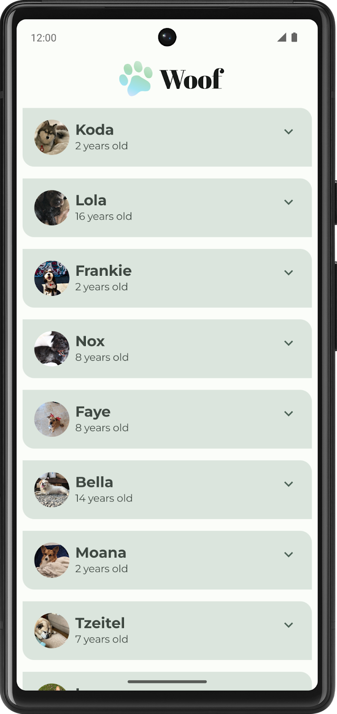

---

## 2. 应用概览

Woof 应用展示狗狗列表。每个列表项包含狗狗照片、名字和年龄。完成主题设置后，应用将拥有更完整的品牌视觉：自定义配色、卡片形状、圆形图片、自定义字体和顶部应用栏。

### 浅色与深色配色

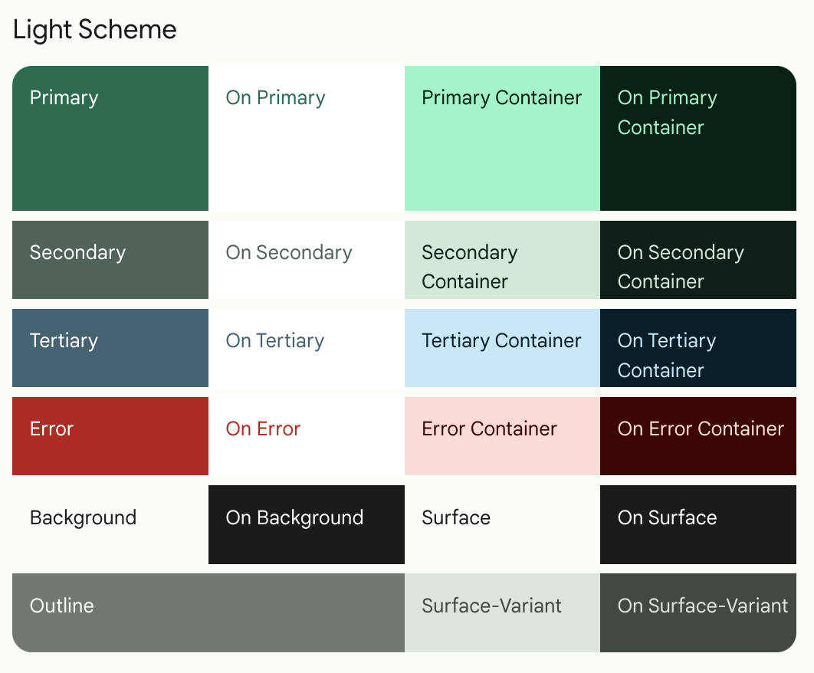

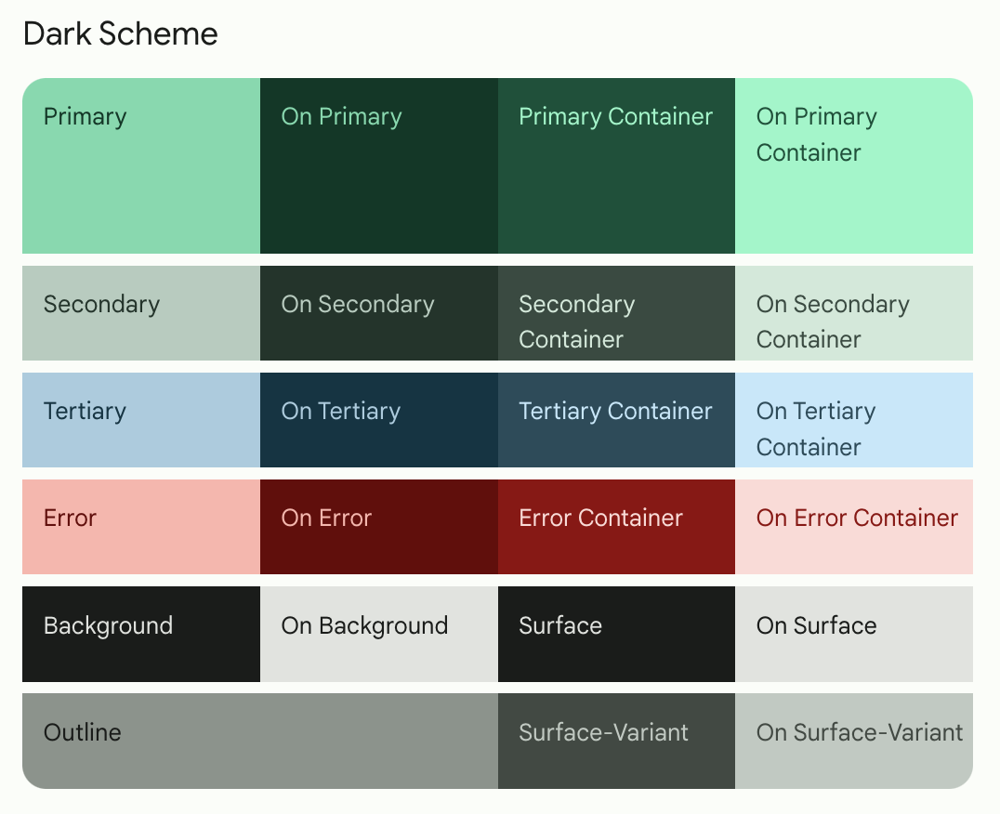

最终应用需要同时支持浅色主题和深色主题：

| 浅色主题 | 深色主题 |
|----------|----------|
|  |  |

### 排版目标

应用会使用 Abril Fatface 和 Montserrat 字体，为标题、狗狗名字和正文建立不同层级。

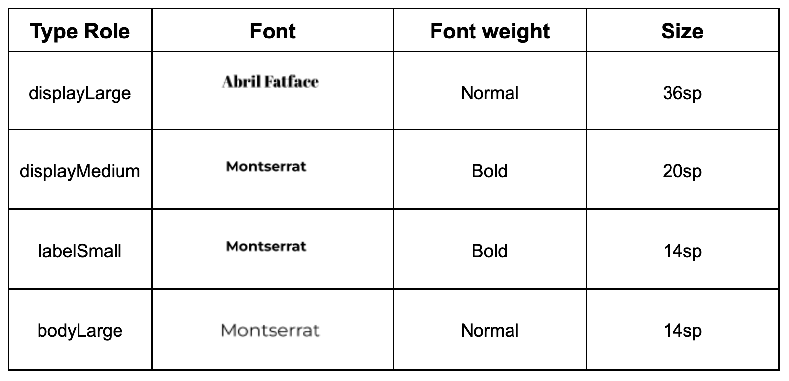

---

## 3. 获取起始代码

下载起始代码：

```bash
git clone https://github.com/google-developer-training/basic-android-kotlin-compose-training-woof.git
cd basic-android-kotlin-compose-training-woof
git checkout starter
```

也可以下载官方 starter 分支 ZIP：

```text
https://github.com/google-developer-training/basic-android-kotlin-compose-training-woof/archive/refs/heads/starter.zip
```

### 查看起始代码

打开项目后，重点查看这些文件：

- `data/Dog.kt`：定义 `Dog` 数据类和狗狗列表数据。
- `res/drawable/`：包含狗狗图片、应用图标等资源。
- `res/values/strings.xml`：包含应用名称、狗狗名称和说明文字。
- `MainActivity.kt`：包含 `WoofApp()`、`DogItem()`、`DogIcon()`、`DogInformation()` 和 `WoofPreview()`。

起始应用可以运行，但视觉还比较基础：

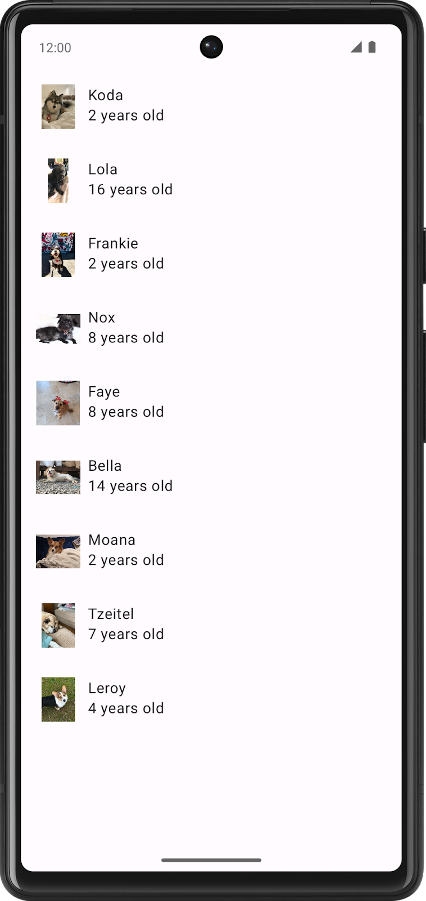

---

## 4. 添加颜色

Material 主题通过颜色槽管理应用颜色。颜色通常使用十六进制值表示，例如 `#006C4C`。

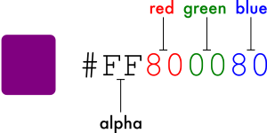

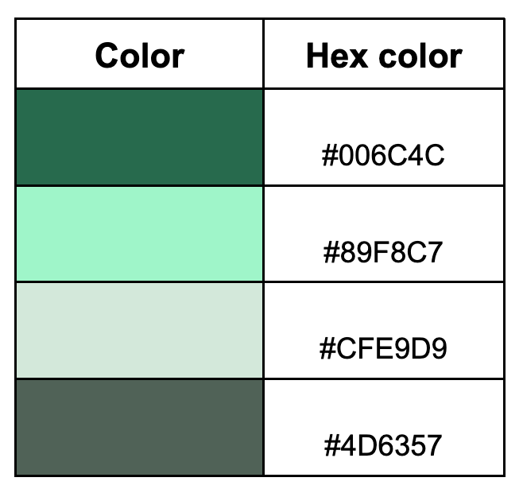

### 使用 Material Theme Builder

1. 打开 Material Theme Builder：`https://m3.material.io/theme-builder#/custom`
2. 在左侧选择 **Core Colors** 中的 **Primary**。
3. 在 HCT 颜色选择器中输入主色：`#006C4C`。
4. 向下查看生成的浅色和深色配色。

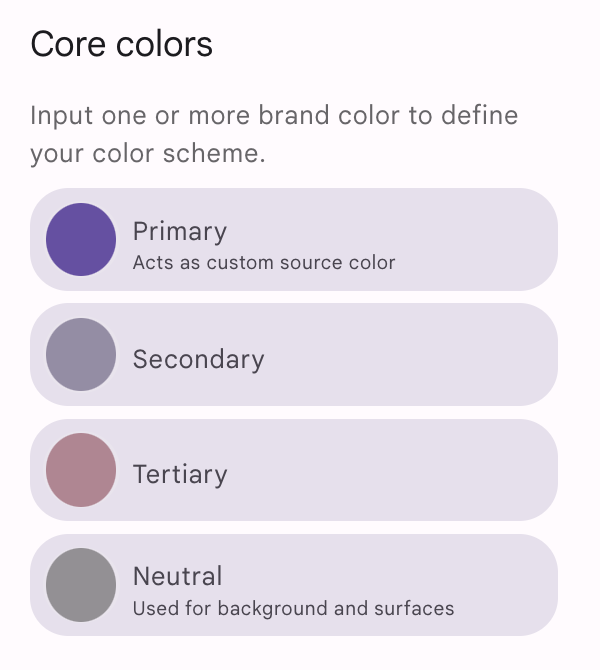

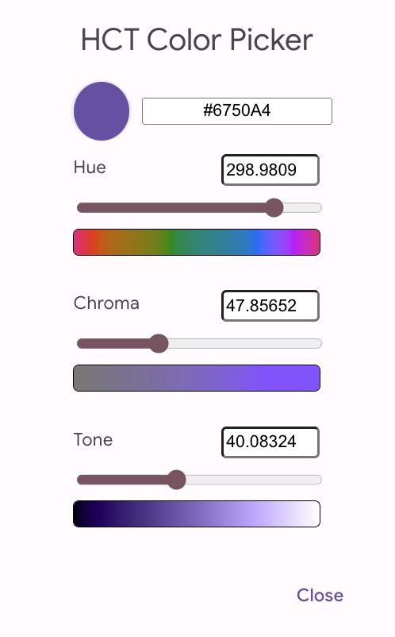

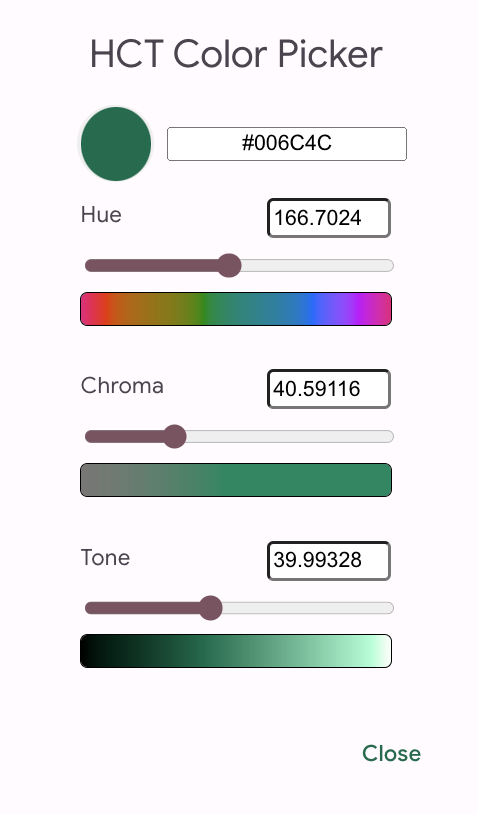

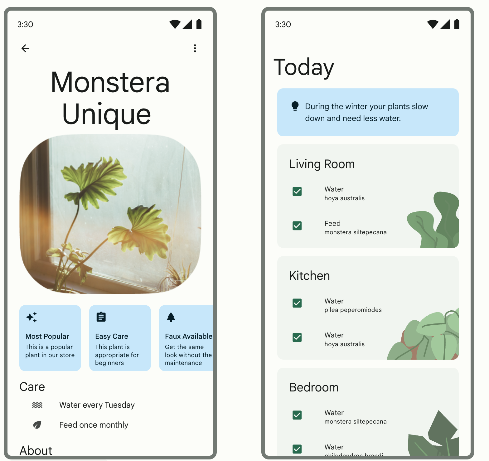

### 更新 `Color.kt`

打开 `ui/theme/Color.kt`，添加浅色和深色主题颜色。下面列出本教程中需要的主要颜色变量：

```kotlin
package com.example.woof.ui.theme

import androidx.compose.ui.graphics.Color

val md_theme_light_primary = Color(0xFF006C4C)
val md_theme_light_onPrimary = Color(0xFFFFFFFF)
val md_theme_light_primaryContainer = Color(0xFF89F8C7)
val md_theme_light_onPrimaryContainer = Color(0xFF002114)
val md_theme_light_secondary = Color(0xFF4D6357)
val md_theme_light_onSecondary = Color(0xFFFFFFFF)
val md_theme_light_secondaryContainer = Color(0xFFCFE9D9)
val md_theme_light_onSecondaryContainer = Color(0xFF092016)
val md_theme_light_tertiary = Color(0xFF3D6373)
val md_theme_light_background = Color(0xFFFBFDF9)
val md_theme_light_onBackground = Color(0xFF191C1A)
val md_theme_light_surface = Color(0xFFFBFDF9)
val md_theme_light_onSurface = Color(0xFF191C1A)
val md_theme_light_surfaceVariant = Color(0xFFDBE5DD)
val md_theme_light_onSurfaceVariant = Color(0xFF404943)

val md_theme_dark_primary = Color(0xFF6CDBAC)
val md_theme_dark_onPrimary = Color(0xFF003826)
val md_theme_dark_primaryContainer = Color(0xFF005138)
val md_theme_dark_onPrimaryContainer = Color(0xFF89F8C7)
val md_theme_dark_secondary = Color(0xFFB3CCBE)
val md_theme_dark_onSecondary = Color(0xFF1F352A)
val md_theme_dark_secondaryContainer = Color(0xFF354B40)
val md_theme_dark_onSecondaryContainer = Color(0xFFCFE9D9)
val md_theme_dark_tertiary = Color(0xFFA5CCDF)
val md_theme_dark_background = Color(0xFF191C1A)
val md_theme_dark_onBackground = Color(0xFFE1E3DF)
val md_theme_dark_surface = Color(0xFF191C1A)
val md_theme_dark_onSurface = Color(0xFFE1E3DF)
val md_theme_dark_surfaceVariant = Color(0xFF404943)
val md_theme_dark_onSurfaceVariant = Color(0xFFBFC9C2)
```

### 更新 `Theme.kt`

在 `Theme.kt` 中使用 `lightColorScheme()` 和 `darkColorScheme()` 把颜色映射到 Material 颜色槽：

```kotlin
private val LightColors = lightColorScheme(
    primary = md_theme_light_primary,
    onPrimary = md_theme_light_onPrimary,
    primaryContainer = md_theme_light_primaryContainer,
    onPrimaryContainer = md_theme_light_onPrimaryContainer,
    secondary = md_theme_light_secondary,
    onSecondary = md_theme_light_onSecondary,
    secondaryContainer = md_theme_light_secondaryContainer,
    onSecondaryContainer = md_theme_light_onSecondaryContainer,
    tertiary = md_theme_light_tertiary,
    background = md_theme_light_background,
    onBackground = md_theme_light_onBackground,
    surface = md_theme_light_surface,
    onSurface = md_theme_light_onSurface,
    surfaceVariant = md_theme_light_surfaceVariant,
    onSurfaceVariant = md_theme_light_onSurfaceVariant,
)

private val DarkColors = darkColorScheme(
    primary = md_theme_dark_primary,
    onPrimary = md_theme_dark_onPrimary,
    primaryContainer = md_theme_dark_primaryContainer,
    onPrimaryContainer = md_theme_dark_onPrimaryContainer,
    secondary = md_theme_dark_secondary,
    onSecondary = md_theme_dark_onSecondary,
    secondaryContainer = md_theme_dark_secondaryContainer,
    onSecondaryContainer = md_theme_dark_onSecondaryContainer,
    tertiary = md_theme_dark_tertiary,
    background = md_theme_dark_background,
    onBackground = md_theme_dark_onBackground,
    surface = md_theme_dark_surface,
    onSurface = md_theme_dark_onSurface,
    surfaceVariant = md_theme_dark_surfaceVariant,
    onSurfaceVariant = md_theme_dark_onSurfaceVariant,
)
```

接着在 `WoofTheme()` 中选择当前配色方案：

```kotlin
@Composable
fun WoofTheme(
    darkTheme: Boolean = isSystemInDarkTheme(),
    dynamicColor: Boolean = false,
    content: @Composable () -> Unit
) {
    val colorScheme = when {
        dynamicColor && Build.VERSION.SDK_INT >= Build.VERSION_CODES.S -> {
            val context = LocalContext.current
            if (darkTheme) dynamicDarkColorScheme(context) else dynamicLightColorScheme(context)
        }
        darkTheme -> DarkColors
        else -> LightColors
    }

    MaterialTheme(
        colorScheme = colorScheme,
        shapes = Shapes,
        typography = Typography,
        content = content
    )
}
```

重新运行后，应用颜色会开始变化：

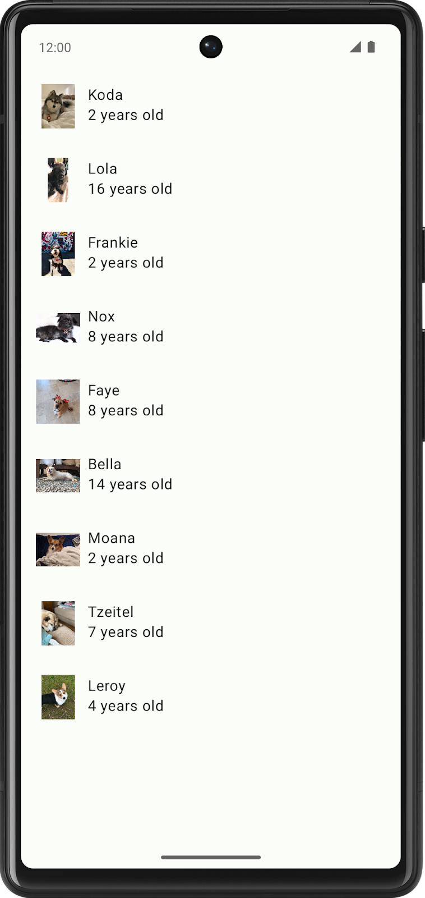

### 使用 `Card` 映射颜色

Material 组件会自动使用主题中的颜色槽。为了让列表项从背景中分离出来，在 `DogItem()` 中用 `Card` 包住 `Row`：

```kotlin
@Composable
fun DogItem(
    dog: Dog,
    modifier: Modifier = Modifier
) {
    Card(modifier = modifier) {
        Row(
            modifier = Modifier
                .fillMaxWidth()
                .padding(dimensionResource(R.dimen.padding_small))
        ) {
            DogIcon(dog.imageResourceId)
            DogInformation(dog.name, dog.age)
        }
    }
}
```

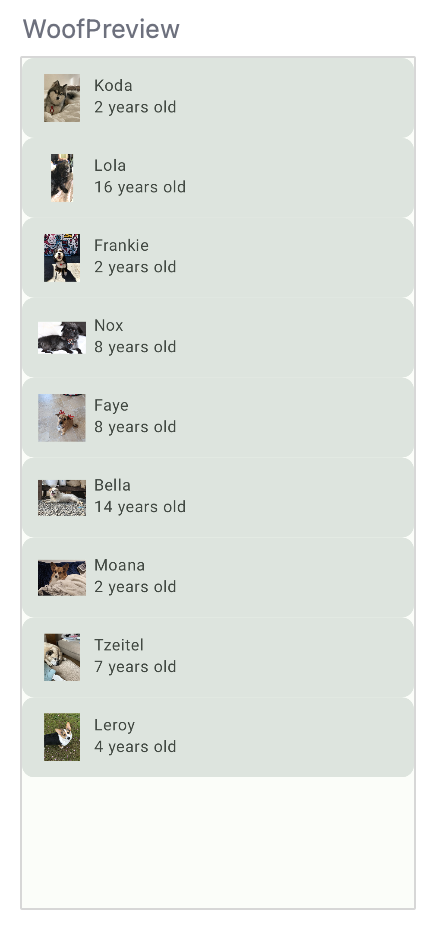

### 使用 `dimens.xml`

在 `res/values/dimens.xml` 中集中管理尺寸：

```xml
<resources>
    <dimen name="padding_small">8dp</dimen>
    <dimen name="padding_medium">16dp</dimen>
    <dimen name="image_size">64dp</dimen>
</resources>
```

在 `WoofApp()` 中给每个列表项加上外边距：

```kotlin
@Composable
fun WoofApp() {
    Scaffold { innerPadding ->
        LazyColumn(contentPadding = innerPadding) {
            items(dogs) {
                DogItem(
                    dog = it,
                    modifier = Modifier.padding(dimensionResource(R.dimen.padding_small))
                )
            }
        }
    }
}
```

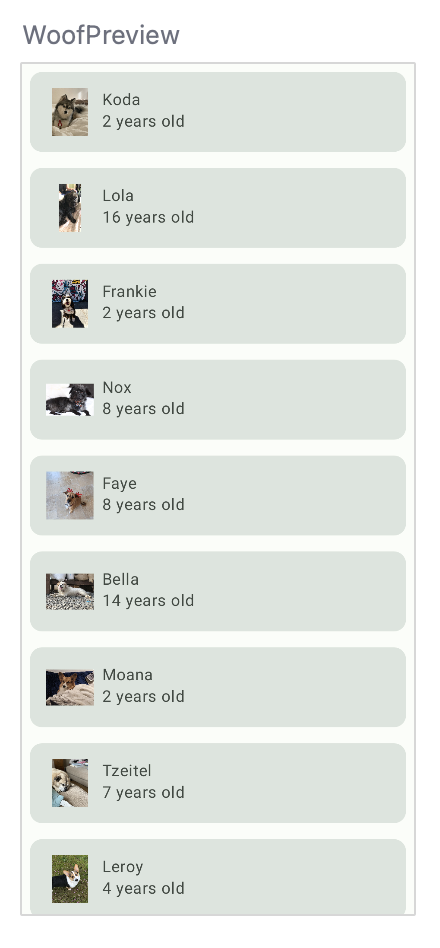

### 深色主题预览

添加一个深色主题预览：

```kotlin
@Preview
@Composable
fun WoofDarkThemePreview() {
    WoofTheme(darkTheme = true) {
        WoofApp()
    }
}
```

| 深色主题 | 浅色主题 |
|----------|----------|
| 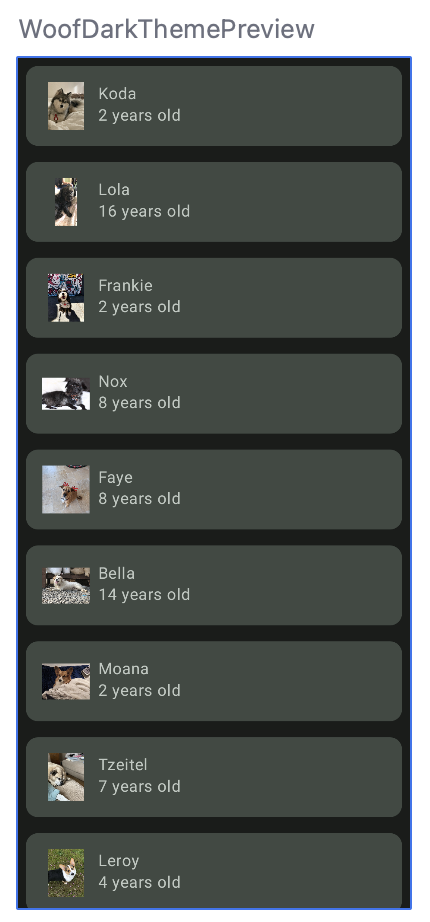 | 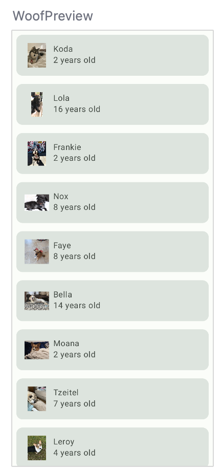 |

在真机或模拟器上，可以通过系统设置切换深色主题，再重新打开 Woof 应用检查实际效果。

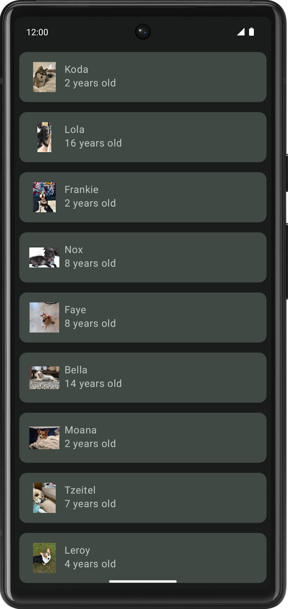

### 动态配色

Android 12 及以上可以根据壁纸生成动态配色。要临时开启动态配色，把 `dynamicColor` 设为 `true`：

```kotlin
@Composable
fun WoofTheme(
    darkTheme: Boolean = isSystemInDarkTheme(),
    dynamicColor: Boolean = true,
    content: @Composable () -> Unit
)
```

体验完动态配色后，本教程继续使用自定义主题，因此再改回 `false`。

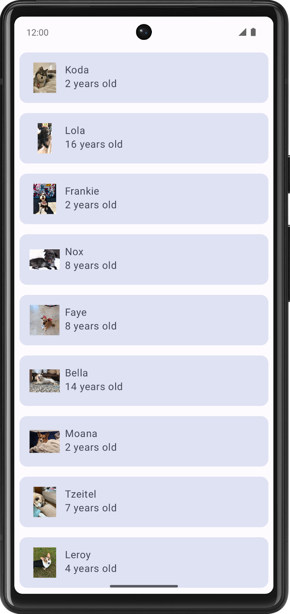

---

## 5. 添加形状

形状会影响组件的视觉个性。Compose 中常用 `RoundedCornerShape` 定义圆角矩形。

| 0 dp | 25 dp | 50 dp |
|------|-------|-------|
| 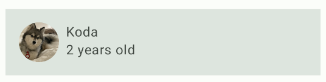 | 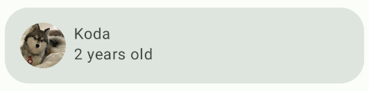 | 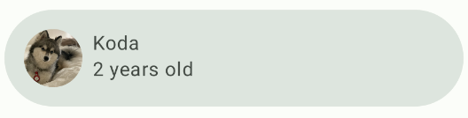 |

也可以给四个角设置不同圆角：

| 示例一 | 示例二 | 示例三 |
|--------|--------|--------|
| 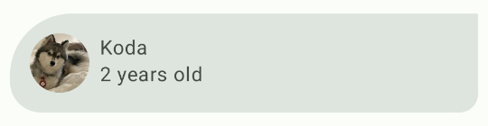 | 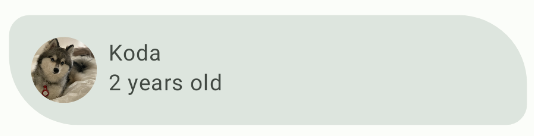 | 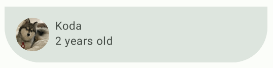 |

### 把狗狗图片裁剪成圆形

打开 `Shape.kt`，让小形状变成圆形：

```kotlin
val Shapes = Shapes(
    small = RoundedCornerShape(50.dp)
)
```

在 `DogIcon()` 中使用 `clip(MaterialTheme.shapes.small)`：

```kotlin
@Composable
fun DogIcon(
    @DrawableRes dogIcon: Int,
    modifier: Modifier = Modifier
) {
    Image(
        modifier = modifier
            .size(dimensionResource(R.dimen.image_size))
            .padding(dimensionResource(R.dimen.padding_small))
            .clip(MaterialTheme.shapes.small),
        painter = painterResource(dogIcon),
        contentDescription = null
    )
}
```

此时图片已经变圆，但部分图片可能没有正确填满圆形区域：

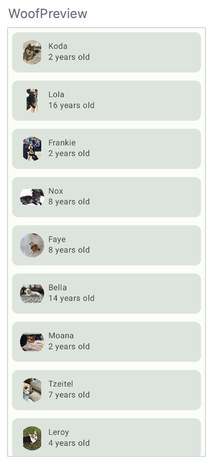

继续添加 `contentScale = ContentScale.Crop`：

```kotlin
Image(
    modifier = modifier
        .size(dimensionResource(R.dimen.image_size))
        .padding(dimensionResource(R.dimen.padding_small))
        .clip(MaterialTheme.shapes.small),
    contentScale = ContentScale.Crop,
    painter = painterResource(dogIcon),
    contentDescription = null
)
```

完成后的圆形图片效果：

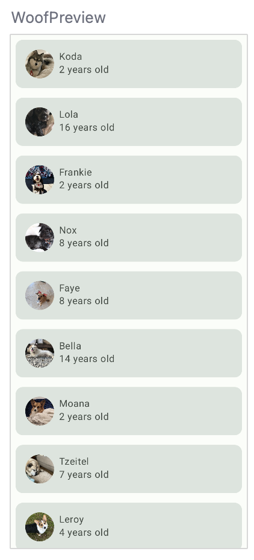

### 给列表项添加形状

`Card` 默认使用主题中的 medium 形状。打开 `Shape.kt`，补充 medium：

```kotlin
val Shapes = Shapes(
    small = RoundedCornerShape(50.dp),
    medium = RoundedCornerShape(bottomStart = 16.dp, topEnd = 16.dp)
)
```

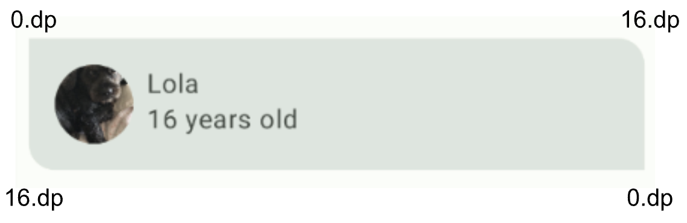

应用后，列表卡片会获得右上角和左下角圆角：

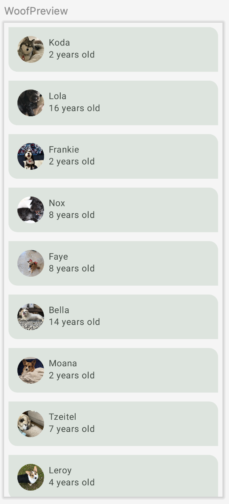

| 不调整形状 | 调整形状 |
|------------|----------|
| 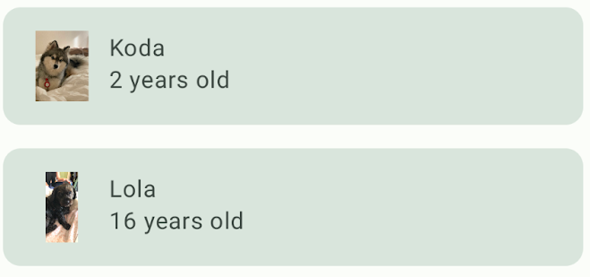 | 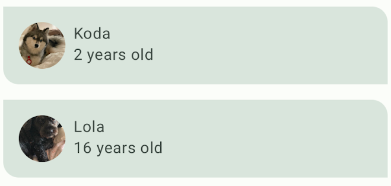 |

---

## 6. 添加排版

Material 3 的字型比例包含 display、headline、title、body、label 等样式。你不需要重写所有样式，只需要覆盖应用实际使用的层级。

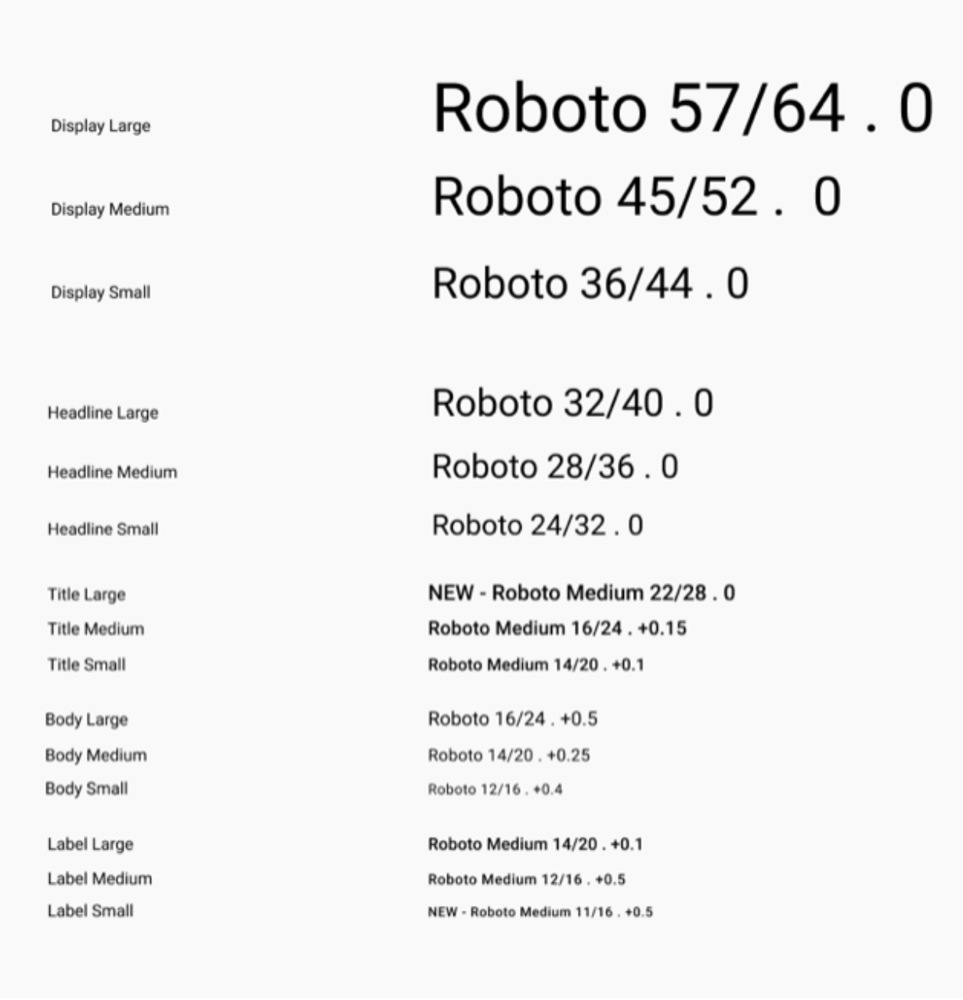

### 创建字体资源目录

1. 在 Android Studio 中右键点击 `res`。
2. 选择 **New > Android Resource Directory**。
3. 目录名设为 `font`，资源类型也设为 `font`。

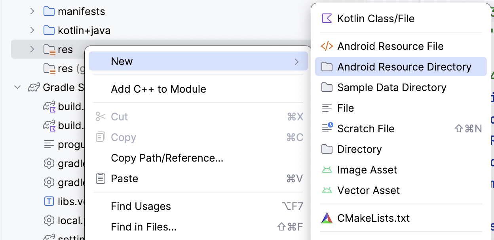

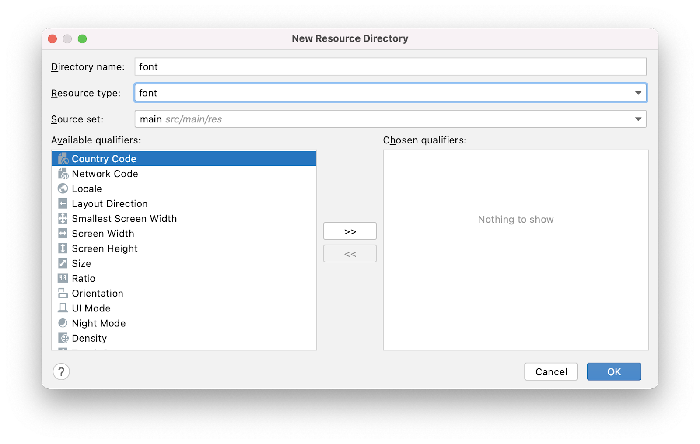

### 下载字体

从 Google Fonts 下载：

- Montserrat：保留 `Montserrat-Regular.ttf` 和 `Montserrat-Bold.ttf`。
- Abril Fatface：保留 `AbrilFatface-Regular.ttf`。

把字体拖入 `res/font/`，并改名：

```text
montserrat_regular.ttf
montserrat_bold.ttf
abril_fatface_regular.ttf
```

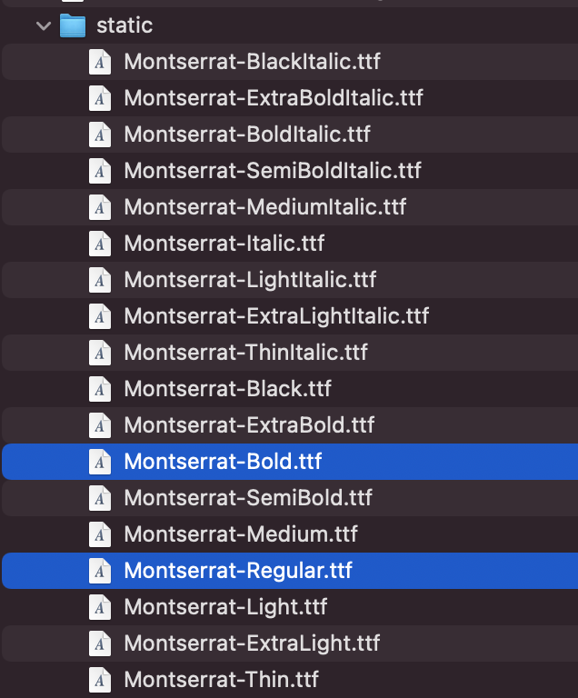

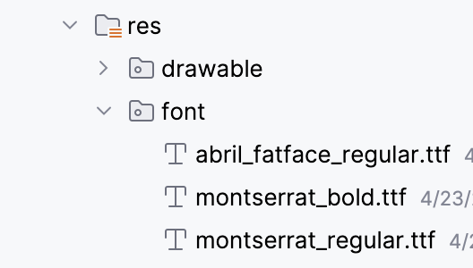

### 初始化字体

打开 `ui/theme/Type.kt`，添加字体族：

```kotlin
import androidx.compose.ui.text.font.Font
import androidx.compose.ui.text.font.FontFamily
import androidx.compose.ui.text.font.FontWeight
import com.example.woof.R

val AbrilFatface = FontFamily(
    Font(R.font.abril_fatface_regular)
)

val Montserrat = FontFamily(
    Font(R.font.montserrat_regular),
    Font(R.font.montserrat_bold, FontWeight.Bold)
)
```

配置应用实际用到的文字样式：

```kotlin
val Typography = Typography(
    displayLarge = TextStyle(
        fontFamily = AbrilFatface,
        fontWeight = FontWeight.Normal,
        fontSize = 36.sp
    ),
    displayMedium = TextStyle(
        fontFamily = Montserrat,
        fontWeight = FontWeight.Bold,
        fontSize = 20.sp
    ),
    labelSmall = TextStyle(
        fontFamily = Montserrat,
        fontWeight = FontWeight.Bold,
        fontSize = 14.sp
    ),
    bodyLarge = TextStyle(
        fontFamily = Montserrat,
        fontWeight = FontWeight.Normal,
        fontSize = 14.sp
    )
)
```

### 应用文字样式

在 `DogInformation()` 中给名字和年龄分别设置样式：

```kotlin
@Composable
fun DogInformation(
    @StringRes dogName: Int,
    dogAge: Int,
    modifier: Modifier = Modifier
) {
    Column(modifier = modifier) {
        Text(
            text = stringResource(dogName),
            style = MaterialTheme.typography.displayMedium,
            modifier = Modifier.padding(top = dimensionResource(R.dimen.padding_small))
        )
        Text(
            text = stringResource(R.string.years_old, dogAge),
            style = MaterialTheme.typography.bodyLarge
        )
    }
}
```

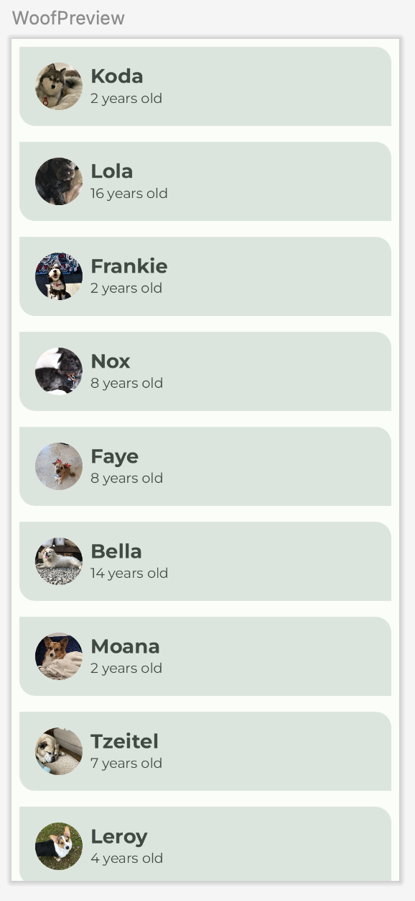

| 排版前 | 排版后 |
|--------|--------|
| 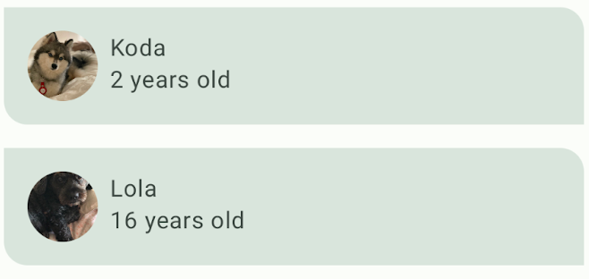 | 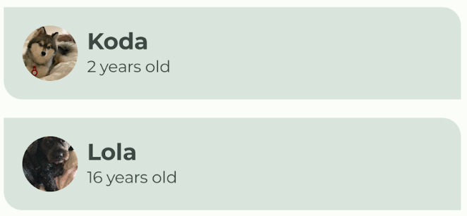 |

---

## 7. 添加顶部栏

`Scaffold` 为 Material 页面提供结构槽位，可以放入顶部栏、底部栏、悬浮按钮和页面内容。本教程使用 `CenterAlignedTopAppBar` 创建居中的顶部应用栏。

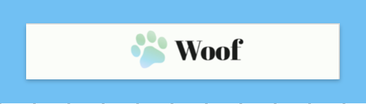

顶部栏由一个 `Row` 组成，内部包含应用徽标和应用名称：

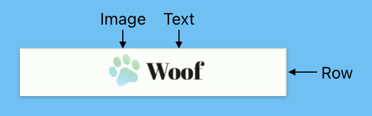

### 创建 `WoofTopAppBar()`

先创建空的顶部栏函数：

```kotlin
@Composable
fun WoofTopAppBar(modifier: Modifier = Modifier) {
}
```

在 `WoofApp()` 的 `Scaffold` 中接入顶部栏：

```kotlin
@Composable
fun WoofApp() {
    Scaffold(
        topBar = {
            WoofTopAppBar()
        }
    ) { innerPadding ->
        LazyColumn(contentPadding = innerPadding) {
            items(dogs) {
                DogItem(
                    dog = it,
                    modifier = Modifier.padding(dimensionResource(R.dimen.padding_small))
                )
            }
        }
    }
}
```

### 添加居中顶部栏

```kotlin
@Composable
fun WoofTopAppBar(modifier: Modifier = Modifier) {
    CenterAlignedTopAppBar(
        modifier = modifier,
        title = {
            Row {
            }
        }
    )
}
```

向 `Row` 添加应用图标：

```kotlin
Image(
    modifier = Modifier
        .size(dimensionResource(R.dimen.image_size))
        .padding(dimensionResource(R.dimen.padding_small)),
    painter = painterResource(R.drawable.ic_woof_logo),
    contentDescription = null
)
```

添加应用名文字：

```kotlin
Text(
    text = stringResource(R.string.app_name),
    style = MaterialTheme.typography.displayLarge
)
```

此时图标和文字可能没有垂直居中：

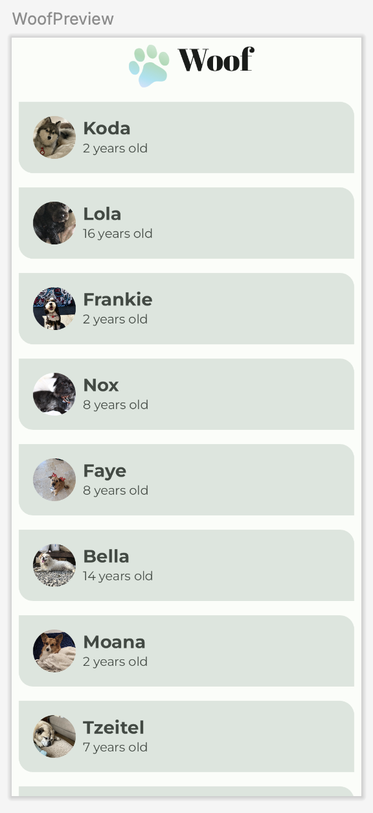

给 `Row` 添加垂直居中：

```kotlin
Row(
    verticalAlignment = Alignment.CenterVertically
) {
    Image(
        modifier = Modifier
            .size(dimensionResource(R.dimen.image_size))
            .padding(dimensionResource(R.dimen.padding_small)),
        painter = painterResource(R.drawable.ic_woof_logo),
        contentDescription = null
    )
    Text(
        text = stringResource(R.string.app_name),
        style = MaterialTheme.typography.displayLarge
    )
}
```

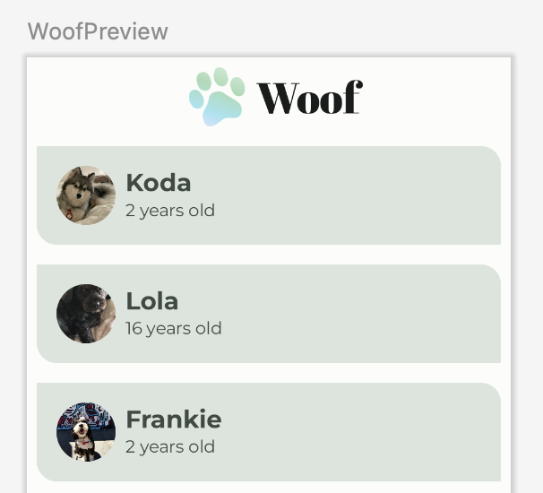

完整函数如下：

```kotlin
@Composable
fun WoofTopAppBar(modifier: Modifier = Modifier) {
    CenterAlignedTopAppBar(
        title = {
            Row(
                verticalAlignment = Alignment.CenterVertically
            ) {
                Image(
                    modifier = Modifier
                        .size(dimensionResource(R.dimen.image_size))
                        .padding(dimensionResource(R.dimen.padding_small)),
                    painter = painterResource(R.drawable.ic_woof_logo),
                    contentDescription = null
                )
                Text(
                    text = stringResource(R.string.app_name),
                    style = MaterialTheme.typography.displayLarge
                )
            }
        },
        modifier = modifier
    )
}
```

| 不含顶部栏 | 带有顶部栏 |
|------------|------------|
| 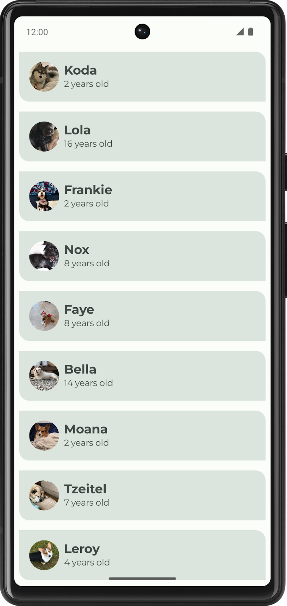 | 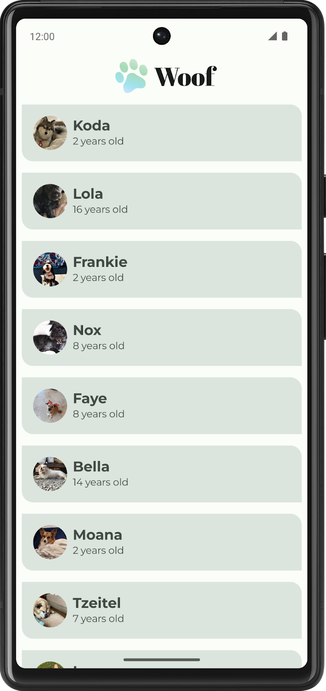 |

最终深色主题效果：

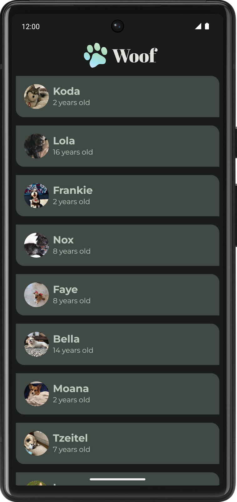

---

## 8. 获取解决方案代码

如果需要查看官方完成版：

```bash
git clone https://github.com/google-developer-training/basic-android-kotlin-compose-training-woof.git
cd basic-android-kotlin-compose-training-woof
git checkout material
```

也可以下载 material 分支 ZIP：

```text
https://github.com/google-developer-training/basic-android-kotlin-compose-training-woof/archive/refs/heads/material.zip
```

---

## 9. 总结

完成本教程后，你应该已经掌握：

- `Theme.kt` 中通过 `MaterialTheme` 统一设置颜色、排版和形状。
- `Color.kt` 中定义浅色和深色主题颜色，再映射到 Material 颜色槽。
- `Shape.kt` 中通过 `RoundedCornerShape` 定义小、中、大组件形状。
- `Type.kt` 中通过 `FontFamily` 和 `TextStyle` 配置自定义字体。
- `Card`、`Image`、`Text` 等组件会从主题中继承视觉规范。
- `Scaffold` 可以组织顶部栏和页面内容，`CenterAlignedTopAppBar` 适合居中标题栏。
- 深色主题需要单独检查颜色对比度和系统栏表现。

---

## 10. 了解更多

- Material Design: https://m3.material.io/
- Material 颜色: https://m3.material.io/styles/color/overview
- Material 排版: https://m3.material.io/styles/typography/overview
- Material 形状: https://m3.material.io/styles/shape/overview
- Compose Scaffold: https://developer.android.com/jetpack/compose/layouts/material
- Android 深色主题: https://developer.android.com/guide/topics/ui/look-and-feel/darktheme
- 官方 Codelab: https://developer.android.com/codelabs/basic-android-kotlin-compose-material-theming?hl=zh-cn

---

本教程中的代码示例来自 Android Developers codelab，按 Apache 2.0 许可发布；说明文字已按课堂资料用途重新整理。
