# 使用 Jetpack Compose 添加简单的动画

本教程整理自 Android Developers Codelab：Woof Animation。它接在前一个 Material Theming 教程之后，基于已经完成主题设置的 **Woof** 应用，继续添加展开按钮、狗狗爱好信息、展开/收起状态，以及平滑的 Compose 动画。

> 本地图片和动图已下载到 `images/` 目录，文中图片均使用相对路径引用。

---

## 1. 准备工作

动画可以让界面变化更容易理解。例如，当一个列表项展开时，如果内容直接跳出来，用户会感觉突兀；如果高度变化带有平滑动画，用户就能更清楚地感知“当前项目被展开了”。

本教程会给 Woof 列表项添加：

- 展开和收起图标按钮。
- 点击按钮后显示或隐藏狗狗爱好信息。
- `remember` 和 `mutableStateOf()` 管理每个列表项的展开状态。
- `animateContentSize()` 为列表项高度变化添加弹簧动画。
- 可选的 `animateColorAsState()` 为展开状态添加颜色动画。

### 前提条件

- 熟悉 Kotlin 函数、lambda 和布尔状态。
- 了解 Compose 中的 `Row`、`Column`、`LazyColumn`、`Card` 等基础布局。
- 了解 Material Design 和 Material 主题。
- 已完成或理解前一个 Woof Material Theming 教程。

### 构建内容

你会基于 **Woof** 应用继续开发：每个狗狗列表项都可以展开，展开后显示狗狗爱好，并通过动画平滑过渡。


---

## 2. 应用概览

前一个教程完成后的 Woof 应用会显示狗狗列表及其基础信息：

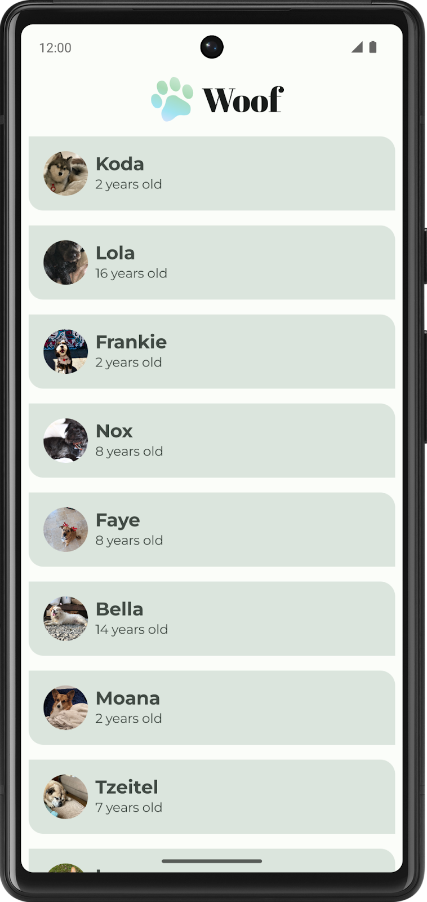

本教程要在每个列表项右侧添加一个展开按钮。用户点击按钮后，列表项下方会显示该狗狗的爱好信息；再次点击后收起。

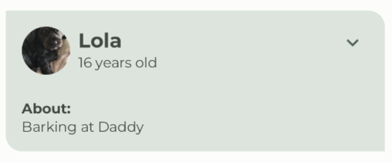

### 获取起始代码

本教程从 `material` 分支开始，也就是前一个 Material Theming codelab 的完成版。

```bash
git clone https://github.com/google-developer-training/basic-android-kotlin-compose-training-woof.git
cd basic-android-kotlin-compose-training-woof
git checkout material
```

也可以下载 ZIP：

```text
https://github.com/google-developer-training/basic-android-kotlin-compose-training-woof/archive/refs/heads/material.zip
```

---

## 3. 添加“展开”图标

这一部分先添加图标按钮，但暂时不处理点击后的展开逻辑。

目标是在每个列表项右侧放置展开或收起图标：

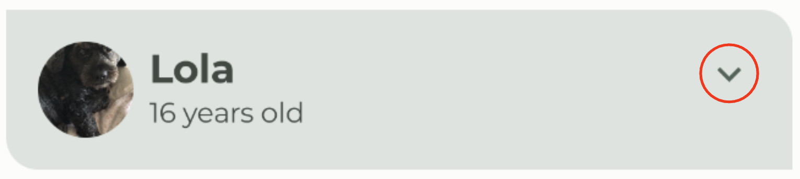

### Icons

图标用于表达操作含义。Material Design 提供了大量常用图标，可以直接在 Compose 中使用。

| 现实对象 | 图标抽象 |
|----------|----------|
|  | 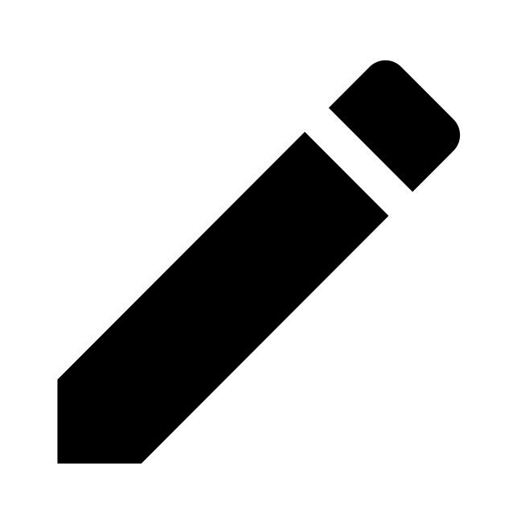 |

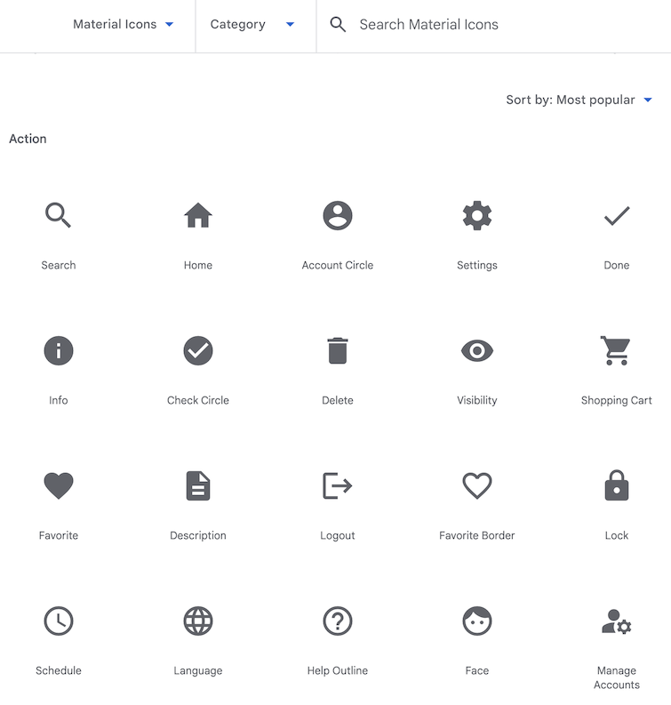

### 添加 Gradle 依赖项

在模块级 `build.gradle.kts` 的 `dependencies` 中添加扩展图标库：

```kotlin
implementation("androidx.compose.material:material-icons-extended")
```

同步项目：

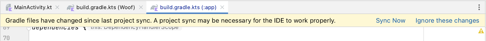

### 添加图标可组合项

在 `MainActivity.kt` 中创建 `DogItemButton()`。它接收当前是否展开、点击回调和可选 `Modifier`。

```kotlin
@Composable
private fun DogItemButton(
    expanded: Boolean,
    onClick: () -> Unit,
    modifier: Modifier = Modifier
) {
    IconButton(
        onClick = onClick,
        modifier = modifier
    ) {
        Icon(
            imageVector = Icons.Filled.ExpandMore,
            contentDescription = stringResource(R.string.expand_button_content_description),
            tint = MaterialTheme.colorScheme.secondary
        )
    }
}
```

需要的 import：

```kotlin
import androidx.compose.material.icons.Icons
import androidx.compose.material.icons.filled.ExpandMore
import androidx.compose.material3.Icon
import androidx.compose.material3.IconButton
```

### 显示图标

在 `DogItem()` 中先添加展开状态：

```kotlin
var expanded by remember { mutableStateOf(false) }
```

需要的 import：

```kotlin
import androidx.compose.runtime.getValue
import androidx.compose.runtime.mutableStateOf
import androidx.compose.runtime.remember
import androidx.compose.runtime.setValue
```

然后在 `Row` 的末尾显示按钮：

```kotlin
Row(
    modifier = Modifier
        .fillMaxWidth()
        .padding(dimensionResource(R.dimen.padding_small))
) {
    DogIcon(dog.imageResourceId)
    DogInformation(dog.name, dog.age)
    DogItemButton(
        expanded = expanded,
        onClick = { /* TODO */ }
    )
}
```

此时按钮已经出现，但位置还没有靠右：

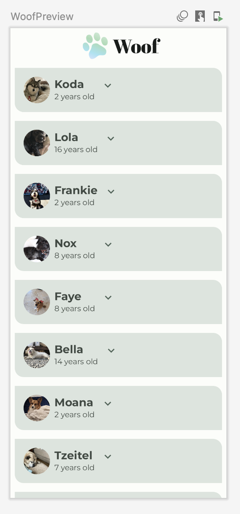

### 对齐“展开”按钮

使用 `Spacer(modifier = Modifier.weight(1f))` 填充剩余空间，把按钮推到行尾。

`weight()` 会按比例分配 `Row` 或 `Column` 中剩余空间：

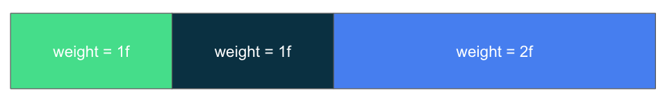

在 Woof 列表项中，`Spacer` 是唯一加权元素，所以它会占满狗狗信息和按钮之间的剩余空间：

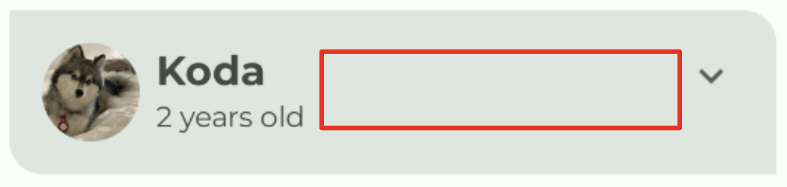

更新代码：

```kotlin
import androidx.compose.foundation.layout.Spacer

Row(
    modifier = Modifier
        .fillMaxWidth()
        .padding(dimensionResource(R.dimen.padding_small))
) {
    DogIcon(dog.imageResourceId)
    DogInformation(dog.name, dog.age)
    Spacer(modifier = Modifier.weight(1f))
    DogItemButton(
        expanded = expanded,
        onClick = { /* TODO */ }
    )
}
```

按钮对齐后的效果：

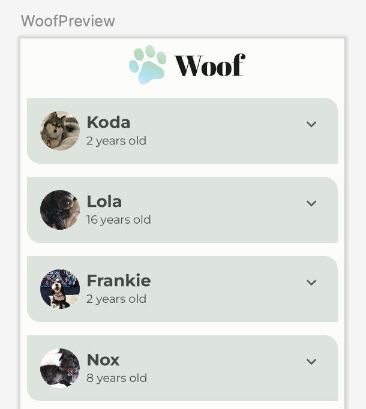

---

## 4. 添加可组合项以显示爱好信息

接下来创建一个新的可组合项，用来显示狗狗爱好信息。


### 创建 `DogHobby()`

```kotlin
@Composable
fun DogHobby(
    @StringRes dogHobby: Int,
    modifier: Modifier = Modifier
) {
    Column(
        modifier = modifier
    ) {
        Text(
            text = stringResource(R.string.about),
            style = MaterialTheme.typography.labelSmall
        )
        Text(
            text = stringResource(dogHobby),
            style = MaterialTheme.typography.bodyLarge
        )
    }
}
```

`DogHobby()` 使用两个文本：

- `About` 标签，使用 `labelSmall`。
- 狗狗爱好正文，使用 `bodyLarge`。

### 把 `Row` 包进 `Column`

因为爱好信息要显示在原有 `Row` 下方，所以需要用 `Column` 包住原来的行布局。

```kotlin
Column {
    Row(
        modifier = Modifier
            .fillMaxWidth()
            .padding(dimensionResource(R.dimen.padding_small))
    ) {
        DogIcon(dog.imageResourceId)
        DogInformation(dog.name, dog.age)
        Spacer(modifier = Modifier.weight(1f))
        DogItemButton(
            expanded = expanded,
            onClick = { /* TODO */ }
        )
    }
}
```

然后在 `Row` 之后调用 `DogHobby()`：

```kotlin
DogHobby(
    dog.hobbies,
    modifier = Modifier.padding(
        start = dimensionResource(R.dimen.padding_medium),
        top = dimensionResource(R.dimen.padding_small),
        end = dimensionResource(R.dimen.padding_medium),
        bottom = dimensionResource(R.dimen.padding_medium)
    )
)
```

这一阶段的 `DogItem()` 可以写成：

```kotlin
@Composable
fun DogItem(
    dog: Dog,
    modifier: Modifier = Modifier
) {
    var expanded by remember { mutableStateOf(false) }
    Card(
        modifier = modifier
    ) {
        Column {
            Row(
                modifier = Modifier
                    .fillMaxWidth()
                    .padding(dimensionResource(R.dimen.padding_small))
            ) {
                DogIcon(dog.imageResourceId)
                DogInformation(dog.name, dog.age)
                Spacer(Modifier.weight(1f))
                DogItemButton(
                    expanded = expanded,
                    onClick = { /* TODO */ },
                )
            }
            DogHobby(
                dog.hobbies,
                modifier = Modifier.padding(
                    start = dimensionResource(R.dimen.padding_medium),
                    top = dimensionResource(R.dimen.padding_small),
                    end = dimensionResource(R.dimen.padding_medium),
                    bottom = dimensionResource(R.dimen.padding_medium)
                )
            )
        }
    }
}
```

此时所有列表项都会一直显示爱好信息：

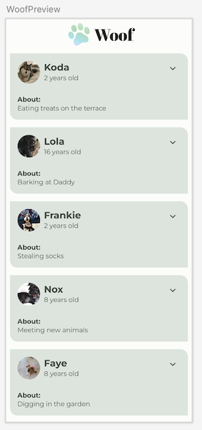

---

## 5. 在点击按钮时显示/隐藏爱好信息

现在让按钮真正控制爱好信息的显示与隐藏。

### 切换展开状态

把 `DogItemButton()` 的 `onClick` 改成切换 `expanded`：

```kotlin
DogItemButton(
    expanded = expanded,
    onClick = { expanded = !expanded }
)
```

`!expanded` 表示取反：`true` 变为 `false`，`false` 变为 `true`。

### 按状态显示 `DogHobby()`

使用 `if (expanded)` 包住 `DogHobby()`：

```kotlin
if (expanded) {
    DogHobby(
        dog.hobbies,
        modifier = Modifier.padding(
            start = dimensionResource(R.dimen.padding_medium),
            top = dimensionResource(R.dimen.padding_small),
            end = dimensionResource(R.dimen.padding_medium),
            bottom = dimensionResource(R.dimen.padding_medium)
        )
    )
}
```

### 使用交互式预览

在 Android Studio 的 Design 窗格中，可以打开 **Interactive Mode** 与预览交互。

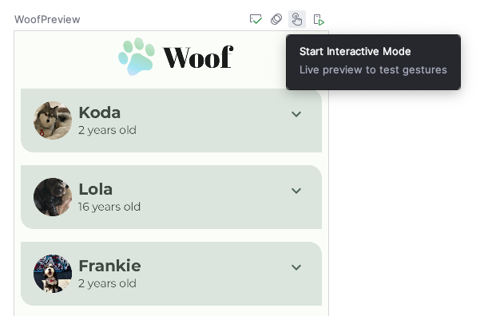

点击展开按钮后，爱好信息会显示或隐藏：

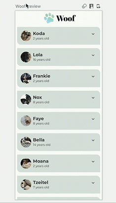

停止交互模式：

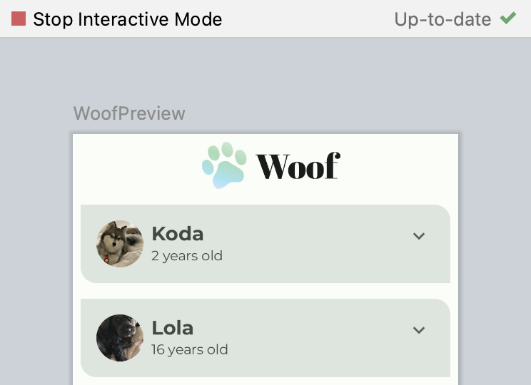

### 根据状态切换图标

当前按钮图标不会变化。为了让状态更清晰，展开时显示 `ExpandLess`，收起时显示 `ExpandMore`。

先添加 import：

```kotlin
import androidx.compose.material.icons.filled.ExpandLess
```

更新 `DogItemButton()` 中的 `Icon`：

```kotlin
Icon(
    imageVector = if (expanded) Icons.Filled.ExpandLess else Icons.Filled.ExpandMore,
    contentDescription = stringResource(R.string.expand_button_content_description),
    tint = MaterialTheme.colorScheme.secondary
)
```

运行后，图标会随展开状态切换：


---

## 6. 添加动画

目前列表项高度变化仍然比较突然。现在使用 `animateContentSize()` 为高度变化添加平滑动画。

### 弹簧动画

弹簧动画是一种基于物理特性的动画。它通常由两个参数影响：

- **阻尼比**：控制弹跳程度。
- **刚度**：控制移动到目标值的速度。

弹簧释放效果：


不同阻尼比：

| 高弹力 | 无弹力 |
|--------|--------|
| 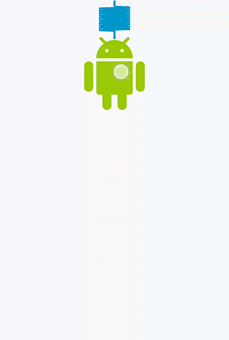 | 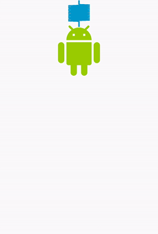 |

不同刚度：

| 高刚度 | 很低的刚度 |
|--------|------------|
| 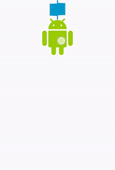 | 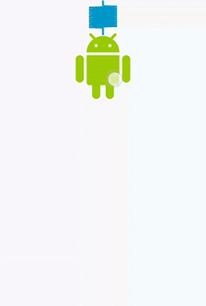 |

### 使用 `animateContentSize()`

在 `DogItem()` 的 `Column` 上添加 `Modifier.animateContentSize()`：

```kotlin
import androidx.compose.animation.animateContentSize

Column(
    modifier = Modifier
        .animateContentSize()
) {
    // Row 和 DogHobby
}
```

默认动画可能比较细微。可以通过 `animationSpec` 自定义弹簧参数：

```kotlin
import androidx.compose.animation.core.Spring
import androidx.compose.animation.core.spring

Column(
    modifier = Modifier
        .animateContentSize(
            animationSpec = spring(
                dampingRatio = Spring.DampingRatioNoBouncy,
                stiffness = Spring.StiffnessMedium
            )
        )
) {
    // Row 和 DogHobby
}
```

推荐的 `DogItem()` 结构：

```kotlin
@Composable
fun DogItem(
    dog: Dog,
    modifier: Modifier = Modifier
) {
    var expanded by remember { mutableStateOf(false) }

    Card(
        modifier = modifier
    ) {
        Column(
            modifier = Modifier.animateContentSize(
                animationSpec = spring(
                    dampingRatio = Spring.DampingRatioNoBouncy,
                    stiffness = Spring.StiffnessMedium
                )
            )
        ) {
            Row(
                modifier = Modifier
                    .fillMaxWidth()
                    .padding(dimensionResource(R.dimen.padding_small))
            ) {
                DogIcon(dog.imageResourceId)
                DogInformation(dog.name, dog.age)
                Spacer(modifier = Modifier.weight(1f))
                DogItemButton(
                    expanded = expanded,
                    onClick = { expanded = !expanded }
                )
            }
            if (expanded) {
                DogHobby(
                    dog.hobbies,
                    modifier = Modifier.padding(
                        start = dimensionResource(R.dimen.padding_medium),
                        top = dimensionResource(R.dimen.padding_small),
                        end = dimensionResource(R.dimen.padding_medium),
                        bottom = dimensionResource(R.dimen.padding_medium)
                    )
                )
            }
        }
    }
}
```

动画完成效果：


---

## 7. （可选）尝试使用其他动画

`animate*AsState()` 是 Compose 中很简单的一类动画 API。你只需要提供目标值，Compose 会自动从当前值过渡到目标值。

常见函数包括：

- `animateColorAsState()`
- `animateDpAsState()`
- `animateFloatAsState()`
- `animateSizeAsState()`
- `animateIntAsState()`

### 使用颜色动画

在 `DogItem()` 中根据展开状态改变列表项背景色：

```kotlin
import androidx.compose.animation.animateColorAsState
import androidx.compose.foundation.background

@Composable
fun DogItem(
    dog: Dog,
    modifier: Modifier = Modifier
) {
    var expanded by remember { mutableStateOf(false) }
    val color by animateColorAsState(
        targetValue = if (expanded) {
            MaterialTheme.colorScheme.tertiaryContainer
        } else {
            MaterialTheme.colorScheme.primaryContainer
        }
    )

    Card(
        modifier = modifier
    ) {
        Column(
            modifier = Modifier
                .animateContentSize(
                    animationSpec = spring(
                        dampingRatio = Spring.DampingRatioNoBouncy,
                        stiffness = Spring.StiffnessMedium
                    )
                )
                .background(color = color)
        ) {
            // Row 和 DogHobby
        }
    }
}
```

颜色动画效果：

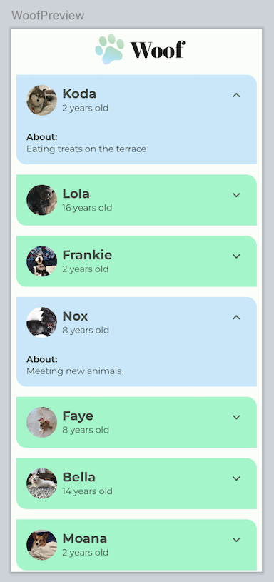

---

## 8. 获取解决方案代码

如需查看官方完成版代码：

```bash
git clone https://github.com/google-developer-training/basic-android-kotlin-compose-training-woof.git
cd basic-android-kotlin-compose-training-woof
git checkout main
```

也可以下载 main 分支 ZIP：

```text
https://github.com/google-developer-training/basic-android-kotlin-compose-training-woof/archive/refs/heads/main.zip
```

---

## 9. 总结

完成本教程后，你应该掌握：

- 如何在 Compose 中使用 `remember` 和 `mutableStateOf()` 保存列表项展开状态。
- 如何使用 `IconButton` 和 Material 图标实现展开/收起按钮。
- 如何通过 `if (expanded)` 控制可组合项是否进入组合。
- 如何使用 Android Studio 预览的交互模式测试可点击界面。
- 如何使用 `animateContentSize()` 为内容尺寸变化添加动画。
- 如何使用 `spring()`、`Spring.DampingRatioNoBouncy` 和 `Spring.StiffnessMedium` 调整弹簧动画。
- 如何使用 `animateColorAsState()` 为颜色变化添加动画。

---

## 了解详情

- Jetpack Compose 动画：https://developer.android.com/jetpack/compose/animation?hl=zh-cn
- 在 Jetpack Compose 中为元素添加动画效果：https://developer.android.com/codelabs/jetpack-compose-animation?hl=zh-cn
- Compose 动画 API：https://developer.android.com/jetpack/compose/animation/introduction?hl=zh-cn
- 官方 Codelab：https://developer.android.com/codelabs/basic-android-kotlin-compose-woof-animation?hl=zh-cn

---

本教程中的代码示例来自 Android Developers codelab，按 Apache 2.0 许可发布；说明文字已按课堂资料用途重新整理。
