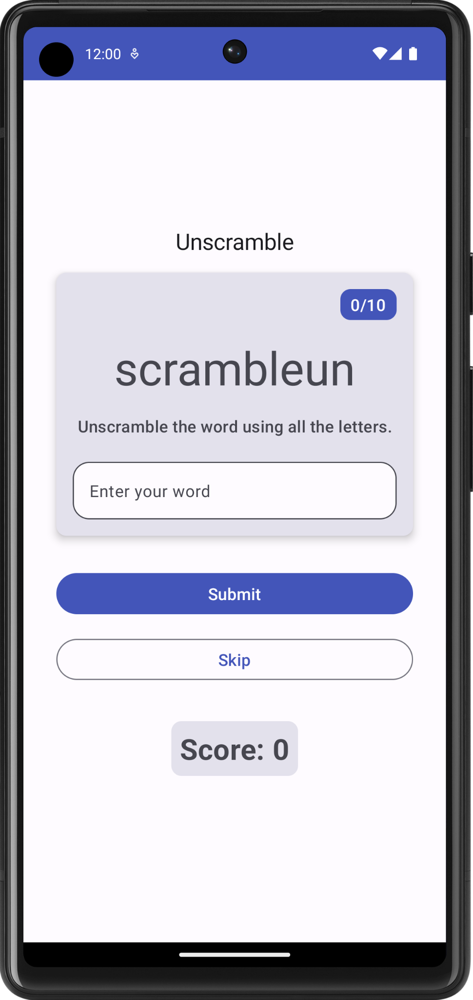
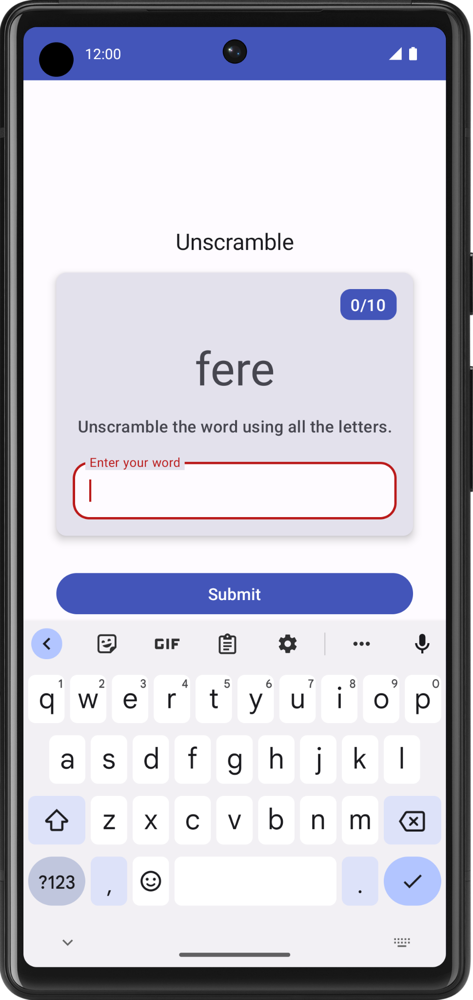
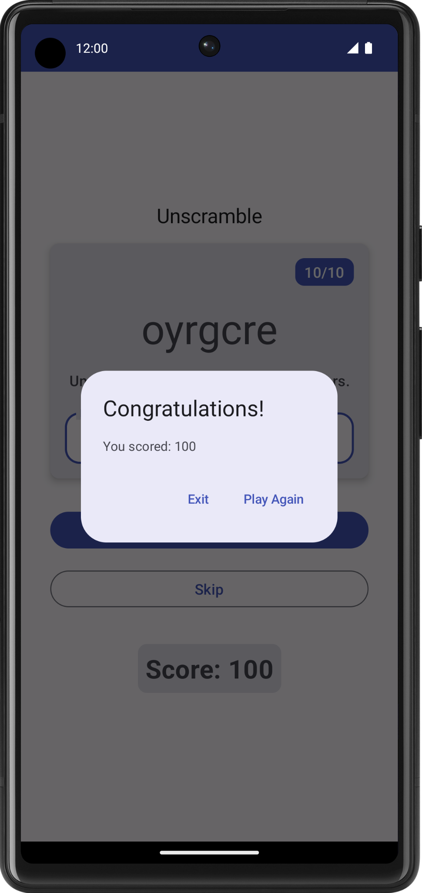
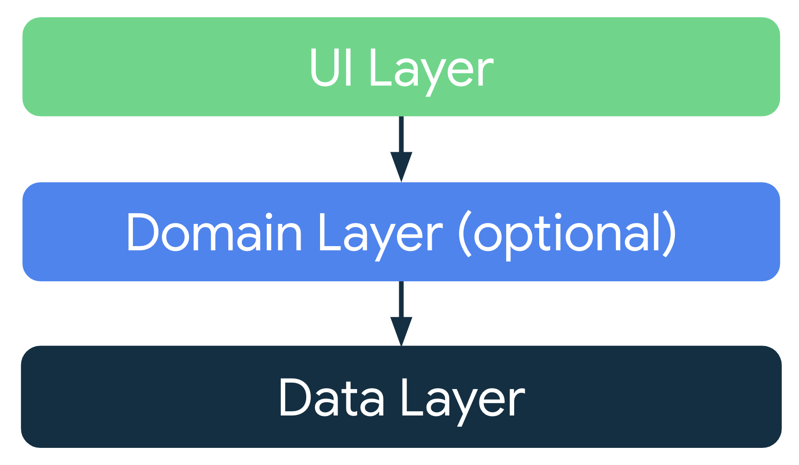
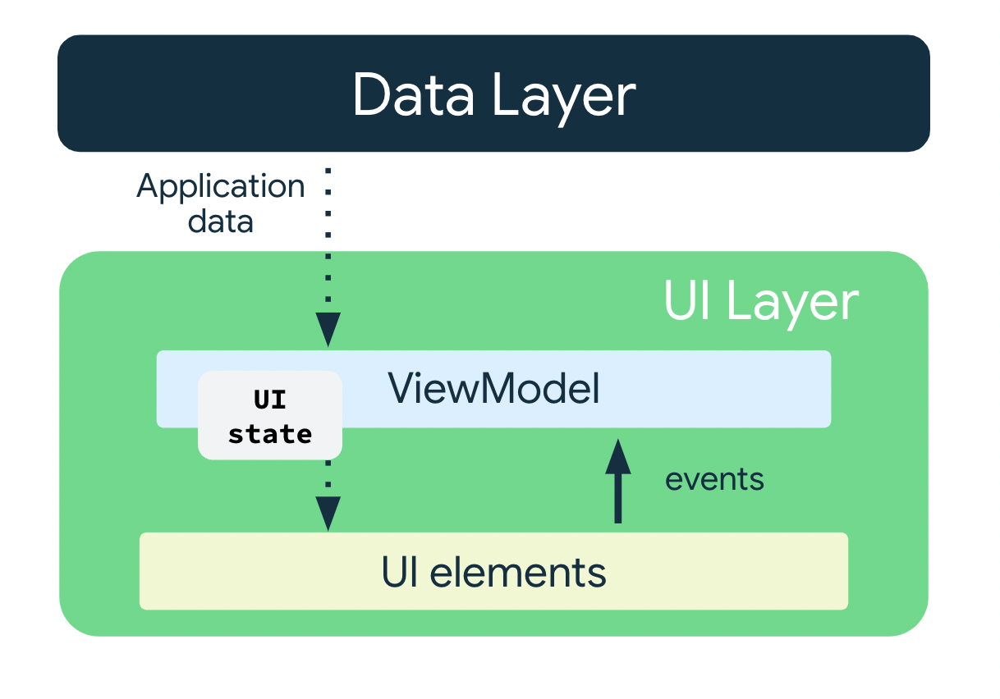
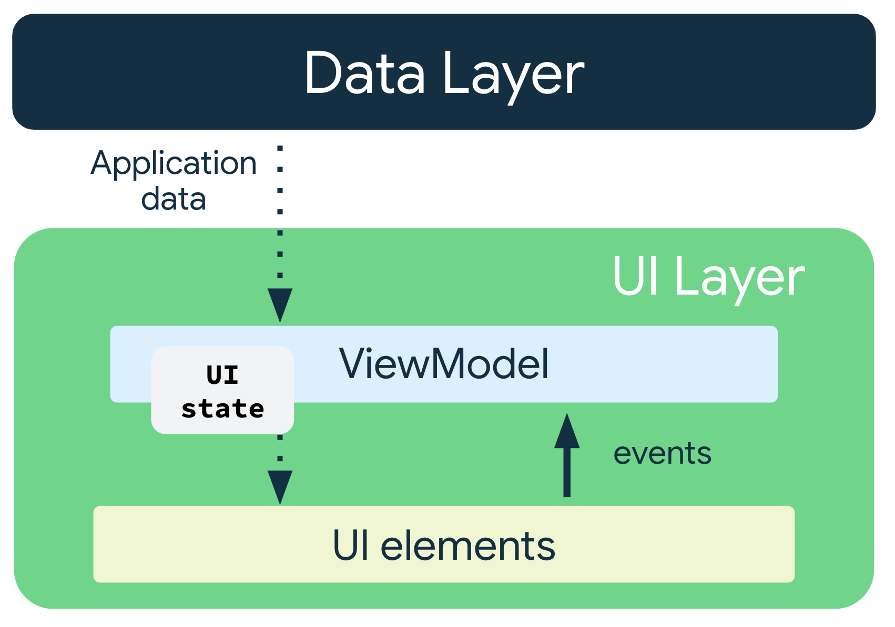
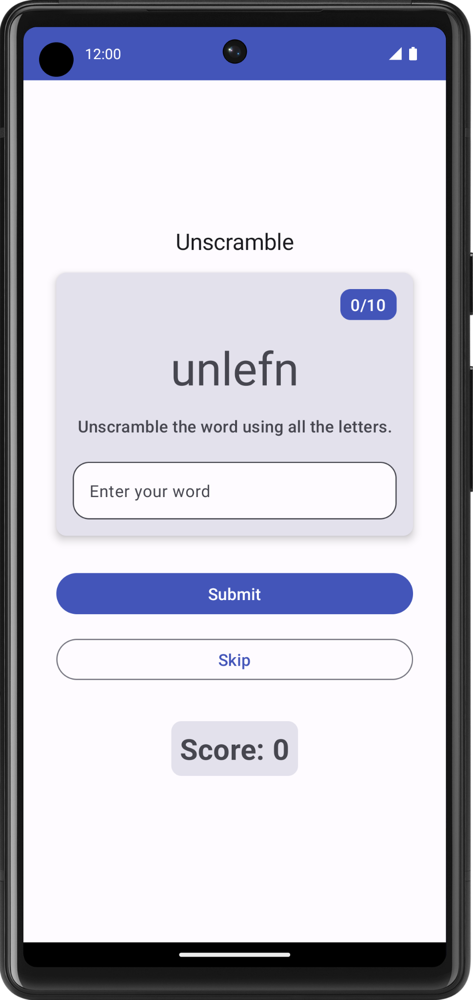
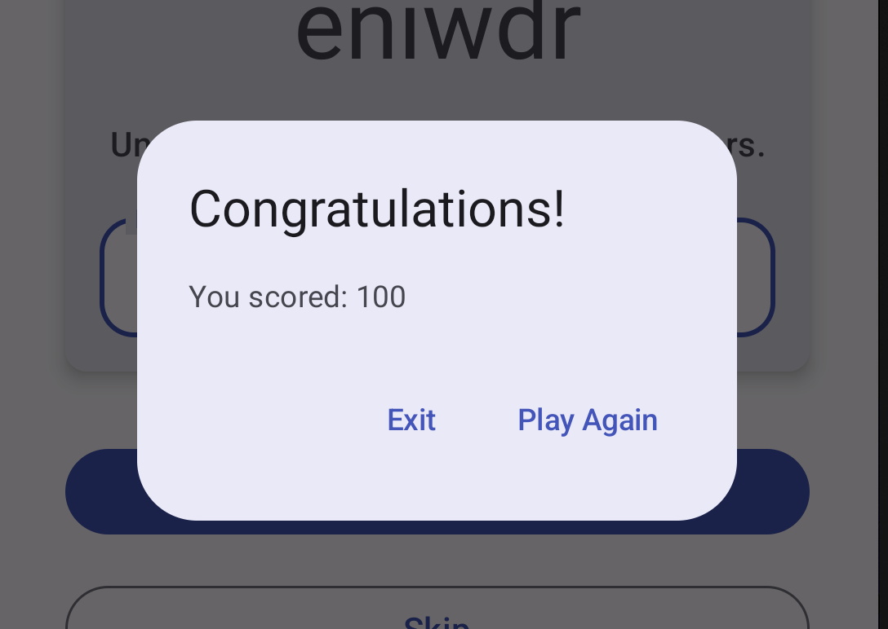
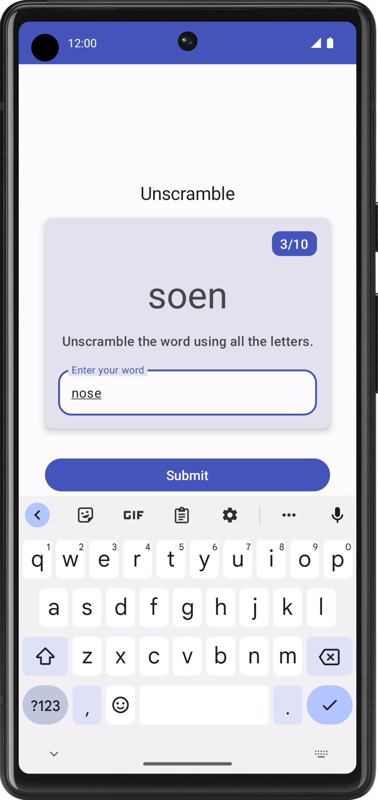
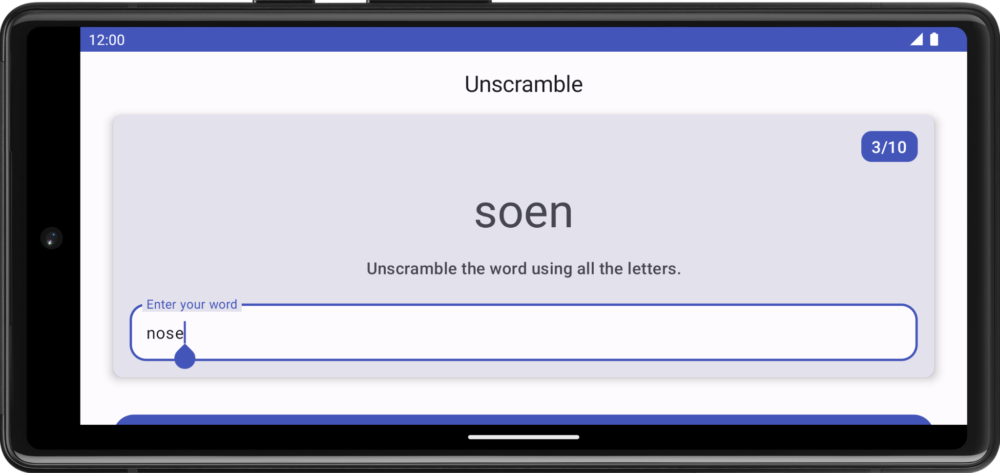

# 在 Compose 中使用 ViewModel 和状态管理

> 本文对应 Android Developers 官方 Codelab：**ViewModel and State in Compose**
> 目标是让你彻底理解每一行代码背后的"为什么"，即使是第一次接触 Android 开发也能看懂。

---

## 目录

1. [准备工作——我们要做什么？](#1-准备工作我们要做什么)
2. [应用概览——游戏长什么样？](#2-应用概览游戏长什么样)
3. [了解应用架构——代码为什么要分层？](#3-了解应用架构代码为什么要分层)
4. [添加 ViewModel——让数据活下来](#4-添加-viewmodel让数据活下来)
5. [构建 Compose 界面——单向数据流](#5-构建-compose-界面单向数据流)
6. [验证猜词与更新得分](#6-验证猜词与更新得分)
7. [显示游戏结束对话框](#7-显示游戏结束对话框)
8. [设备旋转与状态保留](#8-设备旋转与状态保留)
9. [获取解决方案代码](#9-获取解决方案代码)
10. [总结](#10-总结)

---

## 1. 准备工作——我们要做什么？

### 1.1 这个游戏是什么？

**Unscramble** 是一款**猜乱序词**的单人小游戏，就像把一个单词的字母顺序打乱，让你猜出原来的单词是什么。

比如：
- 原词是 `android`，打乱之后可能显示 `dorndia`，你需要猜出 `android`

游戏规则很简单：
- 每局游戏共有 **10 个乱序词**
- 猜对一个词，得 **20 分**
- 猜错了，屏幕会提示 "Wrong Guess!"（猜错了！），可以重试
- 不会的词可以点 **Skip（跳过）**，跳过不得分也不扣分
- 10 个词全部处理完，弹出"恭喜"对话框显示最终得分

### 1.2 起始代码有什么问题？

官方给了我们一个"起始版"的项目，界面已经画好了，但是有几个严重的 bug：

| 问题 | 表现 |
|------|------|
| 乱序词是假的 | 永远显示硬编码的 `"scrambleun"`，不是真的随机词 |
| 按钮没有反应 | 点 Submit（提交）和 Skip（跳过）什么都不发生 |
| 旋转设备会丢数据 | 手机从竖屏转到横屏，得分和进度全部归零 |

我们的任务就是**修复这三个问题**，让游戏真正能玩起来。

### 1.3 学完之后你会掌握什么？

- `ViewModel` 是什么，为什么需要它
- `StateFlow` 和状态管理是怎么工作的
- **单向数据流（UDF）** 的设计理念
- 如何让应用在手机旋转后不丢失数据
- 如何用 `AlertDialog` 弹出结束对话框

### 1.4 前提条件

在开始之前，你需要具备：

- 会写基本的 Kotlin 代码（变量、函数、if/else）
- 用过 Jetpack Compose 画过简单的界面（Text、Button、Column 之类的）
- 安装了最新版 Android Studio

### 1.5 获取起始代码

打开终端，运行以下命令下载项目：

```bash
git clone https://github.com/google-developer-training/basic-android-kotlin-compose-training-unscramble.git
cd basic-android-kotlin-compose-training-unscramble
git checkout starter
```

**逐行解释：**
- `git clone ...`：把 GitHub 上的项目代码下载到你的电脑
- `cd ...`：进入刚下载的项目文件夹
- `git checkout starter`：切换到 `starter` 分支（也就是起始代码，不是最终成品）

如果不熟悉 git，也可以直接下载 ZIP 包：
```
https://github.com/.../archive/refs/heads/starter.zip
```

下载后用 Android Studio 打开项目（File → Open → 选择文件夹）。

### 1.6 起始代码的文件结构

打开项目后，重点关注这几个文件：

```
app/
└── src/main/
    ├── java/com/example/android/unscramble/
    │   ├── data/
    │   │   └── WordsData.kt        ← 词库文件
    │   └── ui/
    │       └── MainActivity.kt     ← 所有界面代码
    └── res/values/
        └── strings.xml             ← 界面文字资源
```

**`WordsData.kt`** 里有三样东西：

```kotlin
// 所有可能出现的单词列表
val allWords: Set<String> = setOf("animal", "auto", "anecdote", ...)

// 每局最多猜几个词（= 10）
const val MAX_NO_OF_WORDS = 10

// 猜对一个词增加多少分（= 20）
const val SCORE_INCREASE = 20
```

**`MainActivity.kt`** 里有几个可组合函数（也就是负责画界面的函数）：

| 函数名 | 作用 |
|--------|------|
| `GameScreen()` | 整个游戏主界面的"大容器" |
| `GameLayout()` | 显示乱序词和输入框的区域 |
| `GameStatus()` | 显示得分和第几个词 |
| `FinalScoreDialog()` | 游戏结束时的对话框 |

---

## 2. 应用概览——游戏长什么样？

### 2.1 三种界面状态

游戏在运行时会出现三种不同的视觉状态：

**① 正常状态（等待输入）**



屏幕上显示：
- 当前是第几题（比如 "1 of 10"）
- 一个乱序词（比如 `dorndia`）
- 一个输入框，提示 "Enter your word"
- 两个按钮：Submit（提交）和 Skip（跳过）

**② 猜错状态（显示错误提示）**



输入框变红，提示文字变成 "Wrong Guess!"（猜错了！）。
乱序词不变，玩家可以重新输入再试一次。

**③ 游戏结束状态（弹出对话框）**



弹出一个对话框，显示：
- 标题："Congratulations!"（恭喜！）
- 内容："You scored: X points"（你得了 X 分）
- 两个按钮：Play Again（再玩一次）和 Exit（退出）

### 2.2 玩家的操作流程

```
启动游戏
    ↓
显示乱序词
    ↓
玩家输入猜测，点 Submit
    ↓
猜对？ → 是 → 得分+20，进入下一词
       ↓
       否 → 显示 "Wrong Guess!"，等待重新输入
    ↓
10 个词都做完？ → 是 → 显示最终得分对话框
               ↓
               否 → 继续下一词
```

---

## 3. 了解应用架构——代码为什么要分层？

在正式写代码之前，我们需要先理解一个重要问题：**为什么不把所有代码都写在一个文件里？**

### 3.1 什么是"分离关注点"？

想象你在开一家餐厅：
- **服务员**负责接待客人、端菜，不负责做菜
- **厨师**负责做菜，不负责端菜
- **仓库管理员**负责存货、采购，不负责做菜也不负责接待

如果一个人既要接待客人、又要做菜、还要管仓库，他一定会手忙脚乱，犯很多错误。

软件也是一样的道理。**分离关注点（Separation of Concerns）** 就是让每个部分各司其职，互不干扰。

在 Android 应用里，我们把代码分成至少两层：

### 3.2 应用架构分层



```
┌─────────────────────────────┐
│         界面层 (UI Layer)    │
│  ┌──────────────────────┐  │
│  │  界面元素             │  │  ← Compose 可组合函数（负责"画"界面）
│  │  (Composable 函数)   │  │
│  └──────────────────────┘  │
│  ┌──────────────────────┐  │
│  │  状态容器             │  │  ← ViewModel（负责"管理数据"）
│  │  (ViewModel)         │  │
│  └──────────────────────┘  │
└─────────────────────────────┘
            ↕ 数据
┌─────────────────────────────┐
│        数据层 (Data Layer)   │
│  Repository、数据库、网络等   │  ← 负责"存储和提供数据"
└─────────────────────────────┘
```

**界面层**做两件事：
1. 把数据显示给用户看（画界面）
2. 把用户的操作（点按钮、输入文字）传递给数据层处理

**数据层**做一件事：
- 存储和管理应用的数据（词库、得分等）

### 3.3 ViewModel 是什么？

`ViewModel` 是住在界面层里的一个特殊角色，专门负责**管理界面需要的数据**。

你可以把它想成游戏里的"后台服务器"：
- 界面（可组合函数）负责显示内容，就像网页
- ViewModel 负责提供数据，就像服务器

**ViewModel 最重要的特性：它的寿命比 Activity 更长！**

这是什么意思呢？

当你旋转手机屏幕时，Android 系统会**销毁并重新创建** Activity（这是一个 Android 的技术设计）。如果你把数据存在 Activity 里，数据就会消失。

但是 ViewModel **不会被销毁**，它会在后台"活着"，等 Activity 重新创建后再把数据交还给它。

```
用户旋转手机
    ↓
Activity 销毁 ← 数据如果在这里 → 数据消失！❌
ViewModel 存活 ← 数据如果在这里 → 数据安全！✅
    ↓
Activity 重新创建
    ↓
ViewModel 把数据交给新的 Activity
    ↓
界面恢复正常，数据没有丢失
```



### 3.4 什么是界面状态？

**界面状态（UI State）** 是指"界面上现在应该显示什么内容"的完整描述。

比如 Unscramble 游戏的界面状态包括：
- 当前显示的乱序词是什么？
- 玩家有没有猜错？
- 现在得了多少分？
- 现在是第几个词？
- 游戏结束了吗？

我们用一个 **数据类（data class）** 来把这些状态统一存放：

```kotlin
data class GameUiState(
    val currentScrambledWord: String = "",  // 当前乱序词
    val isGuessedWordWrong: Boolean = false, // 猜错了吗？
    val score: Int = 0,                     // 当前得分
    val currentWordCount: Int = 1,          // 第几个词
    val isGameOver: Boolean = false          // 游戏结束了吗？
)
```

> **为什么用 `val`（不可变属性）而不用 `var`（可变属性）？**
>
> 因为我们要保证**界面状态是不可变的（immutable）**。每次状态改变，都创建一个新的 `GameUiState` 对象来替换旧的，而不是直接修改旧对象。这样可以避免很多难以察觉的 bug，同时让状态变化更可追踪。

### 3.5 单向数据流（UDF）——数据和事件的流向

这是整个架构中最核心的设计思想，理解了它，后面的代码就全通了。

**单向数据流（Unidirectional Data Flow，UDF）** 的规则：
- **状态（State）向下流动**：从 ViewModel 流向界面（可组合函数）
- **事件（Event）向上流动**：从界面流向 ViewModel



用餐厅比喻来理解：
```
厨师（ViewModel）准备好菜（状态）→ 服务员（界面）端给客人看
客人（用户）点菜（事件）→ 服务员（界面）告诉厨师（ViewModel）
```

具体到 Unscramble 游戏：
```
1. ViewModel 生成乱序词 → 传给界面显示
2. 用户输入猜测，点 Submit → 界面把事件传给 ViewModel
3. ViewModel 验证是否正确，更新状态 → 界面重新显示新状态
```

**为什么要这样设计？**

如果界面可以直接修改数据，数据可以随时随地被任何地方修改，当出现 bug 时，你根本不知道数据是被谁改的。

单向数据流规定：**只有 ViewModel 能修改状态**，界面只是显示状态和发送事件，这样出 bug 了你一定能在 ViewModel 里找到原因。

---

## 4. 添加 ViewModel——让数据活下来

理论讲够了，开始写代码！

### 4.1 第一步：添加 Gradle 依赖项

**Gradle** 是 Android 项目的构建工具，就像一个"购物清单"——你在上面写清楚需要哪些库，Gradle 就帮你自动下载和配置。

打开 `app/build.gradle.kts` 文件（注意是 `app` 目录下的，不是项目根目录的），找到 `dependencies { ... }` 这个代码块，在里面添加一行：

```kotlin
dependencies {
    // ... 其他已有的依赖 ...

    // 添加这一行：ViewModel 和 Compose 的集成库
    implementation("androidx.lifecycle:lifecycle-viewmodel-compose:2.6.1")
}
```

**这行代码的意思：**
- `implementation`：告诉 Gradle "我需要这个库"
- `androidx.lifecycle:lifecycle-viewmodel-compose`：这个库让 ViewModel 和 Compose 可以一起工作
- `2.6.1`：使用的版本号

添加之后，Android Studio 右上角会出现一个 **"Sync Now"** 的提示，点它，等待下载完成。

> **为什么要同步（Sync）？**
> Gradle 需要重新读取配置文件，下载你添加的新库，并把它集成到项目中。不同步的话，你写的代码会报错找不到 ViewModel 相关的类。

### 4.2 第二步：创建 GameUiState 数据类

在 `com.example.android.unscramble.ui` 包下（也就是 `ui` 文件夹里），创建一个新文件 `GameViewModel.kt`。

先在文件里定义状态类，**表达"界面在某个时刻应该长什么样"**：

```kotlin
// 文件：ui/GameViewModel.kt

package com.example.android.unscramble.ui

// GameUiState 描述了界面在某一个时刻的全部状态
// 所有字段都有默认值，所以初始化时可以不传任何参数
data class GameUiState(
    val currentScrambledWord: String = "",   // 当前显示给玩家的乱序词，默认空字符串
    val isGuessedWordWrong: Boolean = false,  // 玩家猜错了吗？默认没猜错
    val score: Int = 0,                      // 当前得分，默认 0 分
    val currentWordCount: Int = 1,           // 当前是第几个词，默认第 1 个
    val isGameOver: Boolean = false           // 游戏结束了吗？默认没有
)
```

**`data class` 是什么？**

`data class`（数据类）是 Kotlin 里专门用来存储数据的类，它会自动帮你生成几个非常有用的函数：

- `copy()`：复制一个对象，可以只改变其中几个字段
- `equals()`：比较两个对象是否完全相同
- `toString()`：把对象转成字符串（调试时很有用）

我们最常用的是 `copy()`，稍后会看到它的用处。

### 4.3 第三步：创建 GameViewModel 类

在同一个文件 `GameViewModel.kt` 中，继续写 ViewModel 类：

```kotlin
import androidx.lifecycle.ViewModel

class GameViewModel : ViewModel() {
    // 这里后面会逐步添加内容
}
```

**`class GameViewModel : ViewModel()`** 的意思：
- `class GameViewModel`：定义一个名叫 `GameViewModel` 的类
- `: ViewModel()`：让它继承 `ViewModel` 类

就像小孩继承了父母的特性一样，`GameViewModel` 继承了 `ViewModel` 的所有能力，包括在配置变更（如旋转屏幕）时继续存活的能力。

### 4.4 第四步：使用 StateFlow 暴露状态

现在要在 ViewModel 里存储 `GameUiState`，并把它"公开"给界面。

**为什么不直接用普通变量？**

普通变量的值变了，界面不会自动知道。我们需要一种"响应式"的数据容器，当数据变化时，自动通知界面更新。这就是 `StateFlow`。

**`StateFlow` 的比喻：**

想象 `StateFlow` 是一个直播频道。ViewModel 是主播，界面是观众。主播发布新内容（状态更新），所有正在观看的观众（界面）都会立即看到最新内容。

```kotlin
import kotlinx.coroutines.flow.MutableStateFlow
import kotlinx.coroutines.flow.StateFlow
import kotlinx.coroutines.flow.asStateFlow

class GameViewModel : ViewModel() {

    // _uiState：私有的，只有 ViewModel 自己能修改
    // MutableStateFlow 表示"可以被改变的状态流"
    private val _uiState = MutableStateFlow(GameUiState())

    // uiState：公开的，界面可以读取，但不能修改
    // asStateFlow() 把 MutableStateFlow 转换为只读的 StateFlow
    val uiState: StateFlow<GameUiState> = _uiState.asStateFlow()
}
```

**这里用了"后备属性（Backing Property）"模式，理解它非常重要：**

```
_uiState（私有，可写）  ←→  uiState（公开，只读）
      ↑                           ↑
 只有 ViewModel 能改           界面只能看，不能改
```

这就像银行账户：
- 只有你自己（ViewModel）能往账户里存钱取钱（`_uiState`）
- 别人（界面）只能看你的余额，不能动它（`uiState`）

为什么要这样做？

**安全性**：如果界面可以直接修改状态，代码会变得混乱，很难追踪数据是谁改的。后备属性模式保证了"修改状态"这个权力只在 ViewModel 手里。

| 属性 | 类型 | 可见性 | 谁能用 |
|------|------|--------|--------|
| `_uiState` | `MutableStateFlow<GameUiState>` | `private`（私有） | 只有 ViewModel 自己 |
| `uiState` | `StateFlow<GameUiState>` | `public`（公开） | 任何人都能读，但不能写 |

### 4.5 第五步：实现随机乱序词逻辑

现在给 ViewModel 添加"选词"和"打乱顺序"的功能。

```kotlin
import com.example.android.unscramble.data.allWords
import com.example.android.unscramble.data.MAX_NO_OF_WORDS

class GameViewModel : ViewModel() {

    private val _uiState = MutableStateFlow(GameUiState())
    val uiState: StateFlow<GameUiState> = _uiState.asStateFlow()

    // 记录当前这道题的正确答案
    // lateinit 表示"我保证在使用前一定会赋值"，先不初始化
    private lateinit var currentWord: String

    // 记录这局游戏已经用过的词，避免重复出题
    // MutableSet 是一个集合，里面的元素不重复
    private var usedWords: MutableSet<String> = mutableSetOf()

    // ==================== 选词和打乱顺序 ====================

    // 从词库里随机挑一个还没用过的词，然后打乱它的字母顺序
    private fun pickRandomWordAndShuffle(): String {
        // 从 allWords 集合中随机选一个词
        currentWord = allWords.random()

        // 如果这个词已经用过了，就递归调用自己再选一次
        // 递归就是"函数自己调用自己"，直到找到一个没用过的词为止
        if (usedWords.contains(currentWord)) {
            return pickRandomWordAndShuffle()
        } else {
            // 找到了一个新词，把它记录到"已用词"集合里
            usedWords.add(currentWord)
            // 打乱字母顺序后返回
            return shuffleCurrentWord(currentWord)
        }
    }

    // 把一个单词的字母顺序打乱
    private fun shuffleCurrentWord(word: String): String {
        // 把字符串转成字符数组，这样可以对每个字母单独操作
        val tempWord = word.toCharArray()

        // 打乱字母顺序
        // 用 while 循环确保打乱后的结果和原词不一样
        // 因为 shuffle() 是随机的，有极小概率打乱后和原词一样
        tempWord.shuffle()
        while (String(tempWord) == word) {
            tempWord.shuffle()  // 如果打乱后还是原词，就再打乱一次
        }

        // 把字符数组转回字符串并返回
        return String(tempWord)
    }

    // ==================== 游戏重置 ====================

    // 重置游戏状态，可以用于"再玩一次"
    fun resetGame() {
        // 清空已用词列表，下一局可以重新用这些词
        usedWords.clear()

        // 把状态更新为初始状态，同时生成第一个乱序词
        _uiState.value = GameUiState(
            currentScrambledWord = pickRandomWordAndShuffle()
        )
    }

    // init 块：ViewModel 被创建时自动执行的代码
    // 相当于构造函数里的初始化代码
    init {
        resetGame()  // 游戏一开始就自动重置（初始化）
    }
}
```

**逐段详细解释：**

---

**`lateinit var currentWord: String`**

`lateinit` 的意思是"我承诺这个变量在被使用之前一定会赋值，但现在先不给它赋值"。

为什么不直接写 `var currentWord: String = ""`？

可以这么写，但用 `lateinit` 更好，因为它会帮你检查：如果你忘了赋值就去用它，程序会抛出一个清晰的错误提示 `UninitializedPropertyAccessException`，而不是悄无声息地用一个空字符串导致奇怪的 bug。

---

**`pickRandomWordAndShuffle()` 里的递归**

```kotlin
if (usedWords.contains(currentWord)) {
    return pickRandomWordAndShuffle()  // 递归调用自己
}
```

这个递归调用的意思是：
1. 我随机选了一个词
2. 发现这个词已经用过了
3. 那就重新选一个词（再调用一次自己）
4. 直到选到一个没用过的词为止

就像从一堆扑克牌里随机抽牌，如果抽到的牌已经用过了就放回去再抽，直到抽到没用过的为止。

---

**`shuffleCurrentWord()` 里的 while 循环**

```kotlin
tempWord.shuffle()
while (String(tempWord) == word) {
    tempWord.shuffle()
}
```

`shuffle()` 是随机的，比如原词是 `"ab"`，打乱后可能是 `"ab"`（还是原来的顺序）或 `"ba"`。我们需要的乱序词**必须和原词不同**，不然玩家一眼就看出来了。

所以用 while 循环：打完乱之后检查一下，如果还是原词就再打乱一次，直到不一样为止。

---

**`_uiState.value = GameUiState(...)`**

`.value` 是直接替换整个状态的方式。等于说：
- 创建一个全新的 `GameUiState` 对象
- 把它赋值给 `_uiState.value`
- `StateFlow` 检测到值变化，自动通知所有观察者（界面）

---

**`init { resetGame() }`**

`init` 块是 Kotlin 类的初始化代码块，当这个类的对象被创建时，`init` 里的代码会立即执行。

所以当 Android 系统第一次创建 `GameViewModel` 时，`resetGame()` 就会被调用，游戏自动开始。

---

## 5. 构建 Compose 界面——单向数据流

数据层（ViewModel）准备好了，现在要让界面能够"看到"这些数据。

### 5.1 在 GameScreen 中获取 ViewModel

打开 `MainActivity.kt`，找到 `GameScreen()` 函数，修改它的参数：

```kotlin
import androidx.lifecycle.viewmodel.compose.viewModel
import androidx.compose.runtime.collectAsState
import androidx.compose.runtime.getValue

@Composable
fun GameScreen(
    // viewModel() 是一个特殊的函数
    // 它会找到或创建一个与当前界面绑定的 GameViewModel 实例
    // 默认值写法让它成为可选参数，方便测试时替换
    gameViewModel: GameViewModel = viewModel()
) {
    // collectAsState() 把 StateFlow 转换成 Compose 可以"观察"的 State 对象
    // 每当 ViewModel 里的状态更新，这里的 gameUiState 就会自动更新
    // 界面也会自动重组（重新绘制）
    val gameUiState by gameViewModel.uiState.collectAsState()

    // 现在可以使用 gameUiState 里的数据了
    // 比如 gameUiState.currentScrambledWord 就是当前的乱序词
}
```

**详细解释：**

---

**`viewModel()` 函数**

这是 `lifecycle-viewmodel-compose` 库提供的函数。它做了两件事：

1. 如果这个 ViewModel 还不存在，就创建一个新的
2. 如果已经存在（比如屏幕旋转后），就返回已有的那个

这就是为什么旋转屏幕后数据不丢失——ViewModel 没有被重新创建，而是找到了原来那个！

---

**`collectAsState()`**

`StateFlow` 本身是一个"数据流"，Compose 不能直接订阅它。`collectAsState()` 把它转换成 Compose 认识的 `State<GameUiState>` 类型。

`by` 关键字（属性委托）让你可以直接写 `gameUiState.xxx`，而不用写 `gameUiState.value.xxx`。

---

### 5.2 把乱序词传递给 GameLayout

修改 `GameLayout()` 函数，让它接受并显示真实的乱序词：

```kotlin
@Composable
fun GameLayout(
    currentScrambledWord: String,   // 新增参数：当前乱序词
    modifier: Modifier = Modifier
) {
    Card(
        modifier = modifier,
        elevation = CardDefaults.cardElevation(defaultElevation = 5.dp)
    ) {
        Column(
            // ...
        ) {
            // 把 hardcoded 的假词换成真实的参数
            Text(
                text = currentScrambledWord,   // ← 这里之前是 "scrambleun"
                fontSize = 45.sp,
                modifier = Modifier.align(Alignment.CenterHorizontally)
            )
            // ...
        }
    }
}
```

然后在 `GameScreen()` 里调用时把数据传进去：

```kotlin
GameLayout(
    currentScrambledWord = gameUiState.currentScrambledWord,  // 从状态里取数据
    modifier = Modifier
        .fillMaxWidth()
        .wrapContentHeight()
        .padding(mediumPadding)
)
```

此时运行应用，你会看到每次启动都是不同的乱序词了！



### 5.3 连接用户输入

现在处理"玩家在输入框里输入猜测"这个功能。

**先在 ViewModel 里添加用户输入的状态：**

```kotlin
import androidx.compose.runtime.mutableStateOf
import androidx.compose.runtime.getValue
import androidx.compose.runtime.setValue

class GameViewModel : ViewModel() {

    // ... 之前的代码 ...

    // 用户当前输入的猜测词
    // 这里用 mutableStateOf 而不是 MutableStateFlow，下面会解释原因
    var userGuess by mutableStateOf("")
        private set  // 外部只能读，不能直接赋值

    // 当用户输入文字时调用这个函数
    fun updateUserGuess(guessedWord: String) {
        userGuess = guessedWord
    }
}
```

**`mutableStateOf` vs `MutableStateFlow`，应该用哪个？**

| 特性 | `mutableStateOf` | `MutableStateFlow` |
|------|------------------|--------------------|
| 适合 | Compose UI 内部的临时状态 | 需要在非 Compose 代码中使用的状态 |
| 用法 | 更简单，直接读写 | 更强大，支持流操作 |
| 适用场景 | 用户正在打字的内容、按钮是否高亮等 | 游戏得分、词语等核心业务状态 |

`userGuess` 只是玩家打字时的临时内容，用 `mutableStateOf` 更简单。游戏得分、乱序词等核心数据用 `MutableStateFlow`。

---

**再更新 `GameLayout()` 的参数，让输入框能双向绑定：**

```kotlin
@Composable
fun GameLayout(
    currentScrambledWord: String,
    userGuess: String,                  // 新增：当前用户输入的内容
    onUserGuessChanged: (String) -> Unit, // 新增：用户改变输入时回调
    onKeyboardDone: () -> Unit,          // 新增：用户点键盘上的"完成"时回调
    modifier: Modifier = Modifier
) {
    Card(...) {
        Column(...) {
            Text(text = currentScrambledWord, ...)

            // OutlinedTextField 是带边框的输入框
            OutlinedTextField(
                value = userGuess,              // 显示 ViewModel 里存的猜测词
                singleLine = true,              // 只允许输入一行
                shape = shapes.large,           // 输入框形状
                modifier = Modifier.fillMaxWidth(),
                colors = TextFieldDefaults.textFieldColors(
                    containerColor = colorScheme.surface
                ),
                onValueChange = onUserGuessChanged,  // 用户每次打字，调用这个回调
                label = { Text(stringResource(R.string.enter_your_word)) },
                isError = false,                // 暂时写 false，后面会改成动态的
                keyboardOptions = KeyboardOptions.Default.copy(
                    imeAction = ImeAction.Done  // 键盘右下角显示"完成"按钮
                ),
                keyboardActions = KeyboardActions(
                    onDone = { onKeyboardDone() }  // 点"完成"时调用回调
                )
            )
        }
    }
}
```

**`onValueChange = onUserGuessChanged` 是什么意思？**

`OutlinedTextField` 的 `onValueChange` 参数是一个回调函数：每当用户在输入框里打了任何一个字，它就会被调用，并把**最新的输入内容**作为参数传进来。

我们把这个事件"向上传"给 `GameScreen`，再由 `GameScreen` 传给 ViewModel 处理。

这就是 UDF（单向数据流）里"**事件向上传**"的体现：
```
用户打字 → TextField 检测到 → onValueChange 回调 → 
→ onUserGuessChanged 参数 → GameScreen 里调用 → 
→ gameViewModel.updateUserGuess(it) → ViewModel 更新状态 →
→ 界面重组，TextField 显示新内容
```

---

**在 `GameScreen` 里传入这些新参数：**

```kotlin
GameLayout(
    currentScrambledWord = gameUiState.currentScrambledWord,
    userGuess = gameViewModel.userGuess,   // 从 ViewModel 读取用户输入
    onUserGuessChanged = { gameViewModel.updateUserGuess(it) },  // 更新用户输入
    onKeyboardDone = { },   // 暂时留空，后面实现提交逻辑
    modifier = Modifier...
)
```

`{ gameViewModel.updateUserGuess(it) }` 是一个 Lambda 函数：
- `{ ... }` 是 Lambda 的写法
- `it` 是 Kotlin Lambda 中默认的单参数名称，这里代表用户最新输入的文字

---

## 6. 验证猜词与更新得分

### 6.1 完善 GameUiState

更新 `GameUiState`，确保它包含所有需要的字段（之前可能只有 `currentScrambledWord`）：

```kotlin
data class GameUiState(
    val currentScrambledWord: String = "",   // 当前乱序词
    val isGuessedWordWrong: Boolean = false,  // 猜错了吗？
    val score: Int = 0,                      // 当前得分
    val currentWordCount: Int = 1,           // 第几个词（1 到 10）
    val isGameOver: Boolean = false           // 游戏是否结束
)
```

每个字段都有默认值，这样在创建时可以只指定要改变的字段。

### 6.2 实现 checkUserGuess() 函数

这是游戏逻辑的核心，当玩家点 Submit 按钮时调用：

```kotlin
import com.example.android.unscramble.data.SCORE_INCREASE
import kotlinx.coroutines.flow.update

fun checkUserGuess() {
    // 把用户输入和正确答案做比较
    // ignoreCase = true 表示忽略大小写，"Android" 和 "android" 都算对
    if (userGuess.equals(currentWord, ignoreCase = true)) {
        // ========== 猜对了！==========
        // 把得分加上 SCORE_INCREASE（= 20）
        val updatedScore = _uiState.value.score.plus(SCORE_INCREASE)
        // 调用 updateGameState 进入下一步
        updateGameState(updatedScore)
    } else {
        // ========== 猜错了！==========
        // 用 update + copy 只更新 isGuessedWordWrong 字段
        // 其他字段（得分、词数等）保持不变
        _uiState.update { currentState ->
            currentState.copy(isGuessedWordWrong = true)
        }
    }

    // 不管猜对还是猜错，都清空输入框
    updateUserGuess("")
}
```

**`_uiState.update { ... }` 和 `copy()` 的详细解释：**

`update` 是 `MutableStateFlow` 提供的函数，用法是：
```kotlin
_uiState.update { currentState ->
    currentState.copy(/* 只改变某些字段 */)
}
```

- `{ currentState -> ... }` 是一个 Lambda，`currentState` 是当前的状态快照
- `currentState.copy(isGuessedWordWrong = true)` 创建一个新的 `GameUiState` 对象，其中 `isGuessedWordWrong` 变为 `true`，其他所有字段保持原值不变

就像复印机：
```
原来的状态：GameUiState(score=40, currentWordCount=3, isGuessedWordWrong=false, ...)
                              ↓ copy(isGuessedWordWrong = true)
新的状态：  GameUiState(score=40, currentWordCount=3, isGuessedWordWrong=true, ...)
```
只有 `isGuessedWordWrong` 变了，其他全部保持原样。

---

### 6.3 实现 updateGameState() 函数

这个私有函数处理猜对后的逻辑：是进入下一个词还是结束游戏。

```kotlin
private fun updateGameState(updatedScore: Int) {
    // usedWords.size 是已经用过的词的数量
    // 当它等于 MAX_NO_OF_WORDS（= 10）时，说明 10 个词都做完了
    if (usedWords.size == MAX_NO_OF_WORDS) {
        // ========== 游戏结束 ==========
        _uiState.update { currentState ->
            currentState.copy(
                isGuessedWordWrong = false,  // 清除错误状态
                score = updatedScore,         // 保存最终得分
                isGameOver = true             // 标记游戏结束
                // 注意：不更新 currentScrambledWord，游戏结束了不需要新词
            )
        }
    } else {
        // ========== 还有下一个词 ==========
        _uiState.update { currentState ->
            currentState.copy(
                isGuessedWordWrong = false,                         // 清除错误状态
                currentScrambledWord = pickRandomWordAndShuffle(),   // 换下一个乱序词
                currentWordCount = currentState.currentWordCount.inc(), // 词数 +1
                score = updatedScore                                 // 更新得分
            )
        }
    }
}
```

**`currentState.currentWordCount.inc()`**

`.inc()` 是 Kotlin 的 `Int` 类型自带的函数，等同于 `+ 1`。
所以 `currentState.currentWordCount.inc()` 就是 `currentState.currentWordCount + 1`。

---

### 6.4 实现 skipWord() 函数

跳过当前词，不得分，进入下一个：

```kotlin
fun skipWord() {
    // 跳过不改变得分，所以传入当前得分
    updateGameState(_uiState.value.score)
    // 清空输入框
    updateUserGuess("")
}
```

注意这里复用了 `updateGameState()`，代码非常简洁。

### 6.5 在界面显示错误状态

当 `isGuessedWordWrong` 为 `true` 时，输入框应该变红并显示错误提示。

先在 `strings.xml` 里添加错误提示文字：

```xml
<!-- res/values/strings.xml -->
<string name="wrong_guess">Wrong Guess!</string>
```

然后更新 `GameLayout()` 的 `isGuessWrong` 参数和 `OutlinedTextField`：

```kotlin
@Composable
fun GameLayout(
    currentScrambledWord: String,
    userGuess: String,
    onUserGuessChanged: (String) -> Unit,
    onKeyboardDone: () -> Unit,
    isGuessWrong: Boolean,        // 新增参数
    modifier: Modifier = Modifier
) {
    // ...
    OutlinedTextField(
        value = userGuess,
        onValueChange = onUserGuessChanged,
        isError = isGuessWrong,    // 猜错了就显示红色错误样式
        label = {
            // 根据 isGuessWrong 动态显示不同的提示文字
            if (isGuessWrong) {
                Text(stringResource(R.string.wrong_guess))  // "Wrong Guess!"
            } else {
                Text(stringResource(R.string.enter_your_word))  // "Enter your word"
            }
        },
        // ...
    )
}
```

**`isError = isGuessWrong` 做了什么？**

`OutlinedTextField` 的 `isError` 参数是 Material Design 内置的错误样式控制：
- 当 `isError = true` 时，输入框边框和标签文字自动变成红色
- 当 `isError = false` 时，恢复正常颜色

我们不需要自己写变色的代码，Material 3 帮我们处理了！

### 6.6 连接 Submit 和 Skip 按钮

在 `GameScreen()` 里，找到 Submit 和 Skip 按钮，给它们添加点击事件：

```kotlin
// Submit 按钮：点击后提交猜测
Button(
    modifier = Modifier.fillMaxWidth(),
    onClick = { gameViewModel.checkUserGuess() }  // 调用 ViewModel 的验证函数
) {
    Text(
        text = stringResource(R.string.submit),
        fontSize = 16.sp
    )
}

// Skip 按钮：点击后跳过当前词
OutlinedButton(
    onClick = { gameViewModel.skipWord() },  // 调用 ViewModel 的跳过函数
    modifier = Modifier.fillMaxWidth()
) {
    Text(
        text = stringResource(R.string.skip),
        fontSize = 16.sp
    )
}
```

同时，更新 `GameScreen()` 中调用 `GameLayout()` 的地方，传入新参数：

```kotlin
GameLayout(
    currentScrambledWord = gameUiState.currentScrambledWord,
    userGuess = gameViewModel.userGuess,
    onUserGuessChanged = { gameViewModel.updateUserGuess(it) },
    onKeyboardDone = { gameViewModel.checkUserGuess() },  // 键盘"完成"也提交猜测
    isGuessWrong = gameUiState.isGuessedWordWrong,  // 传入错误状态
    modifier = Modifier...
)
```

### 6.7 显示得分和词数

找到 `GameStatus()` 函数（显示底部状态栏的函数），让它显示真实数据：

```kotlin
@Composable
fun GameStatus(
    score: Int,
    wordCount: Int,
    modifier: Modifier = Modifier
) {
    Card(modifier = modifier) {
        Column(
            horizontalAlignment = Alignment.CenterHorizontally
        ) {
            Text(
                text = stringResource(R.string.word_count, wordCount, MAX_NO_OF_WORDS),
                // 比如显示 "1 of 10"
            )
            Text(
                text = stringResource(R.string.score, score),
                // 比如显示 "Score: 40"
            )
        }
    }
}
```

在 `GameScreen()` 中调用时传入数据：

```kotlin
GameStatus(
    score = gameUiState.score,
    wordCount = gameUiState.currentWordCount
)
```

现在运行应用，游戏的核心功能已经全部可用了！

---

## 7. 显示游戏结束对话框

### 7.1 什么是 AlertDialog？

`AlertDialog`（提示对话框）是 Material Design 的标准弹窗组件。它会弹出一个小窗口，吸引用户注意，并提供一些按钮让用户做选择。

常见的 AlertDialog 由以下部分组成：

```
┌───────────────────────────┐
│  标题（title）             │  ← "Congratulations!"
│                           │
│  内容文字（text）           │  ← "You scored: 180 points"
│                           │
│  [取消按钮] [确认按钮]      │  ← "Exit"  "Play Again"
└───────────────────────────┘
```



### 7.2 实现 FinalScoreDialog

在 `MainActivity.kt` 中找到（或新建）`FinalScoreDialog()` 函数：

```kotlin
import android.app.Activity
import androidx.compose.ui.platform.LocalContext

@Composable
private fun FinalScoreDialog(
    score: Int,              // 最终得分
    onPlayAgain: () -> Unit, // 点"再玩一次"时的回调
    modifier: Modifier = Modifier
) {
    // LocalContext.current 获取当前的 Android Context（上下文）
    // as Activity 把它转换为 Activity 类型
    // 这样才能调用 activity.finish() 关闭应用
    val activity = (LocalContext.current as Activity)

    AlertDialog(
        // onDismissRequest：用户点击对话框外面时的回调
        // 这里传空 Lambda，表示不允许点外面关闭（必须选按钮）
        onDismissRequest = { },

        title = {
            Text(text = stringResource(R.string.congratulations))
            // 显示 "Congratulations!"
        },

        text = {
            Text(text = stringResource(R.string.you_scored, score))
            // 显示 "You scored: X points"，其中 score 是动态填入的
        },

        modifier = modifier,

        // dismissButton：左侧按钮（通常是"取消"或"退出"）
        dismissButton = {
            TextButton(
                onClick = { activity.finish() }
                // activity.finish() 关闭当前 Activity，即退出游戏
            ) {
                Text(text = stringResource(R.string.exit))
                // 显示 "Exit"
            }
        },

        // confirmButton：右侧按钮（通常是"确认"或"继续"）
        confirmButton = {
            TextButton(
                onClick = onPlayAgain
                // 调用传进来的回调，外部决定"再玩一次"具体做什么
            ) {
                Text(text = stringResource(R.string.play_again))
                // 显示 "Play Again"
            }
        }
    )
}
```

同时在 `strings.xml` 里添加缺少的字符串：

```xml
<string name="congratulations">Congratulations!</string>
<string name="you_scored">You scored: %1$d points</string>
<string name="exit">Exit</string>
<string name="play_again">Play Again</string>
```

**`%1$d` 是什么？**

这是字符串格式化的占位符：
- `%1$d`：第一个参数，显示为整数（d = decimal，十进制整数）
- 当代码里写 `stringResource(R.string.you_scored, score)` 时，`score` 就会被插入到 `%1$d` 的位置

比如 `score = 180`，最终显示的文字就是 `"You scored: 180 points"`。

### 7.3 在 GameScreen 里触发对话框

在 `GameScreen()` 函数里，根据游戏是否结束来决定是否显示对话框：

```kotlin
@Composable
fun GameScreen(
    gameViewModel: GameViewModel = viewModel()
) {
    val gameUiState by gameViewModel.uiState.collectAsState()

    // ... 其他界面代码 ...

    // 关键：当游戏结束时，显示 FinalScoreDialog
    if (gameUiState.isGameOver) {
        FinalScoreDialog(
            score = gameUiState.score,
            onPlayAgain = { gameViewModel.resetGame() }
            // 点"Play Again"时，调用 ViewModel 的 resetGame()
            // resetGame() 会清空状态并重新开始
        )
    }
}
```

**这里的逻辑非常简洁：**
- `if (gameUiState.isGameOver)`：Compose 的声明式 UI，当这个条件为 `true` 时，对话框就"存在"；为 `false` 时，对话框就"不存在"
- 你不需要手动写"显示对话框"和"隐藏对话框"的命令，状态变了，界面自动跟着变

### 7.4 最终的 resetGame()

在 `GameViewModel` 中，`resetGame()` 已经在前面实现了，再看一眼确认它的功能：

```kotlin
fun resetGame() {
    usedWords.clear()  // 清空已用词，下一局可以重新出这些词
    _uiState.value = GameUiState(
        currentScrambledWord = pickRandomWordAndShuffle()
        // 只传入 currentScrambledWord，其他字段（score、currentWordCount等）
        // 都用 GameUiState 里定义的默认值（score=0, currentWordCount=1 等）
    )
}
```

这一个函数就完成了"重置游戏"的全部工作：得分清零、词数重置、已用词清空、生成新乱序词。

游戏结束对话框效果：


---

## 8. 设备旋转与状态保留

### 8.1 为什么旋转屏幕会导致数据丢失？

这是一个很多 Android 初学者遇到的问题，理解它非常重要。

当你旋转手机时，Android 系统认为"屏幕方向变了，需要重新加载界面"，所以它会：
1. 销毁（destroy）当前的 Activity
2. 重新创建（recreate）一个新的 Activity

这个过程类似于关闭程序再重新打开，所有存在 Activity 里的变量都会被清空。

如果你的数据存在普通变量里：
```kotlin
// ❌ 这样写，旋转屏幕后 score 会变回 0
class MainActivity : ComponentActivity() {
    var score = 0  // 旋转后重新创建 Activity，score 重置为 0
}
```

### 8.2 ViewModel 为什么能存活？

`ViewModel` 的生命周期和 Activity 是分开的。即使 Activity 被销毁，ViewModel 也不会被销毁，它会一直存在，直到用户真正离开这个页面（比如按返回键）。

当新的 Activity 被创建后，它会连接到原来那个 ViewModel，数据完好无损。

```
用户旋转手机
    ↓
Activity 销毁并重新创建
    ↓                         ← ViewModel 不受影响，一直活着
新 Activity 调用 viewModel()
    ↓
viewModel() 发现原来的 ViewModel 还在
    ↓
把原来的 ViewModel 返回给新 Activity
    ↓
界面重新显示，数据一切正常 ✅
```

### 8.3 验证状态保留

**测试步骤：**

1. 运行应用
2. 猜对几道题，让得分增加（比如得到 60 分，做到第 4 题）
3. 旋转设备（或在模拟器里按 `Ctrl+F11` 旋转）

| 旋转前 | 旋转后 |
|--------|--------|
|  |  |

旋转后，得分、当前题数、乱序词全部保持不变！

### 8.4 不同状态保留方案对比

在 Android 开发中，有几种保留状态的方式，适用于不同场景：

| 方案 | 存活范围 | 典型用途 |
|------|----------|----------|
| `remember` | 仅在当前重组周期 | 最简单的临时 UI 状态，如动画状态 |
| `rememberSaveable` | 重组 + 配置变更（旋转等） | 需要在旋转后保留的简单 Compose 状态 |
| `ViewModel` | 独立于 Activity 生命周期 | 应用的核心业务数据和逻辑 |

**什么时候用哪个？**

- 一个临时的弹窗是否展开？→ `remember`（很临时，不需要保留）
- 用户在表单里输入的内容？→ `rememberSaveable`（旋转后希望还在）
- 游戏得分、用户数据？→ `ViewModel`（这是核心数据，必须稳定存活）

在 Unscramble 游戏里，我们所有的游戏状态都在 ViewModel 里，所以旋转屏幕后一切正常，不需要额外处理。

---

## 9. 获取解决方案代码

如果你遇到了问题，或者想对照官方完整版代码，可以查看：

```bash
git clone https://github.com/google-developer-training/basic-android-kotlin-compose-training-unscramble.git
cd basic-android-kotlin-compose-training-unscramble
git checkout viewmodel
```

或者直接下载 ZIP：
```
https://github.com/google-developer-training/basic-android-kotlin-compose-training-unscramble/archive/refs/heads/viewmodel.zip
```

---

## 10. 总结

恭喜你完成了整个 Codelab！让我们回顾一下学到的所有重要知识点：

### 10.1 知识点速查表

| 知识点 | 关键概念 | 核心代码 |
|--------|----------|----------|
| 应用架构 | 界面层 + 数据层，分离关注点 | — |
| ViewModel | 继承 `ViewModel`，生命周期独立于 Activity | `class GameViewModel : ViewModel()` |
| 界面状态 | 用不可变 `data class` 描述界面 | `data class GameUiState(...)` |
| 后备属性 | 私有可写 + 公开只读 | `private val _uiState` / `val uiState` |
| StateFlow | 可观察状态流 | `MutableStateFlow(GameUiState())` |
| 状态更新 | 原子替换，用 `copy()` | `_uiState.update { it.copy(...) }` |
| 单向数据流 | 状态向下，事件向上 | `collectAsState()` + 回调参数 |
| 连接 ViewModel | 在 Compose 中获取 ViewModel | `viewModel()` |
| 观察状态 | 把 StateFlow 变成 Compose State | `collectAsState()` |
| 用户输入状态 | 临时 UI 状态 | `mutableStateOf("")` |
| AlertDialog | 结束对话框 | `AlertDialog(title=..., confirmButton=...)` |
| 状态保留 | 旋转后数据不丢失 | ViewModel 自动实现 |

### 10.2 核心数据流总结

```
用户点击 Submit 按钮
    ↓
GameScreen 调用 gameViewModel.checkUserGuess()
    ↓
GameViewModel 验证猜测
    ├── 猜对：updateGameState(newScore) → _uiState.update { copy(score=..., ...) }
    └── 猜错：_uiState.update { copy(isGuessedWordWrong=true) }
    ↓
_uiState 发出新值
    ↓
GameScreen 中 collectAsState() 检测到变化
    ↓
Compose 重组（重新绘制界面）
    ↓
界面显示最新状态
```

### 10.3 最终代码文件结构

```
ui/
├── GameViewModel.kt
│   ├── data class GameUiState       ← 界面状态数据类
│   └── class GameViewModel          ← ViewModel
│       ├── _uiState / uiState       ← StateFlow 后备属性
│       ├── userGuess                ← mutableStateOf 用户输入
│       ├── checkUserGuess()         ← 提交猜测
│       ├── skipWord()               ← 跳过当前词
│       ├── resetGame()              ← 重置游戏
│       └── (private helpers)        ← pickRandomWordAndShuffle 等
└── MainActivity.kt
    ├── GameScreen()                 ← 主界面，连接 ViewModel
    ├── GameLayout()                 ← 乱序词 + 输入框
    ├── GameStatus()                 ← 得分 + 词数
    └── FinalScoreDialog()           ← 结束对话框
```

---

## 11. 了解更多

- [Android 应用架构指南](https://developer.android.com/topic/architecture?hl=zh-cn)
- [界面层架构](https://developer.android.com/topic/architecture/ui-layer?hl=zh-cn)
- [单向数据流（UDF）](https://developer.android.com/topic/architecture/ui-layer#udf?hl=zh-cn)
- [ViewModel 概览](https://developer.android.com/topic/libraries/architecture/viewmodel?hl=zh-cn)
- [Compose 状态管理](https://developer.android.com/jetpack/compose/state?hl=zh-cn)
- [Material 3 AlertDialog](https://developer.android.com/reference/kotlin/androidx/compose/material3/package-summary#AlertDialog)
- [官方 Codelab 原文](https://developer.android.com/codelabs/basic-android-kotlin-compose-viewmodel-and-state?hl=zh-cn)

---

*代码示例来自 Android Developers codelab，按 Apache 2.0 许可发布；说明文字已按课堂资料用途重新整理和扩写。*
