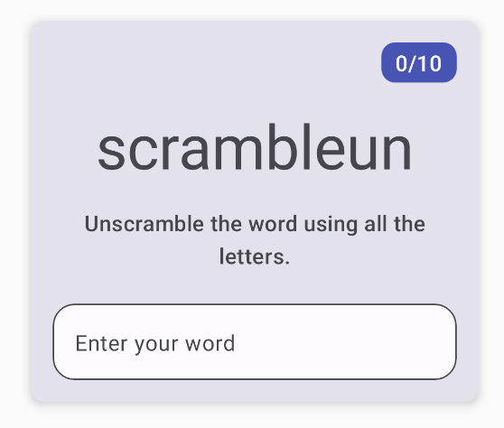

# 在 Compose 中使用 ViewModel 和状态管理

本教程整理自 Android Developers Codelab：ViewModel and State in Compose。目标是基于起始版 **Unscramble** 猜词游戏应用，学习 Android 应用架构（ViewModel、UI State、单向数据流），并在配置变更期间保留应用数据。

> 本地图片已下载到 `images/` 目录，文中图片均使用相对路径引用。

---

## 1. 准备工作

Unscramble 是一款猜乱序词的单人游戏。应用显示一个乱序词，玩家需要猜出原词。猜对得分，也可以跳过。每局共 10 个乱序词。

起始代码已包含游戏界面的基本布局，但存在 bug：乱序词被硬编码，按钮没有响应，旋转设备后游戏状态也会丢失。

本教程会围绕以下主题展开：

- 了解 Android 应用架构（界面层、数据层）和分离关注点。
- 使用 `ViewModel` 管理界面状态，与界面组件解耦。
- 使用 `StateFlow` 和后备属性模式公开可观察状态。
- 实现单向数据流 (UDF)。
- 使用 `rememberSaveable` 和 `ViewModel` 在配置变更期间保留数据。
- 使用 `AlertDialog` 实现游戏结束对话框。

### 前提条件

- 熟悉 Kotlin 基础语法（函数、lambda、布尔状态）。
- 能够使用 Compose 构建 `Row`、`Column`、`Button`、`TextField` 等布局。
- 了解 Material Design 和 Material 3 主题。
- 已安装最新版 Android Studio。

### 构建内容

你将基于起始版 **Unscramble** 应用，逐步添加 ViewModel、状态管理、验证逻辑和得分系统，最终完成一款完整的猜词游戏。


---

## 2. 应用概览

Unscramble 应用的核心功能：

- 显示一个乱序词供玩家猜测
- 玩家在文本框输入猜测，点击 Submit 或键盘 Done 提交
- 猜对得分（+20），进入下一词
- 猜错显示"Wrong Guess!"错误提示
- 可以跳过当前词（Skip）
- 每局 10 个词语，结束后弹出"Congratulations!"对话框
- 旋转设备不丢失游戏状态

游戏有几种关键界面状态：

| 初始状态 | 猜错状态 | 游戏结束 |
|----------|----------|----------|
|  |  |  |

### 获取起始代码

下载起始代码：

```bash
git clone https://github.com/google-developer-training/basic-android-kotlin-compose-training-unscramble.git
cd basic-android-kotlin-compose-training-unscramble
git checkout starter
```

也可以下载 starter 分支 ZIP：

```text
https://github.com/google-developer-training/basic-android-kotlin-compose-training-unscramble/archive/refs/heads/starter.zip
```

用 Android Studio 打开项目后，重点查看：

| 文件 | 说明 |
|------|------|
| `data/WordsData.kt` | 包含 `allWords`（全部词语集合）、`MAX_NO_OF_WORDS`（每局最大词数）、`SCORE_INCREASE`（每词得分） |
| `MainActivity.kt` | 包含所有可组合函数：`GameScreen`、`GameLayout`、`GameStatus`、`FinalScoreDialog` |
| `res/values/strings.xml` | 字符串资源 |

起始应用可以运行，但乱序词硬编码为 `"scrambleun"`，按钮无响应：



---

## 3. 了解应用架构

### 核心架构原则

最常用的 Android 架构原则有两条：

1. **分离关注点**：将应用按功能职责分为不同的类，每个类各自负责一项明确的职责。
2. **通过模型驱动界面**：通过持久化模型（最好是只读模型）来驱动界面，模型应独立于界面元素和应用组件。

### 推荐的应用架构


至少包含两个层：

| 层级 | 组成 | 职责 |
|------|------|------|
| **界面层 (UI Layer)** | 界面元素（Compose 可组合函数）+ 状态容器（ViewModel） | 显示应用数据，处理用户交互 |
| **数据层 (Data Layer)** | Repository、数据源 | 存储、检索和提供应用数据 |
| 网域层（可选） | UseCase | 封装可复用的业务逻辑 |

### ViewModel 的作用

`ViewModel` 是专门存储和公开界面所需状态的组件。其关键特性：

- **生命周期独立于 activity**：在配置变更期间不会被销毁
- **数据在重组后立即可用**：Compose 重组时数据不会丢失
- **需要扩展 `ViewModel` 类**


### 界面状态

界面状态是对界面上应显示内容的一种不可变描述。使用数据类定义：

```kotlin
data class NewsItemUiState(
    val title: String,
    val body: String,
    val bookmarked: Boolean = false
)
```

应用状态的变化由用户事件驱动，通过单向数据流传递。

---

## 4. 添加 ViewModel

### 步骤 1：添加 Gradle 依赖项

在模块级 `build.gradle.kts` 的 `dependencies` 中添加：

```kotlin
implementation("androidx.lifecycle:lifecycle-viewmodel-compose:2.6.1")
```

同步项目（点击 **Sync Now**）。

### 步骤 2：创建 GameViewModel

在 `com.example.android.unscramble.ui` 包下新建 `GameViewModel.kt`：

```kotlin
package com.example.android.unscramble.ui

import androidx.lifecycle.ViewModel

class GameViewModel : ViewModel() {
}
```

### 步骤 3：创建 GameUiState 数据类

在 `GameViewModel.kt` 中定义：

```kotlin
data class GameUiState(
    val currentScrambledWord: String = ""
)
```

### 步骤 4：使用 StateFlow 和后备属性

`StateFlow` 是一种可观察的数据流，能发出当前状态和新状态更新。使用**后备属性**模式：私有可变属性 + 公共只读属性。

```kotlin
import kotlinx.coroutines.flow.MutableStateFlow
import kotlinx.coroutines.flow.StateFlow
import kotlinx.coroutines.flow.asStateFlow

class GameViewModel : ViewModel() {
    // 私有可变状态
    private val _uiState = MutableStateFlow(GameUiState())
    // 公共只读状态
    val uiState: StateFlow<GameUiState> = _uiState.asStateFlow()
}
```

| 属性 | 可见性 | 类型 | 用途 |
|------|--------|------|------|
| `_uiState` | private | `MutableStateFlow<GameUiState>` | 仅在 ViewModel 内部修改 |
| `uiState` | public | `StateFlow<GameUiState>` | 只读，供界面层收集 |

### 步骤 5：生成随机乱序词

在 `GameViewModel` 中添加词语处理逻辑：

```kotlin
import com.example.android.unscramble.data.allWords

private lateinit var currentWord: String
private var usedWords: MutableSet<String> = mutableSetOf()

private fun pickRandomWordAndShuffle(): String {
    currentWord = allWords.random()
    if (usedWords.contains(currentWord)) {
        return pickRandomWordAndShuffle()
    } else {
        usedWords.add(currentWord)
        return shuffleCurrentWord(currentWord)
    }
}

private fun shuffleCurrentWord(word: String): String {
    val tempWord = word.toCharArray()
    tempWord.shuffle()
    while (String(tempWord).equals(word)) {
        tempWord.shuffle()
    }
    return String(tempWord)
}

fun resetGame() {
    usedWords.clear()
    _uiState.value = GameUiState(currentScrambledWord = pickRandomWordAndShuffle())
}

init {
    resetGame()
}
```

关键逻辑说明：

- `pickRandomWordAndShuffle()`：从词库随机选取一个未使用的词，打乱后返回
- `shuffleCurrentWord()`：将单词字母乱序排列，确保结果与原词不同
- `lateinit var currentWord`：保持当前正确词供后续验证
- `usedWords`：跟踪已使用过的词，避免一局中重复
- `init` 块：ViewModel 初始化时调用 `resetGame()`

---

## 5. 构建 Compose 界面（单向数据流）

### 单向数据流 (UDF)

**状态向下流动，事件向上流动。**


完整的数据循环：

1. **事件**：界面元素检测到用户操作，向上传递事件
2. **更新状态**：ViewModel 中的事件处理逻辑更新 `GameUiState`
3. **显示状态**：可组合函数观察到新状态，重组界面

### 在 GameScreen 中收集 ViewModel 状态

更新 `GameScreen()`：

```kotlin
import androidx.lifecycle.viewmodel.compose.viewModel
import androidx.compose.runtime.collectAsState
import androidx.compose.runtime.getValue

@Composable
fun GameScreen(
    gameViewModel: GameViewModel = viewModel()
) {
    val gameUiState by gameViewModel.uiState.collectAsState()

    // ... 将 gameUiState 中的数据传递给子组合项
    GameLayout(
        currentScrambledWord = gameUiState.currentScrambledWord,
        modifier = Modifier
            .fillMaxWidth()
            .wrapContentHeight()
            .padding(mediumPadding)
    )
}
```

关键 API 说明：

| API | 作用 |
|-----|------|
| `viewModel()` | 获取与当前 Compose 上下文绑定的 ViewModel 实例 |
| `collectAsState()` | 将 `StateFlow` 收集为 Compose 可观察的 `State` 对象 |

### 更新 GameLayout 接受参数

修改 `GameLayout()` 接受动态乱序词：

```kotlin
@Composable
fun GameLayout(
    currentScrambledWord: String,
    modifier: Modifier = Modifier
) {
    // ...
    Text(
        text = currentScrambledWord,
        fontSize = 45.sp,
        modifier = modifier.align(Alignment.CenterHorizontally)
    )
}
```

此时运行应用，每次都会显示不同的乱序词：


### 连接用户输入

在 `GameViewModel` 中添加用户猜测状态：

```kotlin
import androidx.compose.runtime.mutableStateOf
import androidx.compose.runtime.getValue
import androidx.compose.runtime.setValue

// 用户猜词——使用 Compose mutableStateOf
var userGuess by mutableStateOf("")
    private set

fun updateUserGuess(guessedWord: String) {
    userGuess = guessedWord
}
```

> **为什么 `userGuess` 用 `mutableStateOf` 而非 `MutableStateFlow`？**
> `userGuess` 是临时 UI 交互状态，用 `mutableStateOf` 更简洁。游戏数据状态（得分、乱序词等）用 `StateFlow` 更适合。

更新 `GameLayout()` 签名字段参数：

```kotlin
@Composable
fun GameLayout(
    currentScrambledWord: String,
    userGuess: String,
    onUserGuessChanged: (String) -> Unit,
    onKeyboardDone: () -> Unit,
    modifier: Modifier = Modifier
) {
    // OutlinedTextField 更新为：
    OutlinedTextField(
        value = userGuess,
        singleLine = true,
        shape = shapes.large,
        modifier = Modifier.fillMaxWidth(),
        colors = TextFieldDefaults.textFieldColors(containerColor = colorScheme.surface),
        onValueChange = onUserGuessChanged,
        label = { Text(stringResource(R.string.enter_your_word)) },
        isError = false,
        keyboardOptions = KeyboardOptions.Default.copy(
            imeAction = ImeAction.Done
        ),
        keyboardActions = KeyboardActions(
            onDone = { onKeyboardDone() }
        )
    )
}
```

在 `GameScreen` 中连接：

```kotlin
GameLayout(
    onUserGuessChanged = { gameViewModel.updateUserGuess(it) },
    onKeyboardDone = { },
    userGuess = gameViewModel.userGuess,
    currentScrambledWord = gameUiState.currentScrambledWord,
)
```

---

## 6. 验证猜词与更新得分

### 在 GameUiState 中添加状态字段

```kotlin
data class GameUiState(
    val currentScrambledWord: String = "",
    val isGuessedWordWrong: Boolean = false,
    val score: Int = 0,
    val currentWordCount: Int = 1,
    val isGameOver: Boolean = false
)
```

| 字段 | 类型 | 说明 |
|------|------|------|
| `currentScrambledWord` | `String` | 当前乱序词 |
| `isGuessedWordWrong` | `Boolean` | 是否猜错（控制错误样式） |
| `score` | `Int` | 当前得分 |
| `currentWordCount` | `Int` | 当前已到第几个词 |
| `isGameOver` | `Boolean` | 10 个词全部完成 |

### 实现验证逻辑

在 `GameViewModel` 中：

```kotlin
import com.example.android.unscramble.data.SCORE_INCREASE
import kotlinx.coroutines.flow.update

fun checkUserGuess() {
    if (userGuess.equals(currentWord, ignoreCase = true)) {
        // 猜对：增加得分
        val updatedScore = _uiState.value.score.plus(SCORE_INCREASE)
        updateGameState(updatedScore)
    } else {
        // 猜错：显示错误状态
        _uiState.update { currentState ->
            currentState.copy(isGuessedWordWrong = true)
        }
    }
    // 清空输入
    updateUserGuess("")
}

fun skipWord() {
    updateGameState(_uiState.value.score)
    updateUserGuess("")
}

private fun updateGameState(updatedScore: Int) {
    if (usedWords.size == MAX_NO_OF_WORDS) {
        // 游戏结束
        _uiState.update { currentState ->
            currentState.copy(
                isGuessedWordWrong = false,
                score = updatedScore,
                isGameOver = true
            )
        }
    } else {
        // 正常流程：下一个词
        _uiState.update { currentState ->
            currentState.copy(
                isGuessedWordWrong = false,
                currentScrambledWord = pickRandomWordAndShuffle(),
                currentWordCount = currentState.currentWordCount.inc(),
                score = updatedScore
            )
        }
    }
}
```

`StateFlow.update()` 和 `copy()` 配合：

- `_uiState.value` 获取当前状态快照
- `copy()` 创建新的不可变状态（只修改指定字段）
- `update()` 原子地替换状态

### 在界面显示错误状态

更新 `GameLayout()` 添加 `isGuessWrong` 参数：

```kotlin
@Composable
fun GameLayout(
    currentScrambledWord: String,
    userGuess: String,
    onUserGuessChanged: (String) -> Unit,
    onKeyboardDone: () -> Unit,
    isGuessWrong: Boolean,
    modifier: Modifier = Modifier
) {
    OutlinedTextField(
        // ...
        isError = isGuessWrong,
        label = {
            if (isGuessWrong) {
                Text(stringResource(R.string.wrong_guess))
            } else {
                Text(stringResource(R.string.enter_your_word))
            }
        }
    )
}
```

在 `strings.xml` 中添加：

```xml
<string name="wrong_guess">Wrong Guess!</string>
```

### 连接 Submit 按钮

在 `GameScreen` 中：

```kotlin
// Submit 按钮
Button(
    modifier = Modifier.fillMaxWidth(),
    onClick = { gameViewModel.checkUserGuess() }
) {
    Text(text = stringResource(R.string.submit), fontSize = 16.sp)
}

// Skip 按钮
OutlinedButton(
    onClick = { gameViewModel.skipWord() },
    modifier = Modifier.fillMaxWidth()
) {
    Text(text = stringResource(R.string.skip), fontSize = 16.sp)
}
```

---

## 7. 显示游戏结束对话框

### FinalScoreDialog

使用 Material 3 的 `AlertDialog`：

```kotlin
@Composable
private fun FinalScoreDialog(
    score: Int,
    onPlayAgain: () -> Unit,
    modifier: Modifier = Modifier
) {
    val activity = (LocalContext.current as Activity)

    AlertDialog(
        onDismissRequest = { },
        title = { Text(text = stringResource(R.string.congratulations)) },
        text = { Text(text = stringResource(R.string.you_scored, score)) },
        modifier = modifier,
        dismissButton = {
            TextButton(onClick = { activity.finish() }) {
                Text(text = stringResource(R.string.exit))
            }
        },
        confirmButton = {
            TextButton(onClick = onPlayAgain) {
                Text(text = stringResource(R.string.play_again))
            }
        }
    )
}
```


### 游戏结束对话框效果


### 在 GameScreen 中触发

```kotlin
if (gameUiState.isGameOver) {
    FinalScoreDialog(
        score = gameUiState.score,
        onPlayAgain = { gameViewModel.resetGame() }
    )
}
```

`resetGame()` 重置状态：

```kotlin
fun resetGame() {
    usedWords.clear()
    _uiState.value = GameUiState(currentScrambledWord = pickRandomWordAndShuffle())
}
```

---

## 8. 设备旋转与状态保留

### ViewModel 的生命周期优势

`ViewModel` 在设备配置变更（如屏幕旋转）时不会被销毁。这意味着在 ViewModel 中管理的所有状态都会自动保留。

**测试步骤：**

1. 运行应用，猜对几个词获得分数
2. 旋转设备（或模拟器）

| 旋转前（竖屏） | 旋转后（横屏） |
|----------------|----------------|
|  |  |

得分、当前词数和乱序词都会保持不变。

### 状态保留方案对比

| 方案 | 保留范围 | 适用场景 |
|------|----------|----------|
| `remember` | 仅重组期间 | 临时 UI 交互状态 |
| `rememberSaveable` | 重组 + 配置变更 | 需要跨配置变更的 Compose 状态 |
| `ViewModel` + `StateFlow` | 独立于 activity 生命周期 | 应用业务逻辑状态 |

---

## 9. 获取解决方案代码

如需查看官方完成版代码：

```bash
git clone https://github.com/google-developer-training/basic-android-kotlin-compose-training-unscramble.git
cd basic-android-kotlin-compose-training-unscramble
git checkout viewmodel
```

也可以下载 viewmodel 分支 ZIP：

```text
https://github.com/google-developer-training/basic-android-kotlin-compose-training-unscramble/archive/refs/heads/viewmodel.zip
```

---

## 10. 总结

完成本教程后，你应该掌握：

- **应用架构**：界面层、数据层的职责划分，分离关注点原则。
- **ViewModel**：扩展 `ViewModel` 类，利用其生命周期优势在配置变更期间保留数据。
- **界面状态**：使用数据类定义不可变的 `GameUiState`，通过 `copy()` 更新。
- **StateFlow**：使用 `MutableStateFlow` + 后备属性模式，公开只读的 `StateFlow`。
- **单向数据流 (UDF)**：状态向下流动，事件向上流动。
- **`collectAsState()`**：在 Compose 中收集 `StateFlow` 为可观察状态。
- **`mutableStateOf()`**：用于 Compose 可观察 UI 状态（如用户输入）。
- **事件处理**：`checkUserGuess()`、`skipWord()`、`resetGame()` 的完整实现。
- **`AlertDialog`**：Material 3 对话框组件，实现游戏结束界面。
- **配置变更**：`ViewModel` 中的状态在屏幕旋转后自动保留，无需额外处理。

---

## 11. 了解更多

- Android 应用架构指南：https://developer.android.com/topic/architecture?hl=zh-cn
- 界面层架构：https://developer.android.com/topic/architecture/ui-layer?hl=zh-cn
- 使用单向数据流管理状态：https://developer.android.com/topic/architecture/ui-layer#udf?hl=zh-cn
- ViewModel 概览：https://developer.android.com/topic/libraries/architecture/viewmodel?hl=zh-cn
- Compose 状态和 StateFlow：https://developer.android.com/jetpack/compose/state?hl=zh-cn
- AlertDialog 使用：https://developer.android.com/reference/kotlin/androidx/compose/material3/package-summary#AlertDialog
- 官方 Codelab：https://developer.android.com/codelabs/basic-android-kotlin-compose-viewmodel-and-state?hl=zh-cn

---

本教程中的代码示例来自 Android Developers codelab，按 Apache 2.0 许可发布；说明文字已按课堂资料用途重新整理。

